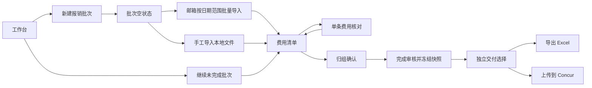

# Concur UI 对标评审与本产品交互优化方案

> 文档状态：UI/UX 评审基线
> 版本：v1.2
> 更新日期：2026-08-26
> 输入：用户提供的 Concur 管理费用、创建报销单、添加费用、费用清单和费用明细截图；当前 Windows 客户端 UI；《产品 UI 与用户交互设计》；《Concur 字段映射方案》

## 1. 结论摘要

Concur 值得借鉴的不是视觉风格，而是清晰的对象层级：

```text
报销单列表
→ 创建或打开一张报销单
→ 查看该报销单的费用清单
→ 打开单条费用
→ 左侧填写字段、右侧核对发票
→ 返回清单继续下一条
```

当前软件已经具备采集、解析、去重、归组、原件预览、字段编辑、导出和 Concur 收据发送能力，但 UI 仍存在五个结构性问题：

1. “创建批次”和“获取发票后另外生成批次”是两个割裂流程；正确关系应是先创建批次，再在该批次内执行一次或多次数据导入；
2. 批次详情把基本信息、审核、归组、历史、导出、Concur发送和状态操作堆在同一长页；旧优化方案又把输出、Concur和记录做成批次标签，仍然没有守住审核与交付边界；
3. 审核区缺少类似 Concur 的高信息密度费用清单，无法快速扫视日期、类型、供应商、城市、金额和问题；
4. 单张审核缺少稳定的本地费用项；旧方案曾计划直接加入“Concur填报字段”，会让核心数据和某个租户页面耦合；
5. 当前Concur能力止于收据库，尚未完成“创建报销单草稿 → 创建并填写费用 → 上传且关联发票”的核心闭环。

优化方向应为：

- 把“批次”保留为本产品唯一核心对象；
- 把采集流水线收进已创建的批次，而不是单独作为主导航或再次创建批次；
- 批次内部只保留“费用清单”和“归组”两个一级视图，单条核对、问题和记录留在视图内部；
- 保留三栏归组审核能力，同时新增更适合批量浏览的费用表格；
- 单条费用借鉴 Concur 的左右分栏和连续核对效率，但左侧只使用软件定义的稳定费用字段；目标必填缺口只在上传预检出现；
- 用户点击“完成审核”并冻结本地快照后，通过独立交付选择决定导出Excel或上传Concur；上传路径再创建未提交报销单草稿、填写费用并定向关联发票；
- 不复制 Concur 的企业审批状态、报销限额处理和最终自动提交。

## 2. 评审范围与产品边界

### 2.1 本次评审覆盖

- 报销批次管理；
- 新建批次；
- 空批次和发票来源选择；
- 费用类型选择；
- 批次费用清单；
- 单条费用明细与发票原件核对；
- 重复、归组、必填缺口和输出前确认；
- Windows桌面端缩放、键盘和错误恢复。

### 2.2 不扩大产品责任

- 软件按发票实际价税合计准备申报金额，不执行公司餐费等报销上限；
- 用户进入 Concur 后自行处理公司政策、可报金额、税务调整和最终提交；
- 当前实现仍以发送收据为主，但目标核心版本必须包含报销单草稿创建、费用创建/填写和附件定向关联；
- 不把 Concur 的审批、付款和核准状态伪装成本地软件已经同步的状态；
- 不把 Concur 的手工创建费用作为本产品主路径，手工录入只用于解析失败或无结构化票据的兜底。

## 3. Concur 页面结构分析

### 3.1 管理费用页

截图体现：

- 报销单和待报销费用位于同一管理上下文；
- 报销单列表提供名称、状态、日期、金额等高价值字段；
- 页面右上角只有一个明确主操作“创建报销单”；
- 支持时间范围筛选和列表排序；
- 待报销费用支持上传、查看、编辑、删除、合并、移动等批量动作。

可借鉴：

- 在首屏同时回答“已有任务是什么”和“下一步做什么”；
- 列表行直接可进入详情；
- 状态、金额和日期保持稳定列宽；
- 未选择对象时批量操作明确禁用。

不照搬：

- 本产品 MVP 不建立独立的全局“待报销费用池”，避免在批次与全局费用之间引入第二套归属关系；
- 使用“未完成批次”和“批次内待处理票据”代替全局待报销池；
- 不采用只显示图标的主导航，低频用户需要文字标签。

### 3.2 创建报销单

截图体现：

- 创建时只要求报销单名称；
- 报销日期自动带出；
- 备注可选；
- 主操作固定在底部，创建和取消关系明确。

可借鉴：

- 首次创建只收集必要信息；
- 创建时间由系统自动记录；
- 主操作位置稳定；
- 必填符号清楚。

需要优化：

- Concur全屏弹层留白过多，本产品应使用中等宽度抽屉或紧凑配置页；
- 本产品新建批次只填写批次名称，创建时间由系统生成；
- 日期范围、邮箱、本地文件和其他导入选项均不属于创建表单；
- 创建成功后立即进入批次空状态，再由用户选择导入方式。

### 3.3 空报销单

截图体现：

- 顶部紧凑显示名称、金额、状态和编号；
- 空状态清楚解释当前没有费用；
- 提供“上传发票”“手动创建费用”“从待报销费用选择”三条路径。

可借鉴：

- 空状态直接提供下一步，不展示空表格；
- 入口按来源组织；
- 报销单上下文始终可见。

本产品应调整为：

1. 从只读邮箱获取；
2. 导入本地发票/配套票据文件或文件夹；
3. 继续上次未完成的采集；
4. 手工补录仅作为解析失败兜底，不作为与自动获取并列的主入口。

### 3.4 Concur费用类型映射（只在上传阶段）

截图体现：

- 顶部按“发票创建、手动创建、待报销费用”切换；
- 支持搜索费用类型；
- 显示最近使用；
- 费用类型按分类折叠。

可借鉴：

- “最近使用”能降低企业长费用目录的选择成本；
- 搜索同时匹配类型、类别和描述；
- 当前选择状态明显；
- 费用类型目录适合配置探测和人工修正。

这些交互只借鉴到“目标系统映射配置/上传预检”，不得放进单条费用核对。目标规则是：

- 软件内部费用分类保持稳定；
- 内部分类按企业映射自动生成Concur费用类型；
- 只有映射缺失、目标目录漂移或用户修改本次上传值时打开Concur类型选择器；
- 选择器按“推荐、最近使用、全部类型”排列；
- 支持“更新映射配置”或“仅用于本次上传”，两种动作必须区分；
- Concur费用类型的稳定ID、层级路径和显示名称只保存在映射档案/上传快照，不写入 `ExpenseItem`。

### 3.5 费用清单

截图体现：

- 批次名称、总金额、状态、编号集中在紧凑页头；
- 费用清单显示日期、备注、票据缩略图、属性、费用类型、供应商/城市、付款类型和金额；
- 底部持续显示总金额；
- 点击整行进入单条详情。

这是当前软件最值得借鉴的部分。当前左侧 240px 发票列表只显示发票号、日期、金额和少量徽标，不适合批量扫描，也无法直接判断费用类型、供应商和城市是否合理。

### 3.6 单条费用明细

截图体现：

- 左侧是表单，右侧是原始发票；
- 顶部显示当前 `1/22`，可上一条/下一条；
- 发票查看器可折叠；
- 表单字段按两列排列；
- 原始文件名和打开动作始终可见。

可借鉴：

- 字段和原件同屏；
- 当前项位置明确；
- 用户无需返回清单即可连续核对；
- 发票查看器独立滚动、缩放和翻页；
- 右侧查看器可收起，为字段编辑释放空间。

本产品需要进一步增加：

- “软件费用信息”“票据信息”和“问题与依据”分组；
- 票面、配套材料、行程推导、软件默认、用户输入和人工修改的来源标记；
- 软件本地核对完成数量；
- “保存并下一张待处理”；
- 重复对比和归组证据；
- 原件失败时的重新加载、外部打开和文件定位。

## 4. 当前 UI 的主要问题

### 4.1 问题分级

| 级别 | 定义 |
|---|---|
| P0 | 阻断发布可用性、容易造成数据错误或让用户无法完成主流程 |
| P1 | 明显增加理解和审核成本，应在 Concur 字段适配前完成 |
| P2 | 跨公司、多租户或高阶效率增强 |

### 4.2 当前问题清单

| # | 当前问题 | 用户影响 | 对标发现 | 优先级 |
|---:|---|---|---|---|
| 1 | 主导航把“批次与审核”和“获取与处理”拆成两个同级入口 | 用户创建批次后还要离开批次寻找导入入口 | Concur围绕报销单对象组织创建、费用和详情 | **P0** |
| 2 | 当前流水线处理完成后生成新的批次，而不是向用户已经创建的批次导入 | 同一报销任务可能出现空批次和另一个有数据的批次 | 创建报销单后，添加费用始终发生在同一报销单上下文 | **P0** |
| 3 | 批次详情以覆盖式长页面打开，右上角用“关闭审核”退出 | 缺少稳定返回路径和页面层级；关闭含义像放弃操作 | Concur使用完整详情页和明确返回入口 | **P0** |
| 4 | 基本信息、时间线、添加来源、审核、归组、历史、导出、发送和状态纵向堆叠 | 核心审核和下一步容易落到首屏以下 | Concur用紧凑页头、清单和上下文操作分层 | **P0** |
| 5 | 没有高信息密度的费用清单视图 | 用户无法快速扫视类型、供应商、城市、金额和异常 | Concur费用表格是报告级主要工作面 | **P0** |
| 6 | 左侧发票列表以发票号为主信息 | 发票号不适合人脑识别，50张批次查找困难 | Concur优先显示日期、类型、商户、地点和金额 | **P1** |
| 7 | 当前项没有明显的 `当前/总数` 和可见上一条/下一条按钮 | 只能依靠列表或隐藏的键盘快捷键连续审核 | Concur在单项页顶部持续显示 `1/22` | **P0** |
| 8 | 切换发票时没有明确的未保存保护或“保存并下一张” | 修改可能被用户误认为已保存，连续审核效率低 | Concur保持单项上下文；本产品应进一步自动保存 | **P0** |
| 9 | 原件预览失败时主要显示错误文本，缺少外部打开、重新加载和定位文件 | 已出现“无法打开文件”的真实问题，用户无法自行恢复 | Concur查看器保留文件名和打开动作 | **P0** |
| 10 | PDF依赖 WebView 内嵌查看，缺少稳定分页、适宽、旋转和统一缩放 | 不同Windows/WebView2环境表现不稳定 | Concur使用独立票据查看器工具栏 | **P0** |
| 11 | 重复只显示徽标和原因，缺少两条记录并排比较及明确计入决策 | 用户难以确认重复来源，容易误删或把重复金额计入 | Concur列表适合定位，但本产品需利用历史台账做更强对比 | **P0** |
| 12 | 归组同时在左侧列表和“高级归组管理”中出现 | 同一任务有两套操作位置，用户不知道应在哪里处理 | Concur按对象提供单一主工作面 | **P1** |
| 13 | 页面直接显示规则版本、总体置信度等技术指标 | 技术信息不能告诉普通用户该做什么 | Concur只显示业务状态和动作 | **P1** |
| 14 | 当前字段编辑器主要是发票事实，旧方案又准备直接改成Concur表单模型 | 缺少稳定本地费用分类、实际发生日期、费用说明、地点、付款方式、币种和票面税项；且会被租户字段变化牵连 | 借鉴表单布局，但建立目标系统无关的 `ExpenseItem`，上传时再映射 | **P0** |
| 15 | “开票日期”和未来“交易日期”没有在UI中分开 | 容易把开票日误填为实际消费日 | Concur明确使用交易日期；截图证明两者可能不同 | **P0（适配前）** |
| 16 | 当前“销方缺失”提示说字段可留空，但目标 Concur 供应商为必填 | 软件审核通过不代表 Concur 可填写 | Concur通过红星明确必填 | **P0（适配前）** |
| 17 | 批次状态使用“已提交、已批准、已完成”等类似企业审批的名称 | 用户可能误以为状态已与 Concur 同步 | Concur状态是真实企业工作流；本软件当前没有该同步 | **P0** |
| 18 | 批次列表没有筛选、排序、问题数、最后更新时间和上下文主操作 | 批次多后难以找到需要继续的任务 | Concur提供时间过滤、稳定列和状态 | **P1** |
| 19 | 列表仅批次名可点击，整行不可进入；主动作是删除 | 发现性弱，继续任务不突出 | Concur整行具有明确进入动作 | **P1** |
| 20 | 多处使用原生 `alert`、`confirm` | 反馈不一致，不能展示影响范围、撤销或详细错误 | 企业产品使用受控弹层和页面内反馈 | **P1** |
| 21 | 流水线页面仍使用硬编码蓝色，其他页面使用松针绿色 | 视觉语言和按钮层级不一致 | Concur统一设计系统；本产品应保留自身品牌但统一令牌 | **P1** |
| 22 | 全局强制最小宽度1100px，三栏在缩放后改为上下堆叠 | Windows 125%/150%时可能出现横向滚动、字段掉到首屏外 | Concur在宽屏利用左右布局，但本产品需适配桌面缩放 | **P0** |
| 23 | 日期存在本地格式、HTML日期和Concur截图格式多种表现 | 用户跨页面核对容易误读 | 本产品应统一 `YYYY-MM-DD`，不照搬美式日期 | **P1** |
| 24 | 状态操作按钮直接显示目标状态，例如“已提交” | 不是动作语言，且没有解释状态变化影响 | 应使用“完成本地审核”“重新打开审核”等动作 | **P1** |
| 25 | Concur流程只提供收据试发/批量发送 | 用户仍需手工建报销单、建费用、填字段和逐条关联附件，核心闭环未完成 | Concur对象层级清楚，产品应在整理后自动生成未提交草稿 | **P0** |
| 26 | 本地导入把EML与发票文件并列 | 用户难以理解是在导入邮件还是发票，输入边界不清 | 本地入口应直接围绕费用票据文件 | **P1（Alpha前）** |
| 27 | 主发票、行程单和明细缺少发票单聚合 | 配套材料可能被误当成独立票据、费用或归组对象 | Concur一笔费用下集中管理对应附件 | **P0** |
| 28 | 重复候选的金额计入状态不够突出 | 用户可能在未决定重复时看到被抬高的总额或上传数量 | 财务列表必须明确计入/未计入及金额影响 | **P0** |
| 29 | 归组从全部票据同时推断，没有先建立明确行程组 | 异地餐饮/商户信息可能误建差旅行程，后续解释困难 | 先由强行程证据建立对象，再添加费用 | **P0** |

## 5. 借鉴、优化和不照搬的边界

| Concur设计 | 借鉴内容 | 本产品优化方式 | 不照搬内容 |
|---|---|---|---|
| 管理费用页 | 报销单列表、筛选、稳定列、明确主操作 | 增加未完成任务、问题数和“继续审核” | 全局待费用池在MVP不新增 |
| 创建报销单 | 少量必填、固定动作区 | 只输入批次名称；创建时间由系统生成 | 日期范围、来源和处理参数塞进创建弹层；大面积全屏空白 |
| 空报销单 | 空状态直接提供添加路径 | 邮箱获取、本地导入、恢复任务三条路径 | 手工逐项建费作为主路径 |
| 添加费用 | 来源切换、搜索、最近类型、折叠分类 | 仅未映射时出现，支持批量应用同类票据 | 每张发票都重新选择费用类型 |
| 费用清单 | 高密度表格、缩略图、金额总计、整行进入 | 增加问题状态、归组、必填完成度和批量审核 | “已批准金额”等本地没有的数据 |
| 单项详情 | 字段/原件分栏、当前序号、连续切换、折叠查看器 | 增加来源标记、必填缺口、自动保存、重复对比 | 公司限额后的金额和企业审批结果 |
| 顶部状态 | 名称、金额、状态、编号集中展示 | 显示本地处理状态、待解决数和自动保存时间 | 冒充Concur审批/付款状态 |
| 菜单和导航 | 上下文操作集中 | 使用文字按钮和少量更多菜单 | 图标式主导航和多层隐藏菜单 |

## 6. 目标信息架构

### 6.1 主导航

```text
工作台
报销批次
历史台账
设置
```

调整规则：

- 删除独立主导航“获取与处理”；
- “获取、解析、去重、归组”成为批次内部阶段；
- “工作台”是默认入口，优先展示未完成任务和“新建批次”；
- “报销批次”负责查询，不承担复杂编辑；
- “历史台账”提供跨批次重复依据；
- “设置”包含邮箱来源、常驻城市、Concur映射和数据管理。

### 6.2 页面层级



### 6.3 批次内部标签

批次详情使用固定页头和两个一级视图：

1. `费用清单`：默认页，浏览、筛选、批量处理；
2. `归组`：明确行程、市内消费、待归组、拆分和合并。

重复、缺失字段和待挂载材料是费用清单/归组内的状态、筛选和检查器；字段修改、排除、恢复等记录在检查器中查看。批次内不再显示`输出与 Concur`或`记录`一级标签。

“添加来源”不是独立标签：

- 空批次时作为主空状态；
- 已有费用时作为费用清单右上角的次操作“继续添加发票”。

## 7. 目标页面方案

### 7.1 工作台

首屏优先级：

1. 未完成批次；
2. 新建批次；
3. 待处理问题和本月票据摘要；
4. 最近批次。

未完成批次卡片必须显示：

- 批次名称；
- 当前阶段；
- 发票数和金额；
- 待处理问题数；
- 最近更新时间；
- 明确主操作，例如“继续审核3个问题”。

不再让新用户先看到无引导的空表格。新建批次完成后进入有明确导入动作的批次空状态。

### 7.2 新建批次

使用不超过 560px 的对话框或右侧抽屉，只包含：

| 字段 | 规则 | 是否可编辑 |
|---|---|---:|
| 批次名称 | 唯一需要用户填写的字段；可提供名称建议但不依赖月份 | 是 |
| 创建时间 | 点击创建时由系统记录本地时间 | 否，不作为表单输入 |

主按钮为“创建批次”，次按钮为“取消”。创建成功后立即进入该批次，不启动邮箱或文件处理，不要求用户填写月份、日期范围、来源、授权码、输出位置或试运行参数。

当前数据库中的 `month` 不再作为用户创建批次时的业务字段。过渡实现可以从创建时间生成内部默认值以兼容旧表结构，但目标模型应允许根据已导入票据动态计算月份或日期覆盖范围，不能把它作为创建表单必填项。

### 7.2.1 批次内数据导入

批次创建后，用户在批次内选择数据导入方式：

| 导入方式 | 需要填写/选择 | 不需要填写 |
|---|---|---|
| 邮箱批量导入 | 邮箱账号、开始日期、结束日期；无会话授权时输入本次授权码 | 批次名称、创建时间、输出位置 |
| 本地文件导入 | 发票/配套票据文件或包含票据的文件夹 | 日期范围、邮箱、授权码、EML |

导入规则：

- 日期范围属于某一次邮箱导入任务，不属于批次属性；
- 本地文件导入不显示日期范围；
- 本地文件选择器、拖放区和帮助文案不显示EML；
- 同一批次允许多次邮箱导入和多次本地导入；
- 每次导入保存来源类型、执行时间、状态、成功数、忽略数和失败数；
- 新数据进入同一批次后执行批内和历史去重，不生成另一个批次；
- 导入中断后恢复的是该批次的导入任务；
- 已有费用时，“继续导入”作为费用清单的次操作。

### 7.3 批次紧凑页头

```text
← 报销批次
2026年6月报销                     ¥8,320.08
待审核 · 22张 · 3个问题 · 自动保存于10:42

[费用清单] [归组]
```

页头保持粘性，只显示完成任务所需信息。数据库 ID、规则版本、SHA-256 和操作历史移到视图内检查器或诊断信息。共享底栏只显示计入金额、重复未计入、阻断数和“完成审核”，不显示导出或上传。

### 7.4 费用清单

建议列：

| 列 | 内容 | 交互 |
|---|---|---|
| 状态 | 缺失、重复、待确认、完成、排除 | 可筛选 |
| 日期 | 交易日期优先；尚未确认时显示开票日并标注 | 可排序 |
| 票据文件 | 主发票缩略图及行程单/明细数量 | 悬停预览、进入发票单 |
| 费用分类 | 软件内部稳定分类 | 可批量修正；不显示Concur选项 |
| 供应商/城市 | 两行展示 | 文本搜索 |
| 归组 | 差旅行程或市内月份 | 可批量移动 |
| 金额 | 发票实际价税合计 | 右对齐、可排序 |
| 计入状态 | 已计入、疑似重复未计入、重复未计入、用户确认非重复已计入 | 可筛选、不可用普通复选框绕过 |
| 必填 | `7/7`、`5/7`等 | 点击定位缺口 |
| 操作 | 进入详情 | 整行也可进入 |

列表顶部：

- 搜索；
- 状态筛选；
- 归组筛选；
- 本地费用分类筛选；
- “只看问题”；
- “继续添加发票”。

列表底部粘性汇总：

```text
计入19张 · 申报总额 ¥8,320.08 · 重复未计入3张 ¥806.00 · 3个问题
                                      [继续处理问题]
```

默认排序为阻断问题、疑似重复、归组待确认、未审核、已完成，不按数据库插入顺序。

### 7.5 单条费用核对

目标布局：

```text
← 费用清单       7 / 22       [上一条] [下一条待处理]
餐饮 · ¥126.00 · 2个本地字段待确认
┌──────────────────────────────┬──────────────────────────┐
│ 费用信息                      │ 发票单文件               │
│ 费用分类       餐饮           │ [适宽][-][100%][+]       │
│ 实际发生日期   2026-06-25     │                          │
│ 费用说明       KA拜访用餐     │ [主发票][行程单][明细]   │
│ 交易对方       武汉某餐饮企业 │                          │
│ 发生地点       湖北省武汉市   │ [重新加载][外部打开]     │
│ 实际金额       CNY 126.00     │                          │
│ 票面税项       13% / 14.49    │                          │
│ ───────────────────────────  │ 文件名 · 页数 · 只读     │
│ 票据信息                      │                          │
│ 发票号、开票日、购方、销方…  │                          │
└──────────────────────────────┴──────────────────────────┘
已自动保存 · 本地核对7/9                      [保存并下一张]
```

字段分组：

1. `费用信息`：软件内部费用分类、实际发生日期、费用说明、交易对方、结构化地点、付款方式、实际金额、币种和票面税项；
2. `票据信息`：发票号、开票日期、购买方、销售方、票种和解析证据；
3. `问题与依据`：重复、签章、归组、字段来源；
4. `更多`：解析证据和技术诊断，仅在需要时展开。

每个本地字段显示来源：

- 发票票面；
- 配套材料；
- 行程推导；
- 软件默认；
- 用户输入；
- 人工修改。

该页面不得出现Concur费用类型ID、City of Purchase、VAT选项、目标租户必填星号或企业自定义字段。它们只在选择目标后的映射配置和上传预检中出现。

字段状态不能只靠颜色，必须有文字或图标：

- 已从票面/材料获得；
- 需确认；
- 缺失，需补充；
- 已修改；
- 对本费用不适用。

### 7.6 原件查看器

必须支持：

- 适合宽度、适合页面、50%–250%缩放；
- PDF页码和上一页/下一页；
- 图片拖动和滚轮缩放；
- 旋转；
- 折叠、展开和可调整分栏宽度；
- 显示文件名、格式、大小和只读状态；
- 重新加载；
- 使用系统默认程序打开原文件；
- 在文件资源管理器中显示；
- 打开失败时保留字段表单和错误恢复动作，不清空当前选择。

实现上不应继续把 WebView 内置 PDF iframe 当作唯一预览路径。发布前至少需要“应用内预览 + 系统外部打开”的双路径；后续可引入固定版本的 PDF 渲染器，获得一致的分页和缩放行为。

### 7.7 重复处理

同一发票的相同文件或来源副本应先聚合进同一发票单，只形成一笔费用。只有无法可靠合并的记录才进入“疑似重复”对比。

点击“疑似重复”后打开对比抽屉：

| 当前记录 | 疑似重复记录 |
|---|---|
| 原件缩略图 | 原件缩略图 |
| 发票号、日期、金额、销方 | 发票号、日期、金额、销方 |
| 当前批次和归组 | 历史批次、报销时间和状态 |
| 文件哈希/命中理由（折叠） | 文件哈希/命中理由（折叠） |

动作：

- “不是重复，计入总额”；
- “确认重复，保持不计入”；
- 打开历史记录；
- 暂不决定。

疑似重复从命中开始即不计入申报总额和Concur待上传费用；“暂不决定”继续保持不计入。只有用户明确确认不是重复后才增加总额。底层文件继续保留，操作可审计、可撤销；软件不得自动删除重复票据。

### 7.8 归组

归组流程改为“先建明确行程组，再归入其他发票单”：

- 分为“待确认”“差旅行程”“市内消费”“已排除”；
- 第一阶段只使用铁路/航空城际票据、已挂载行程单等强证据建立候选行程组；
- 每个行程组必须显示锚点发票单、日期范围、城市链和形成理由；
- 第二阶段再建议酒店、餐饮、出租车等其他发票单归入已形成的组；
- 证据不足时保持待归组，没有明确锚点时不自动建立差旅行程；
- 配套行程单和明细随所属发票单移动，不独立归组或计费；
- 每组显示已归入张数、待确认张数、计入金额和待确认原因；
- 不在普通界面显示规则版本和百分比置信度；
- 使用业务语言，例如“没有找到离开北京或返程的交通票”；
- 支持拖动移动，同时保留键盘可用的“移动到”菜单；
- 新建、拆分、合并统一放在本页，不在另一个重复入口再实现一次；
- 对“只有5月/6月市内消费、没有差旅”的情况显示形成该结论的证据和缺失证据。

### 7.9 完成审核与独立交付选择

批次双视图只显示本地审核准备度：

```text
本地费用核对  22/22 完成
重复          3 项未计入 · 不阻断其余费用
归组          已确认
原件          22/22 可读取

[完成审核]
```

点击“完成审核”后冻结 `ReviewSnapshot`，导航到批次外的交付选择：

```text
审核已完成 · 22笔 · CNY 8,320.08

[导出 Excel]       [上传到 Concur]
本地稳定字段         选择档案并检查映射
```

两项视觉同级但不是永久互斥：完成一种后可以返回执行另一种。Excel不依赖Concur档案；CSV/PDF等如保留，只作为Excel导出内的次级格式。用户选择Concur后，页面另显示：

```text
映射档案      目标公司 · v3
目标字段      20/22 已映射
待配置        费用分类→费用类型 1项
本次补充      成本中心 1项

[预览内部字段→Concur字段]
[创建Concur草稿并上传]
```

若上传按钮禁用，旁边直接说明是审核快照失效、映射配置缺失还是本次目标字段待补，并链接到对应解决动作。本地事实修改需返回批次并重新完成审核；目标映射缺口不得禁用基于同一有效快照的Excel导出。

交付任务和结果关联批次但不构成批次视图。返回批次恢复之前的视图、筛选和选中项；任何影响费用、计入状态、归组或附件的修改都会使旧快照失效，阻止新交付直到重新审核。

完成后明确告诉用户：

1. 已创建的Concur报销单草稿名称和外部编号；
2. 费用创建、字段填写、发票上传和附件关联的逐项结果；
3. 哪些步骤失败、可以如何局部重试；
4. 下一步打开该Concur草稿，按实际发票金额核对字段与附件；
5. 根据公司规定在 Concur 内调整并由用户最终提交。

上传过程使用固定阶段条：`冻结映射投影 → 创建报销单 → 创建费用 → 填写映射字段 → 上传并关联发票 → 回读核对`。同一批次只能有一个进行中的上传会话；关闭后恢复该会话，重复点击不得创建新的报销单。

## 8. 状态与术语调整

### 8.1 产品术语

| 当前词语 | 建议词语 | 原因 |
|---|---|---|
| 批次 | 报销批次 | 与Concur报销单区分，同时保留本地对象含义 |
| 流水线 | 获取与处理 | 面向用户，不暴露技术实现 |
| 已提交 | 本地审核完成/已生成输出 | 当前没有同步Concur提交状态 |
| 已批准 | 已发送收据/等待用户在Concur处理 | 当前没有同步审批结果 |
| 已完成 | 已归档 | 表示本地任务结束，不代表Concur已付款 |
| 关闭审核 | 返回报销批次 | 明确导航，不暗示放弃 |
| 置信度72% | 这个字段需要确认 | 使用行动语言 |

### 8.2 建议的本地状态

```text
草稿
处理中
处理已暂停
处理失败
待审核
可输出
已生成输出
收据发送中
收据已发送
已归档
```

如果未来能够读取 Concur 状态，应独立显示为“Concur状态”，不能覆盖本地处理状态。

## 9. 保存、切换与键盘交互

### 9.1 保存规则

- 合法字段在失焦或切换项目时自动保存；
- 页面持续显示“正在保存、已保存、保存失败”；
- 非法字段阻止切换，并把焦点移动到错误字段；
- `Ctrl+S`仍可手动保存；
- 主操作为“保存并下一张待处理”；
- 当前项全部完成后自动跳到下一条问题，不机械跳到下一行；
- 关闭页面时如仍有未保存内容，显示受控确认弹层。

### 9.2 键盘规则

| 快捷键 | 动作 |
|---|---|
| `Alt+↑/↓` | 上一条/下一条费用 |
| `Ctrl+S` | 保存当前字段 |
| `Ctrl+Enter` | 保存并下一条待处理 |
| `Alt+X` | 排除或恢复 |
| `F6` | 在清单、字段、原件之间切换焦点 |
| `+/-` | 原件查看器获得焦点时缩放 |
| `Esc` | 关闭当前抽屉或返回清单，不直接丢弃修改 |

快捷键说明不应长期占用左栏空间，放入页头帮助入口和首次使用提示。

## 10. Windows布局与视觉规范

### 10.1 缩放适配

必须覆盖：

- 1920×1080，100%、125%、150%；
- 1366×768，100%和125%；
- 应用最小可用窗口；
- Windows系统文字缩放；
- 减少动态效果和高对比度模式。

布局规则：

- 大于等于1440 CSS px：费用清单/字段/原件可三栏；
- 1100–1439 CSS px：清单进入可收起侧栏，字段与原件两栏；
- 小于1100 CSS px：费用清单和详情切换，原件使用可拉出的右侧面板；
- 不通过全局 `min-width: 1100px` 强制横向滚动；
- 粘性页头和底栏不能遮挡表单最后一行或原件操作。

### 10.2 视觉一致性

- 保留暖纸背景、松针主色、琥珀提醒和红色风险，不改成Concur蓝；
- 流水线页面移除硬编码Bootstrap蓝色，统一使用设计令牌；
- 主按钮、次按钮、危险按钮、文字按钮和禁用状态统一组件；
- 移除原生 `alert`、`confirm`，使用应用内对话框、页面错误和撤销条；
- 日期统一显示为 `YYYY-MM-DD`；
- 金额统一为 `CNY 1,234.56` 或 `¥1,234.56`，同一页面不能混用；
- 颜色不作为唯一状态标识。

## 11. 实施优先级

### 11.1 P0-A：发布前主流程可用性

| 工作项 | 产出 | 验收标准 |
|---|---|---|
| 修正批次与导入关系 | 先创建批次，再在批次内执行邮箱或本地导入 | 导入不再创建新批次；空批次明确显示两种导入方式；任务中断仍回到同一批次 |
| 收窄本地输入 | 本地只显示发票/配套票据文件和文件夹 | 文件选择器、拖放和帮助文案不出现EML |
| 发票单聚合 | 主发票下挂行程单、明细、其他材料和重复来源副本 | 配套材料不形成独立费用或金额；未挂载材料进入待处理 |
| 全页批次工作区 | 稳定返回路径、紧凑页头、费用清单/归组双视图 | 不使用覆盖式长详情；不存在输出、Concur或记录批次标签 |
| 费用清单 | 高密度表格、筛选、问题数、总额 | 50张批次可在一屏快速定位问题 |
| 连续审核 | 当前/总数、上一条、下一条待处理、自动保存 | 切换项目不丢字段修改 |
| 原件双路径 | 应用内预览、重新加载、外部打开、文件定位 | PDF内嵌失败时用户仍能打开原件完成审核 |
| 重复决策 | 并排对比、“确认重复，继续排除”/“不是重复，计入总额”、撤销 | 重复不会自动删除，默认不计入，恢复计入必须显式且可追溯 |
| 重复计入口径 | 疑似/确认重复默认未计入；显式确认非重复后才计入 | 暂不决定、重启、输出和上传均不改变未计入状态 |
| 两阶段行程归组 | 强证据先建组，其他发票后建议归入 | 无锚点不建差旅行程；归组依据可直接从UI得到 |
| 完成审核与快照 | 底栏只提供“完成审核”，冻结版本化审核结果 | 阻断未清零不能完成；本地修改立即失效旧快照 |
| 独立交付选择 | 审核后并列显示“导出Excel”“上传到Concur” | 审核前批次内无交付入口；两种顺序均可执行且幂等 |
| 本地状态重命名 | 去除虚假的Concur审批含义 | 用户不会误认为软件已在Concur提交或获批 |
| 缩放与布局 | 响应式分栏和发布矩阵 | 125%/150%下主操作和字段不被遮挡 |

### 11.2 P0-B：上传到Concur核心闭环

| 工作项 | 产出 |
|---|---|
| 稳定本地费用模型 | `ExpenseItem` 与 `InvoiceRecord` 分层，单条核对不含目标系统字段 |
| 本地核对字段 | 费用分类、实际发生日期、费用说明、交易对方、地点、付款方式、金额、币种、票面税项及来源 |
| 映射配置 | 内部字段路径到外部字段ID、选项、转换、默认值和条件必填规则 |
| 7个已知目标必填字段 | 只在选择租户后的上传预检显示映射状态、来源和缺口 |
| 费用类型映射 | 内部费用分类到Concur稳定选项ID，支持搜索、确认和配置版本 |
| 地点映射 | 内部结构化地点到Concur地点选项，不改变本地地点 |
| 税务映射 | 票面税项到目标VAT字段，语义未确认时不映射 |
| Concur准备度 | 上传页显示当前档案的映射投影；不回写单条核对页 |
| 映射隔离 | 切换租户/规则后本地费用值、审核状态和本地输出零变化 |
| 映射快照 | 保存费用项revision、规则版本、本次补充值和最终外部值 |
| 草稿级字段 | 报销单名称、日期、备注和目标租户确认；这些字段不进入本地新建批次 |
| 上传会话 | 报销单/费用外部ID、阶段状态、幂等键、中断恢复和未知状态处理 |
| 草稿创建 | 用户明确触发后创建一个未提交报销单草稿 |
| 费用创建与填表 | 每笔已确认费用只创建一次，逐字段核对结果 |
| 发票关联 | 原始发票上传到正确费用条目，错关联和漏关联为0 |
| 局部重试 | 只重试失败阶段，已成功对象不重复创建 |
| 完成动作 | “在Concur中打开并检查”，最终提交仍由用户执行 |

### 11.3 P1：效率与一致性

- 工作台和最近批次；
- 批次筛选、排序、搜索和最后更新时间；
- 统一设计组件和受控对话框；
- 批量修改同类费用分类和归组；
- 缩略图、悬停预览和列设置；
- 操作历史筛选和8秒撤销条；
- 费用清单导出前预览。

### 11.4 P2：跨公司与高级场景

- 企业配置档案导入/导出和漂移检测；
- 成本中心、项目号、参与人、分摊和明细字段；
- 外币、多税率和多语言；
- 多Concur页面版本；
- 全局待处理费用池；
- 在租户明确授权可用时增加或切换到官方接口适配。

## 12. UI 验证方案

### 12.1 核心任务验证

| 场景 | 验证目标 |
|---|---|
| 首次无数据 | 用户能从首屏开始第一个批次，不需要理解“批次”和“流水线”的差别 |
| 邮箱真实批次 | 新建批次后设置日期范围并批量导入；处理、恢复和审核均保持在该批次上下文 |
| 本地文件批次 | 新建批次后选择发票/配套票据文件或文件夹；界面不要求日期范围、邮箱信息或EML |
| 多次导入同一批次 | 第二次邮箱或本地导入只增加新数据，重复项不产生重复费用记录，也不创建新批次 |
| 发票单聚合 | 主发票、行程单和消费明细形成一个发票单、一笔费用和一个金额 |
| 重复金额 | 疑似/确认重复不进入总额；明确确认非重复后才增加总额和待上传数 |
| 两阶段归组 | 锚点票据先形成明确行程组，酒店/餐饮/出租车随后建议归入；无锚点保持待确认 |
| 50张混合票据 | 5分钟内定位并处理3–8个异常 |
| 原件打不开 | 能重新加载或外部打开，不阻断字段审核 |
| 同批次重复 | 能比较、保留或排除，列表不再出现无解释重复项 |
| 历史重复 | 能看到历史批次和命中依据，不泄露不必要原始路径 |
| 无差旅行程 | UI能解释因缺少哪些交通或城市证据而归为市内消费 |
| 连续编辑 | 切换、保存、下一条和返回清单不会丢失修改 |
| 稳定本地费用核对 | 页面只显示软件字段；目标租户变化不改变本地费用数据和本地输出 |
| Concur映射缺口 | 选择目标后，缺少任一目标必填映射时明确定位；目标专用补充值留在上传会话 |
| Concur草稿上传 | 创建一个未提交草稿，逐条填写费用并正确关联原始发票 |
| 上传中断与重试 | 恢复同一会话，只补失败步骤，不产生重复报销单、费用或附件 |
| 完成与发送 | 明确区分本地完成、草稿已创建、收据兼容发送和用户尚需在Concur最终提交 |

### 12.2 视觉和可访问性验证

- 100%、125%、150%缩放截图对比；
- 费用清单、单项详情和原件查看器在最小窗口下的操作可达性；
- 全键盘完成筛选、打开、编辑、排除、保存和返回；
- 焦点顺序、可见焦点、屏幕阅读器标签；
- 减少动态效果时无闪烁或不必要动画；
- 失败、空、加载、部分成功、恢复和只读状态；
- 长中文交易对方、长文件名、长费用分类和大金额不破坏布局。

## 13. 验收标准

方案实施完成必须满足：

1. 用户从工作台一个主操作即可新建报销批次，创建表单只要求批次名称；
2. 创建时间由系统记录，日期范围和来源不进入批次创建表单；
3. 邮箱按日期范围批量导入和本地文件导入都发生在已创建的同一个报销批次内；
4. 本地导入只接受发票及配套票据文件/文件夹，产品入口不出现EML；
5. 主发票、行程单、消费明细和来源副本聚合为一个发票单，配套材料不独立计费；
6. 疑似和确认重复默认不计入总额，只有用户明确判定非重复后才恢复计入；
7. 行程组先由明确锚点建立，再判断其他发票归属；无锚点不自动建差旅行程；
8. 创建、导入、处理和审核始终属于同一个报销批次；交付结果关联该批次但不成为批次视图；
9. 批次详情不再以一张无层级的长页面承载全部功能，一级视图严格只有费用清单和归组；
10. 费用清单能同时看到日期、类型、供应商、城市、金额、计入状态和问题；
11. 单项详情同屏显示软件定义的费用信息、票据信息和发票单全部票据文件，不显示Concur字段或目标必填性；
12. 当前序号、上一条、下一条待处理和保存状态始终可见；
13. 原件预览失败时有重新加载、外部打开和文件定位路径；
14. 重复票据有明确对比和计入决策，不会自动删除；
15. 归组结论使用业务证据解释，不向普通用户展示算法置信度；
16. 开票日期和交易日期是两个独立字段；
17. 批次内审核动作只有“完成审核”；审核成功后冻结快照并进入独立交付选择；
18. 交付选择只把“导出Excel”和“上传到Concur”作为主入口，执行一种后仍可返回执行另一种；
19. 审核后修改本地费用、计入状态、归组或附件时旧快照失效，重新审核前不能新交付；
20. Excel导出不依赖Concur企业档案、字段映射或登录会话；
21. 选择目标租户后，上传预检才逐项显示Concur已知必填字段的映射完成或缺失状态；
22. 发票金额始终使用实际价税合计，不应用企业报销上限；
23. 本地状态不会被误解为Concur已经提交、审批或付款；
24. 用户最终提交和公司政策调整仍在Concur内完成；
25. Windows 125%和150%缩放不遮挡主操作，不依赖水平滚动完成审核；
26. 页面不再使用原生阻塞式警告框作为主反馈；
27. 典型50张批次可以优先处理异常，不要求逐张打开已自动通过项目；
28. 所有关键操作都有成功、失败、恢复和撤销反馈；
29. 同一本地费用项切换两个映射档案后，本地字段、审核状态和本地输出保持不变；
30. 每次上传可追溯到审核快照、费用项revision、映射版本、本次补充值和最终外部字段值；
31. 批次整理完成后能够创建一个Concur未提交报销单草稿；
32. 每笔费用字段与本地确认值一致，且关联正确原始发票；
33. 重复点击、中断恢复和失败重试不产生重复报销单、费用或附件；
34. 未知Concur状态先回读或要求人工核对，不得显示为成功或盲目重建。

## 14. 与现有文档的关系

- 本文档补充《产品 UI 与用户交互设计》中“当前UI到目标UI”的落地细节；
- Concur目标字段、必填性和数据缺口以《Concur 字段映射方案》为准；
- 本文将Concur草稿创建、费用填写和发票关联上传纳入核心发布范围，但不改变“不自动点击最终提交”的边界；
- 后续UI开发任务应从本文P0-A开始，再执行P0-B，不应先做视觉换肤或复制Concur页面。
