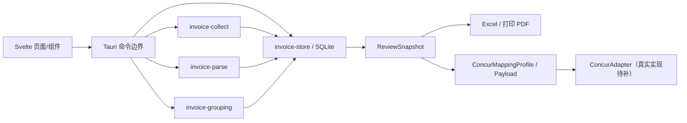

# 代码架构审查（2026-09-03）

> 范围：Rust workspace、Tauri 命令层、SQLite 台账、Svelte 5 UI、构建/发布脚本
> 规模：约 49,432 行 Rust、10,261 行 Svelte/TypeScript（不含生成物）
> 结论：架构能够支撑当前内部 Alpha；Concur 真实适配是功能缺口，持久层和命令层过度集中是下一阶段主要技术债

## 1. 总体结论

仓库已经形成清晰的本地优先分层：采集、解析、归组和存储位于独立 Rust crate，Tauri 负责桌面编排，Svelte 负责工作流 UI。稳定 `ExpenseItem` 与 Concur 目标投影分离、只读邮件收集与批次解析分离、审核快照与交付任务分离，三项边界是当前架构最重要的正确选择。

本次静态审查和现有自动回归没有发现必须在内部 Alpha 前重写架构的问题。不得在发布前进行高风险的大规模数据库拆分。应先完成 Concur 适配器契约和真实验证，再逐步拆分 `ledger_db.rs`、Tauri 命令编排和大型 UI 组件。



## 2. 做得正确的架构边界

1. **领域 crate 已分离。** `invoice-collect`、`invoice-parse`、`invoice-grouping`、`invoice-store` 的责任比单体 Tauri 应用更清楚，解析和归组可以脱离 UI 测试。
2. **本地领域模型不依赖 Concur。** `ExpenseItem` 保留稳定业务语义，`ConcurMappingProfile`/冻结投影只在交付阶段出现，避免租户字段变化污染本地数据。
3. **原件与费用分离。** 发票单聚合主发票和材料，配套文件不独立计费；计入状态统一控制 UI、快照和交付。
4. **审核快照是交付边界。** Excel、打印 PDF 和 Concur 会话读取不可变 `ReviewSnapshot`，本地修改使快照失效，降低结果漂移和重复写入风险。
5. **外部副作用有门禁。** IMAP 使用只读路径；Concur 真正写入未配置时返回明确禁用状态，不伪造成功；版本检查和外发由用户触发。
6. **可恢复任务和资源限制存在。** 流水线检查点、幂等键、OCR 子进程隔离、文件/解压预算和 DataRoot 边界已建立。
7. **依赖可复现。** Rust 使用 Cargo/Cargo.lock，前端使用 npm/package-lock.json；依赖版本和 portable 结构受门禁脚本约束。

## 3. 审查发现

| ID | 等级 | 发现 | 影响 | 建议阶段 |
|---|---|---|---|---|
| ARC-001 | P0（Concur能力） | 没有真实 `ConcurAdapter`；`get_concur_draft_capability` 明确禁用，`start_concur_delivery` 只记录失败任务 | 完整核心价值无法闭环，但不会误报外部成功 | 下一功能迭代，指定租户先行 |
| ARC-002 | P2 | `crates/invoice-store/src/ledger_db.rs` 约 12,551 行，混合 schema、迁移、查询、事务、业务规则和大量测试辅助 | 修改冲突高，迁移/领域规则难独立审查 | Concur 契约稳定后渐进拆分 |
| ARC-003 | P2 | `pipeline.rs` 约 3,474 行、`review.rs` 约 2,455 行、`email_collection.rs` 约 1,587 行，Tauri 命令同时承担 DTO、文件 IO、状态机和业务编排 | 命令层难复用，错误/锁/事务边界不统一 | 建立 application service 层后逐命令迁移 |
| ARC-004 | P2 | `Mutex<AppState>` 是全局粗粒度锁，多个生产命令仍用 `lock().unwrap()` | 发生任意持锁 panic 后，后续命令可能再次 panic；长任务需要持续避免持锁执行 IO | 增加统一 `lock_state()`，分离只读 DB 句柄和会话秘密 |
| ARC-005 | P2 | 大型 UI 组件承担过多状态：`PipelineRunner.svelte` 约 813 行，部分审核/交付页也接近单页上限；`types.ts` 汇集多个领域 | 页面变更回归面大，局部状态和 IPC 错误处理易分叉 | 按 page-model、领域类型和可测试 action 拆分 |
| ARC-006 | P2（已缓解） | 旧 PDF 台账与新材料打印 PDF 原先同时注册为运行时命令 | 两套 PDF 产品语义可被误调用 | 本次已删除旧命令入口并从 Tauri handler 移除；底层旧生成器只保留给历史回归，后续整体删除 |
| ARC-007 | P2 | `commands/concur.rs` 的收据邮件路径与 `review.rs` 的草稿上传路径并存，命名都包含 Concur | 开发者和文档容易把“邮件发送成功”误解为“费用已创建并关联” | 保持兼容路径但重命名命令/模块为 receipt_mailer；共享统一能力说明 |
| ARC-008 | P2 | `crates/invoice-grouping/tests/real_data.rs` 有被忽略的 `unimplemented!()` 占位，仓库中也保留少量 dead-code 旧路径 | 不影响默认测试，但容易造成覆盖率误解 | 改为显式 ignored fixture contract 或删除过期占位 |
| ARC-009 | P2（发布） | Git 历史仍可达旧 `fixtures/test-images` 对象 | 当前工作树/包虽不含文件，公开仓库/制品仍有隐私风险 | 仓库管理员受控历史处置，非普通代码重构 |

## 4. 本次已落地的架构修正

- 删除旧 `export_batch_pdf` 命令并从 Tauri `invoke_handler` 移除，运行时只暴露新的材料打印 PDF 命令；底层旧生成器暂留给历史回归，避免本次大范围删除造成风险。
- `export_batch_excel` 和 `export_batch_csv` 不再对全局状态锁使用 `unwrap()`；锁中毒会返回可操作错误而不是立即崩溃。
- 将 D23–D31、R33–R40 写入唯一规格基线，使邮件收集/批次解析、费用/归组审核、本地/目标字段和本地/Concur交付的边界可以由测试直接追踪。

## 5. 推荐的目标结构

不建议一次性重写。按下面顺序做可回滚的小步拆分：

```text
invoice-store/src/
├─ migrations/        # 每个 schema 版本独立、只有迁移
├─ repositories/      # batch / collection / expense / review / delivery
├─ transactions/      # complete_review / import_batch / delivery_session
└─ models/

src-tauri/src/
├─ commands/          # 参数校验、DTO、调用 service
├─ services/          # collection / pipeline / review / delivery
├─ adapters/          # filesystem / shell / concur / smtp
└─ jobs/              # 统一进度事件、取消、恢复

ui/src/
├─ domains/           # collection / expense / grouping / delivery 类型和 actions
├─ pages/             # 路由级容器
└─ components/        # 无业务副作用的展示/交互组件
```

## 6. Concur 适配器架构要求

先定义并用模拟适配器锁定契约，再接具体租户：

```text
probe_capabilities(session)
create_report(idempotency_key, report_payload) -> external_report_id | unknown
create_expense(idempotency_key, mapped_payload) -> external_expense_id | unknown
upload_attachment(idempotency_key, expense_id, bytes, sha256) -> external_attachment_id | unknown
read_back(report_id) -> normalized_report_snapshot
open_in_concur(report_id)
```

约束：

- 适配器只接受冻结投影和已验证文件，不读取/修改 `ExpenseItem`。
- 每个外部对象先查询本地幂等键和已知 ID；超时一律进入 unknown，禁止直接重建。
- 认证会话由用户可见地建立，密码、SSO 令牌和可复用 Cookie 不进入数据库或日志。
- 目标页面/API 版本与映射版本同时冻结；探测到结构漂移立即停止。
- 回读结果归一化后逐字段、逐附件对账；只有 100% 一致才显示草稿完成。

## 7. 演进计划

### 现在（提交前）

- 完成格式、Clippy、Rust/UI 测试、Svelte 检查、生产构建、秘密/许可和 portable 门禁。
- 保持 Concur 外部写入关闭；不为了测试架构而访问真实租户。
- 提交统一规格、代码和审查报告。

### 下一迭代（Concur）

1. 冻结适配器 trait、规范化错误和回读 DTO。
2. 用模拟适配器覆盖成功、部分成功、超时、unknown、重复点击和恢复。
3. 取得指定测试租户和逐次写入批准后实现单租户 adapter。
4. 先一张费用/一份附件，再多费用/多附件；始终保持未提交。
5. 完成字段、金额、附件和对象数量 100% 回读对账。

### Concur 稳定后

1. 按领域拆分 `ledger_db.rs`，保持 SQL、事务和外部行为不变。
2. 提取 pipeline/review/collection application services，命令层只做边界转换。
3. 统一 `AppState` 锁获取和后台 job/progress 协议。
4. 拆分大型 Svelte 页面和 `types.ts`，增加页面状态单测。
5. 删除旧 PDF 台账和 ignored real-data 占位，清理兼容命名。

## 8. 架构 Go/No-Go

- **当前内部 Alpha：Go（以全量门禁通过为前提）。**
- **真实 Concur 核心能力：No-Go，ARC-001 未关闭。**
- **公开发布：No-Go，除 ARC-001 外还需关闭隐私历史、签名和发布元数据门禁。**
- **是否需要发布前大重构：否。** 当前应优先稳定行为和完成 Concur 契约，不应引入不可逆 schema/目录重写。
