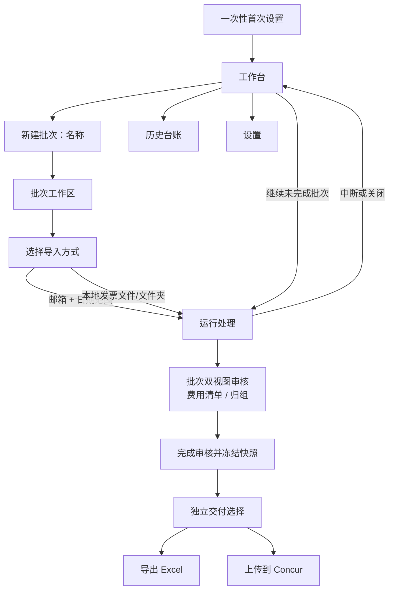

# Invoice Assistant 产品 UI 与用户交互设计

> **执行优先级说明（2026-09-03）：** 本文保留页面设计细节，但当前产品行为以 `specs/mvp-release-baseline/` 2.0 的 D23–D31 / R33–R40 为准。若本文仍出现三栏审核、批次创建时选择来源、费用/归组互相阻断、旧打印目录或验签任务等表述，均视为历史方案。

> 状态：MVP 设计基线
> 版本：v1.3（已对齐 MVP 2.0 优先级）
> 日期：2026-09-03
> 目标平台：Windows 免安装 Tauri / WebView2 本地端
> 适用范围：功能 MVP，以及发布后的账号与数据加密扩展
> 相关文档：`invoice-reimbursement-product-spec.md`、`docs/user-account-and-data-encryption-design.md`

## 1. 文档目的

本文件将产品定义、Windows 测试问题、功能缺口、用户输入要求以及账号/数据加密分阶段决策整理为统一的 UI 和交互基线。

设计目标不是展示技术流水线，而是让用户以最少判断完成以下任务：

1. 告诉产品发票从哪里来。
2. 启动一个报销批次并看到可靠进度。
3. 只处理系统无法确定的少量异常。
4. 完成审核后明确选择导出 Excel 或上传到 Concur。
5. 明确知道产品完成了什么，以及自己下一步要做什么。

功能 MVP 不引入注册、登录、余额、订阅和数据加密。邮箱授权码只在当前会话内使用；账号绑定、加密备份和跨设备恢复在功能发布稳定后增加。

## 2. DESIGN SPECIFICATION

### 2.1 Purpose Statement

产品面向每次处理 15 张以上差旅发票、需要使用 Concur 报销的个人用户。界面应把复杂的采集、解析、校验、归组、审核和输出压缩为一条可恢复的任务路径，并通过原件对照、金额合计和明确状态建立信任。

### 2.2 Aesthetic Direction

**Industrial / utilitarian：工业化财务工作台。**

视觉重点是精确、稳定、可审计，而不是装饰性氛围。采用账本、文件夹、工作台和检查标记的视觉语言；高密度区域保持秩序，低频设置区域保留足够留白。

### 2.3 Color Palette

| 用途 | 色值 | 使用范围 |
|---|---|---|
| 暖纸背景 | `#F3F0E8` | 应用主背景、原件检查区 |
| 深墨文字 | `#17211C` | 标题、正文、主要图标 |
| 松针主色 | `#136B52` | 主按钮、当前步骤、成功状态 |
| 提醒琥珀 | `#C47A16` | 待确认、疑似重复、需要决策 |
| 风险红 | `#B33A32` | 阻断错误、删除、校验失败 |
| 分隔线 | `#D6D1C5` | 表格、输入框、区域边界 |

颜色不是唯一状态载体；状态必须同时使用图标、文字或形状表达。

### 2.4 Typography

- 中文正文：`Source Han Sans SC`，随应用打包。
- 英文、金额和日期：`IBM Plex Sans`。
- 发票号、任务 ID、文件名：`IBM Plex Mono`。
- 页面标题 24px/32px，区块标题 18px/26px，正文 14px/22px，辅助文本 12px/18px。
- 金额使用等宽数字特性，避免列表中小数位跳动。

### 2.5 Layout Strategy

- 常驻 224px 左侧导航，主工作区占剩余宽度。
- 批次审核采用不对称三栏：行程树 240px、发票列表弹性宽度、原件检查器 380–460px。
- 右侧检查器只在需要查看原件或编辑字段时出现，其他页面让主内容向右延展。
- 不使用居中浮动大卡片作为主页面结构；首次设置采用左侧说明栏与右侧表单区。
- 主操作固定在内容区右上或底部操作栏，避免用户在长页面中寻找按钮。

### 2.6 Icon、Motion 与 Theme

- 图标统一使用 Lucide，线宽和尺寸保持一致，不使用 Emoji 作为产品图标。
- 页面切换 160ms，抽屉 180ms，状态变化 120ms；尊重“减少动态效果”系统设置。
- 进度动画只表示仍在工作，不用无法解释的循环动画掩盖停滞。
- MVP 只实现经过完整设计的浅色主题；不依赖浏览器自动切换深色模式。

## 3. 用户与核心任务

### 3.1 核心用户

- 每次报销 15–80 张差旅发票的 Concur 用户。
- 一个月使用一次，对产品操作记忆弱，需要每次进入都能快速恢复认知。
- 关注金额、重复报销、票据归组和最终输出，不关心 OCR、LLM、数据库等技术名词。
- 可能处于公司网络、IMAP 受限或无法安装额外运行时的 Windows 环境。

### 3.2 用户最关心的问题

用户在每个阶段需要立即得到一个答案：

| 阶段 | 用户问题 | UI 必须回答 |
|---|---|---|
| 开始 | 我该从哪里开始？ | 一个明确主按钮，以及未完成任务入口 |
| 配置 | 需要输入什么？ | 只显示当前来源所需字段，提供默认值 |
| 运行 | 软件是否还在工作？ | 当前阶段、已处理数量、最近一次进展 |
| 异常 | 我需要做什么？ | 问题原因、原件对照、推荐动作 |
| 审核 | 总金额和行程对吗？ | 原件、字段、分组、金额合计同时可见 |
| 输出 | 产品完成了什么？ | 文件、发送结果、风险和下一步 |

### 3.3 易用性原则

1. **批次是唯一核心对象**：流水线只是批次内部状态，不作为独立产品入口。
2. **异常驱动**：默认展示需要用户处理的内容，已确认项目保持可查但不抢占注意力。
3. **一步一个决定**：每个页面只有一个主操作，次要操作降低视觉权重。
4. **永不静默失败**：后台失败必须转化为明确状态和可执行动作。
5. **过程可恢复**：每个阶段完成后持久化；关闭应用不等于取消任务。
6. **技术语言隐藏**：界面不直接显示解析层级、协议状态码或模型置信度。
7. **危险操作可撤销**：移动、排除、批量编辑提供撤销；删除和覆盖需二次确认。
8. **先建批次，再导入数据**：新建批次只填写名称，创建时间由系统生成；日期范围、邮箱、本地文件和输出选项属于批次内的具体任务，不进入创建表单。

## 4. MVP 范围与阶段边界

### 4.1 功能 MVP 包含

- 本地单用户设置，不注册、不登录。
- 邮箱导入，以及本地发票文件/文件夹导入入口；本地UI不提供`.eml`导入。
- 邮箱授权码按会话输入，不持久化。
- 采集、解析、校验、去重、归组、审核、输出完整流程。
- 低置信票据人工补录、拖动改组、金额对账。
- Excel、Concur CSV、打印合订本和标准目录。
- 用户确认后的“上传到Concur”：创建报销单草稿、创建并填写费用、上传且关联对应发票、回读核对。
- Concur 邮件收单的一张试发与批量发送，作为直接草稿上传不可用时的兼容路径。
- 批次检查点、失败重试、中断继续。
- 历史台账和重复报销结果展示。
- 数据本地保存和未加密状态的准确告知。
- 签名的 Windows x64 免安装 ZIP；普通用户解压后直接运行，程序与数据目录分离。

### 4.2 功能 MVP 不包含

- 注册、登录、余额、充值、订阅和自动计费。
- 邮箱授权码自动保存。
- 账号匹配的加密备份、跨设备恢复和云同步。
- 设备管理、恢复码和密钥轮换。
- Concur 最终提交、审批、付款和公司报销限额处理。
- 无人值守、后台隐藏或绕过用户确认的Concur自动化。
- 未经目标租户授权或验证的通用Concur适配承诺。

### 4.3 发布后扩展

- 产品账号、MFA 和设备列表。
- 本地档案绑定产品用户。
- 数据加密迁移、加密备份和跨电脑恢复。
- 账号托管备份与私密备份。
- 余额、订阅、充值和开票。

## 5. 信息架构

### 5.1 常驻导航

应用只保留四个常驻页面：

| 导航 | 作用 | 默认内容 |
|---|---|---|
| 工作台 | 今天应该做什么 | 继续任务、新建批次、最近批次 |
| 报销批次 | 查询和管理历史任务 | 按创建时间排序的批次列表 |
| 历史台账 | 查看已处理发票和重复依据 | 搜索、筛选、重复记录 |
| 设置 | 修改本地资料和处理规则 | 报销资料、采集、Concur、归组、数据 |

MVP 左侧导航底部显示：

```text
本地模式
数据保存在此电脑
```

发布账号版本后，这里替换为账号、设备和备份状态。

### 5.2 页面层级



“创建、导入、运行、审核、交付”属于同一个任务链，但对象边界清晰：创建只负责生成批次，导入才选择邮箱日期范围或本地文件；批次内只保留费用清单和归组；交付是完成审核后的独立页面，不是批次标签。

## 6. 端到端用户流程

### 6.1 首次使用主流程


目标：除邮箱服务商外部操作外，首次设置在 3 分钟内完成。

### 6.2 月度使用主流程


### 6.3 中断恢复流程

```text
应用重新启动
→ 工作台顶部出现“上次批次在【归组】阶段中断”
→ 主按钮“继续处理”
→ 次按钮“查看批次”
→ 用户主动选择后才提供“放弃批次”
```

## 7. 首次设置设计

首次设置是一次性三步流程，采用左侧固定说明栏、右侧表单区。左侧显示当前步骤、预计时间和隐私说明；右侧只放当前步骤所需字段。

### 7.1 步骤 1：使用方式与报销资料

字段：

| 字段 | 要求 | 默认/校验 |
|---|---|---|
| 使用模式 | 必选 | Concur 模式、纯本地模式 |
| 报销人姓名 | 必填 | 2–40 字符 |
| 常驻城市 | 必填 | 支持搜索和多个城市，至少一个 |
| 公司发票抬头 | 必填 | 去除首尾空格 |
| 纳税人识别号 | 必填 | 保留原始大小写，格式提示不强行改写 |

交互：

- 初次默认选择 Concur 模式，并说明软件可在发票整理完成后创建和填写未提交草稿、关联发票；最终提交仍由用户本人完成。
- 选择纯本地模式后，隐藏所有 Concur 输入。
- 常驻城市使用可搜索标签输入，不用自由文本加逗号。
- 点击“下一步”后统一校验；第一个错误字段获得焦点。
- 已填内容在步骤间保留，关闭向导前提示是否保留草稿。

### 7.2 步骤 2：选择发票来源

提供两个同等可见的入口：

#### 邮箱自动获取

- 邮箱地址。
- 邮箱服务商，自动识别；无法识别时显示高级设置。
- 应用专用密码/授权码，密码型输入，可切换显示。
- 高级设置：IMAP 主机、端口、TLS；Concur 发送时增加 SMTP 配置。
- 明确提示：“授权码只在本次运行期间使用，关闭应用后不会保存。”

按钮：

- 主按钮“测试并继续”。
- 次按钮“查看获取授权码教程”。
- 文本操作“改用文件导入”。

连接测试状态：

| 状态 | 呈现 |
|---|---|
| 未测试 | 主按钮可用，下一步不可用 |
| 测试中 | 按钮显示进度，输入暂时锁定，可取消 |
| 成功 | 显示已连接邮箱和可访问文件夹数量 |
| 密码错误 | 说明需要应用专用密码，并保留邮箱地址 |
| 公司策略阻止 | 建议联系 IT 或切换文件导入 |
| 网络错误 | 保留输入，提供重试，不判定密码错误 |

任何邮箱字段变化都会使“测试成功”状态失效。

#### 文件导入

- “选择发票文件夹”。
- “稍后在批次中选择”。
- 支持格式说明：XML、OFD、PDF、JPG、JPEG、PNG、TIFF；可以同时选择主发票、行程单和消费明细。
- 说明文件导入不是降级路径，后续解析、归组和输出能力完全一致。

### 7.3 步骤 3：确认并开始

完成页不使用笼统的“准备就绪”，而是按实际配置显示：

```text
报销资料已保存到此电脑
常驻城市：北京、上海
采集方式：邮箱，本次会话已连接
使用模式：Concur 草稿上传（收据邮件可作为兼容路径）

授权码不会保存；关闭应用后需要重新输入。
```

主按钮：“开始第一个批次”。
次按钮：“先进入工作台”。

如果用户未测试邮箱，只能显示“邮箱尚未连接”，不能显示全部完成。

## 8. 工作台设计

工作台帮助低频用户立即知道下一步，不用理解应用模块。

### 8.1 布局

```text
┌────────导航────────┬──────────────────────────────────────────┐
│ 工作台             │  2026 年 8 月报销                         │
│ 报销批次           │  [新建批次]                               │
│ 历史台账           │                                          │
│ 设置               │  ┌ 未完成任务 / 本月摘要 ─────────────┐ │
│                    │  │ 上次停在归组 · 42/52 张 [继续处理] │ │
│                    │  └────────────────────────────────────┘ │
│ 本地模式           │                                          │
│ 数据在此电脑       │  最近批次                                │
└────────────────────┴──────────────────────────────────────────┘
```

### 8.2 内容优先级

1. 未完成批次，有则占据首屏最高优先级。
2. “新建批次”主操作。
3. 本月待处理、需要确认、台账覆盖数量。
4. 最近 5 个批次。
5. 累计价值：处理张数、避免重复金额、节省时间估算。

### 8.3 空状态

首次无批次时：

```text
还没有报销批次
先创建一个批次，再在批次内从邮箱或本地文件导入发票。

[新建第一个批次]  [查看 2 分钟说明]
```

不展示空表格。创建成功后直接进入该批次的空状态，明确展示“邮箱批量导入”和“本地文件导入”，不要求用户再去另一个主导航寻找获取入口。

## 9. 批次工作区设计

批次工作区是一个持久路由，内部根据状态展示空状态、导入配置、运行或审核。审核阶段的一级视图固定为`费用清单`和`归组`，不包含输出、Concur或记录标签。顶部批次栏始终显示：批次名称、创建时间、状态、发票数量、总金额和自动保存时间。数据日期范围在导入后作为内容摘要展示，不作为批次创建字段。用户完成审核后离开批次路由，进入关联该批次的独立交付选择。

### 9.1 状态模型

```text
草稿
→ 前置检查
→ 采集
→ 解析
→ 校验与去重
→ 行程归组
→ 待审核
→ 已审核（存在有效审核快照）

任一运行阶段可进入：已暂停 / 失败 / 已取消

交付任务独立记录：Excel导出 / Concur上传 / 兼容收据邮件
每个交付任务可进入：未开始 / 进行中 / 部分失败 / 成功 / 需要确认
```

批次处理状态、审核快照状态和交付任务状态分别持久化，不能用一个“已完成”混合表达。修改影响费用、计入状态、归组或附件的本地数据后，批次回到待审核，旧快照标记为失效；已有交付历史保留。

### 9.2 新建批次与数据导入

新建批次表单只包含：

| 字段 | 规则 | 交互 |
|---|---|---|
| 批次名称 | 唯一用户输入项 | 必填，最长100字 |
| 创建时间 | 点击创建时由系统记录 | 只读，不显示输入控件 |

创建成功后立即进入批次空状态，不启动处理任务。批次空状态提供：

```text
这个批次还没有发票

[邮箱批量导入]  按日期范围从已配置邮箱只读获取
[本地文件导入]  选择发票文件或包含发票的文件夹
```

选择邮箱批量导入后才显示：

| 字段 | 默认值 | 交互 |
|---|---|---|
| 邮箱账号 | 上次成功账号 | 可切换已配置账号 |
| 开始日期 | 上次日期范围或当前月第一天 | Date Picker |
| 结束日期 | 上次日期范围或当天/当月末 | Date Picker |
| 运行方式 | 正式运行 | 高级选项，可切换试运行 |

日期范围是本次邮箱导入任务的参数，不写成批次属性。同一批次可以执行多次邮箱导入，每次保存自己的日期范围、执行状态和结果统计。

邮箱来源但当前无凭据会话时，在本页打开窄幅凭据面板：

- 显示已保存的邮箱地址。
- 只要求再次输入授权码。
- 成功后立即关闭面板并进入前置检查。
- 不提供“记住密码”选项。

选择本地文件导入后打开文件/文件夹选择器，不显示邮箱和日期范围。支持 PDF、OFD、XML、图片和包含这些票据的文件夹；同一批次允许多次本地导入。`.eml` 只可作为邮箱采集内部解析格式或历史兼容能力，不出现在本地文件选择器、拖放提示和正式支持文案中。

导入预览按“发票单”而不是按文件展示：

```text
预计形成 12 个发票单
主发票 12份 · 已挂载行程单 3份 · 已挂载明细 5份
待选择归属材料 2份 · 疑似重复 1份（默认不计入）
```

行程单、消费明细和其他配套材料必须挂载到一个主发票单；无法自动判断归属时进入“待挂载材料”，不独立形成费用或金额。

每次导入都必须：

- 关联当前 `batch_id`，不能新建另一个批次；
- 保存来源类型、任务开始时间、任务结束时间、状态、成功数、忽略数和失败数；邮箱导入另存搜索日期范围；
- 对新数据执行批内和历史去重；
- 中断后从当前批次恢复；
- 已有数据时通过“继续导入”进入，不清空原有费用和审核结果。

启动前摘要：邮箱导入显示账号和搜索范围；本地导入显示文件/文件夹数量。输出位置不属于导入步骤。

主按钮：“开始导入”。
次按钮：“取消并返回批次”。

### 9.3 运行状态

```text
┌────阶段轨道────┬────────当前工作─────────────┬────批次摘要────┐
│ 采集       完成 │ 正在检查发票是否重复         │ 已发现 52      │
│ 解析       完成 │                              │ 已解析 48      │
│ 校验       进行 │ 48 / 52                      │ 待确认 3       │
│ 归组       等待 │ 最近更新：10:42:18           │ 重复 1         │
│ 审核       等待 │                              │ 失败 0         │
│ 审核       等待 │ [停止并保留进度]             │                │
└────────────────┴──────────────────────────────┴────────────────┘
```

交互要求：

- 事件监听在任务启动前完成，并通过 `pipeline_id` 关联。
- 页面进入时主动查询持久化状态，不能只依赖实时事件。
- 进度同时显示阶段、数量和最近更新时间，不能只有百分比。
- 处理超过预期时间时显示“仍在处理第 18/52 张”，不自动判定失败。
- 30 秒没有状态变化时主动查询后端任务；确认失败后再切换错误状态。
- “停止并保留进度”完成当前安全点后暂停，不删除已处理内容。
- 用户离开页面时任务继续；导航和工作台显示运行状态。

### 9.4 失败状态

错误显示在发生问题的阶段原位，不使用系统原生警告框。

| 场景 | 用户文案 | 主操作 | 次操作 |
|---|---|---|---|
| 授权码错误 | 邮箱没有接受这个授权码，请确认使用的是应用专用密码 | 重新输入 | 改用文件导入 |
| 无邮箱账号 | 还没有选择采集邮箱 | 选择邮箱 | 改用文件导入 |
| 文件损坏 | 3 个文件无法读取，其他 49 个已保留 | 查看文件 | 忽略并继续 |
| 磁盘空间不足 | 还需要约 1.2 GB 空间才能生成输出 | 更改输出目录 | 稍后继续 |
| 模型超时 | 行程判断暂时没有完成，已保留现有结果 | 重试此阶段 | 进入手工审核 |
| 应用异常退出 | 上次处理在归组阶段中断 | 继续处理 | 查看批次 |

错误信息结构固定为：发生了什么、已保存什么、用户可以做什么。

### 9.5 批次双视图

```text
← 报销批次
2026年6月报销 · 待审核 · 22张 · CNY 8,320.08

[费用清单] [归组]
```

- `费用清单`是默认视图，包含表格、问题筛选、重复、待挂载材料、单条费用核对和操作记录检查器；
- `归组`包含明确行程组、市内消费、待归组、拆分、合并和形成依据；
- 两个视图共享计入金额、重复未计入、阻断数和“完成审核”底栏；
- 审核期间不显示Excel、Concur档案、上传、输出包或独立“记录”一级入口；
- 从交付页返回时恢复离开前的视图、筛选、滚动位置和选中项。

## 10. 审核工作台设计

审核是唯一主要人工卡点，目标是典型 50 张批次在 5 分钟内完成确认。

### 10.1 三栏布局

```text
┌────行程与异常────┬────────发票列表────────────┬────原件与字段────┐
│ 待确认        3  │ □ 7/03 高铁   ¥553.00      │ [原始 PDF/图片]  │
│ 重复          1  │ □ 7/03 出租车  ¥68.00      │                  │
│ 上海 7/03–7/05  │ □ 7/04 酒店   ¥1,280.00    │ 日期  2026-07-04 │
│ 深圳 7/15–7/19  │                              │ 金额  1280.00    │
│ 市内消费      8  │                              │ 税额  72.45      │
│ 已排除        2  │                              │ [保存并下一张]   │
├─────────────────┴──────────────────────────────┴─────────────────┤
│ 计入 49 张 ¥8,234.00 · 重复未计入 3 张 ¥806.00 [完成审核] │
└──────────────────────────────────────────────────────────────────┘
```

### 10.2 默认排序

1. 阻断问题：关键金额、日期、发票号码不确定。
2. 疑似重复和规则冲突。
3. 行程归组歧义。
4. 单张超过提醒阈值。
5. 已自动通过项目。

用户进入审核时默认选中第一个未解决问题，而不是列表第一张发票。

### 10.3 发票操作

- 单击选中一个发票单，并显示主发票及其行程单、明细等配套文件标签。
- 双击或按 Enter 进入字段编辑。
- 多选后批量移动到另一行程。
- 拖动发票到行程树完成改组；必须同时提供“移动到”菜单作为键盘替代。
- 支持拆分行程、合并行程、排除发票、恢复排除。
- 每次移动、排除和字段编辑后出现 8 秒撤销条。
- 未保存编辑切换发票时，自动保存合法内容；非法内容阻止切换并定位字段。
- 配套材料随所属发票单一起移动到行程组，不允许把行程单或明细拖成一笔独立费用。

### 10.4 单条费用信息（稳定本地模型）

单条费用核对左侧不展示Concur表单，而展示软件定义、跨公司稳定的费用信息：

```text
费用信息
费用分类        餐饮
实际发生日期    2026-06-25
费用说明        邮件KA拜访期间用餐
交易对方        武汉某餐饮企业
发生地点        湖北省武汉市
付款方式        未知
实际金额        CNY 126.00
票面税项        13% / CNY 14.49
关联行程        北京→武汉 6/24–6/26
计入状态        已计入
```

- 标签使用软件领域术语，不使用Concur费用类型、City of Purchase、VAT选项或企业自定义字段名称；
- 每个字段显示来源和确认状态：票面、配套材料、行程推导、软件默认、用户输入或人工修改；
- 费用分类使用软件内部稳定分类，不能存储某个企业的Concur选项ID；
- 实际发生日期与开票日期分开；票面税项不等于某租户的可抵扣VAT；
- 单条费用完成规则由软件定义，不随目标租户的必填字段变化。

右侧仍显示同一发票单的主发票、行程单、明细和其他材料。发票号码、开票日期、购销方税号等放在“票据信息”，不混入费用字段。

### 10.5 纸票紧凑录入

- 左侧保持原图，右侧仅显示日期、金额、税额、税率、票种。
- `Tab` 移动到下一字段，`Shift+Tab` 返回。
- `Enter` 保存并跳到下一张待录入票。
- 金额与税额输入即时格式化，但不在用户输入过程中改写光标位置。
- 原图支持滚轮缩放、拖动和平铺适宽。

### 10.6 金额对账与阻断

底部操作栏始终显示：

- 发票总数。
- 已计入张数和申报总额。
- 各行程小计入口。
- 疑似/确认重复未计入张数和金额。
- 其他排除金额。
- 未解决问题数。

存在以下任一情况时，“完成审核”禁用，并在按钮旁说明原因：

- 关键字段为空或格式非法。
- 同一发票出现在两个行程。
- 金额合计校验失败。
- 原始文件缺失。

疑似重复尚未决定不阻断完成审核，但该候选必须保持“未计入总额/后续不交付”。用户只有点击“不是重复，计入总额”后，系统才更新总额和后续交付费用数；“暂不决定”和关闭页面都不能自动计入。

### 10.7 发票单与配套材料

每个列表行代表一个发票单，而不是一个文件。右侧查看器使用同一组标签：

```text
[主发票] [行程单 1] [消费明细 2] [其他材料 1] [来源副本 1]
```

- 主发票提供票面事实并默认产生一个稳定本地费用项；
- 行程单和明细可以补充日期、路线、服务项目等字段；
- 配套材料不增加发票张数、费用条目或申报金额；
- 待挂载材料显示“选择所属发票单”，完成前不能作为费用输出。

### 10.8 明确行程组

行程页先显示“用于建立行程的锚点发票单”，再显示“建议归入的其他发票单”：

```text
北京 → 武汉 · 2026-06-24 至 2026-06-26
建组依据：北京—武汉铁路票 + 已挂载行程单

已归入：铁路票、酒店
建议归入：餐饮2张、出租车3张
待确认：1张异地餐饮
```

没有铁路、航空、行程单等明确锚点时，不自动生成差旅行程。酒店、餐饮和出租车只能归入已经成立的行程组；匹配不明确时保持待归组。

## 11. 审核完成与独立交付设计

### 11.1 完成审核与快照

阻断项清零后，批次底栏的“完成审核”可用。用户点击后，系统冻结当前费用项、发票单、计入状态、归组、附件和金额摘要，生成带版本的 `ReviewSnapshot`，再进入独立交付选择。交付页顶部显示实际成果：

```text
52 张发票 → 3 趟行程 · 合计 ¥8,234.00
拦截 1 张重复：6 月已报的 G13，¥553.00
已对照 3 个月历史台账，共 147 张发票
```

不能只显示“处理完成”。如果用户返回批次修改本地数据，旧快照立即标记“已失效”，新交付按钮禁用，直至重新完成审核；历史Excel或Concur结果仍可查看但明确标识其快照版本。

### 11.2 交付选择

```text
选择交付方式

[导出 Excel]
使用本地稳定字段生成报销明细，不需要Concur配置

[上传到 Concur]
选择企业档案，检查字段映射，创建未提交草稿并关联发票
```

两项在当前页面视觉同级；用户选择其一进入对应任务，但不是永久互斥。完成一种后可返回此页执行另一种，两种任务共享同一个有效审核快照、分别使用幂等键。

### 11.3 Excel导出

Excel入口先显示文件名、保存位置、计入费用数、实际总金额、重复未计入数和审核快照时间。它只使用本地稳定字段，不读取Concur企业档案、映射或登录状态。生成成功后提供“打开Excel”“打开所在文件夹”“返回交付选择”。同名文件不得静默覆盖。

CSV、打印合订本和标准目录如保留，只作为Excel导出页的次级附加格式：

每种输出作为一行，包含状态、大小和动作：

| 输出 | 操作 |
|---|---|
| 分类目录 | 打开文件夹 |
| 报销汇总表.xlsx | 打开、另存为 |
| 费用明细.csv（可选） | 打开、另存为 |
| 打印合订本.pdf | 预览、打印、打开目录 |
| 原始件目录 | 打开文件夹 |

生成失败的单个输出可单独重试，不要求整个批次重跑。

### 11.4 上传到 Concur

该功能只在完成审核后的独立交付选择出现，不属于“新建批次”，也不属于批次双视图。入口显示：

```text
上传到 Concur
将创建：1 个报销单草稿 · 22 笔费用 · 22 个发票附件
实际金额合计：CNY 8,320.08
```

页面分为四个区域：

1. **上传前检查**：选择目标租户和映射档案后，展示映射版本、内部字段→目标字段预览、目标必填缺口、本次上传补充值、计入状态与总额对账、归组确认、原件可读和当前登录会话；疑似/确认重复保持“本次不上传”，不要求为了继续上传而强制作出重复结论；
2. **报销单草稿**：名称默认使用本地批次名称，报销单日期建议后由用户确认，备注可选；
3. **映射后的费用与附件预览**：逐项显示本地费用分类、目标费用类型、实际发生日期、交易对方、发生地点、实际金额、映射状态和将关联的原文件；
4. **执行结果**：创建报销单、创建费用、填写字段、上传并关联附件、回读核对的阶段状态。

如果缺少的是本地事实，入口返回“单条费用核对”；如果缺少的是成本中心、项目号等Concur专用字段，用户只在上传页补充或更新企业映射档案。外部补充值不得写回本地费用项，目标映射不完整也不得阻断Excel/CSV/PDF等本地输出。

主按钮为“创建草稿并上传”。点击前二次确认目标租户、费用数和实际总金额。执行中不允许再次启动新的上传会话；关闭页面或应用后可恢复原会话。

每笔费用必须有独立结果：

- `未开始`；
- `费用已创建`；
- `字段已填写`；
- `发票已关联`；
- `需要确认`；
- `失败，可重试`。

重试只处理失败步骤，成功的报销单、费用和附件不得重复创建。全部成功后的主按钮变为“在 Concur 中打开并检查”；Concur 中保持未提交草稿，由用户处理公司规则并最终提交。

每次上传保存本地费用项revision、映射档案/规则版本、本次上传补充值和最终目标值快照。更换公司或Concur租户时只重新生成目标投影，本地费用字段、审核状态和本地输出保持不变。

### 11.5 Concur 邮件收单（兼容路径）

首次使用必须经过试发：

1. 选择一张代表性发票。
2. 显示发件邮箱、收件地址、文件名和大小。
3. 用户点击“发送一张测试收据”。
4. 提示用户到 Concur 检查结果。
5. 用户选择“只进入收据库”或“自动生成了费用条目”，系统据此记录该租户行为。
6. 记录租户特性后，才允许“发送剩余 51 张”。

批量发送显示成功、待重试、失败数量。失败项保留结构化文件名，可逐项或批量重试，不能重复发送已成功项。

该路径只解决收据进入Concur的问题，不宣称已经创建、填写或关联指定费用。

### 11.6 下一步指引

完成页底部根据模式给出明确下一步：

Concur 模式：

```text
1. 打开软件已创建的 Concur 报销单草稿。
2. 核对费用字段和每笔费用对应的发票。
3. 按公司规定调整限额、税务或其他企业字段。
4. 核对总额后由您本人提交。
```

若使用了兼容的收据邮件路径，则改为提示用户在Concur中手工新建报销单、填写费用并从Available Receipts关联收据，不能沿用“草稿已创建”的成功文案。

纯本地模式：

```text
1. 打开报销汇总表确认软件内部费用分类。
2. 打印合订本并按页码顺序装订。
3. 在公司报销系统中录入并提交。
```

## 12. 报销批次页面

批次页面用于查询，不承担复杂编辑。

### 12.1 列表字段

- 批次名称。
- 创建时间；导入后可显示票据日期覆盖范围摘要。
- 状态。
- 发票数量。
- 总金额。
- 需要确认数量。
- 最后更新时间，以本地时间显示。

### 12.2 操作

- 点击整行打开批次工作区，不使用 400px 侧边详情面板。
- 草稿：继续配置、删除。
- 运行中：查看进度、停止并保留。
- 待审核：继续审核。
- 失败：查看原因、从失败阶段重试。
- 已审核：进入交付选择；如有进行中或已完成交付，显示其独立状态。

删除只允许草稿或明确允许删除的失败批次；删除前显示将删除的文件和记录数量。

## 13. 历史台账页面

台账是长期价值入口，不只是技术数据库视图。

### 13.1 功能

- 按发票号码、日期、金额、票种、报销人搜索。
- 按月份、行程、批次和重复状态筛选。
- 显示该发票在哪个批次、何时报销、是否被重复命中。
- 点击记录打开只读详情和原件。
- 显示“已覆盖多少个月、多少张发票”的价值摘要。

### 13.2 MVP 数据操作

- 允许导出可读台账 CSV，并提示可能包含敏感信息。
- 不提供“安全备份”或“跨设备恢复”入口。
- 如果提供临时迁移包，必须标记为未加密且排除邮箱授权码。

发布账号与加密版本后，再增加加密备份、账号匹配导入和冲突预览。

## 14. 设置页面

设置使用左侧二级导航，不把所有配置堆在一个长表单中。

### 14.1 MVP 分组

| 分组 | 内容 |
|---|---|
| 报销资料 | 报销人、常驻城市、抬头、税号、大额阈值 |
| 发票采集 | 邮箱地址、IMAP/SMTP 元数据、文件导入默认目录 |
| Concur | 模式、验证邮箱、试发状态、费用类型映射 |
| 归组规则 | 休息日、机场/车站关键词、酒店关键词 |
| 数据与隐私 | 本地数据目录、占用空间、清理临时文件、遥测开关 |
| 本机与版本 | 免安装版本/架构、程序位置、数据位置、WebView2 状态、更新与回退 |

邮箱设置页不能显示已保存密码。状态应为：

```text
邮箱配置已保存
授权码：未保存，将在下次采集时询问
```

“休息日定义”使用 `fieldset + legend`；切换按钮提供 `aria-pressed`。

### 14.2 保存行为

- 普通设置离开输入框后不自动持久化，页面底部显示“保存更改”。
- 保存成功使用短暂状态提示，不用阻塞弹窗。
- 存在未保存内容时离开页面，显示保留/放弃确认。
- 对归组结果有影响的设置说明“仅影响新批次”或提供重新归组选项。

### 14.3 发布后新增分组

- 账号与登录。
- 设备管理。
- 数据加密状态。
- 备份与恢复。
- 恢复码和密钥轮换。
- 余额、订阅和账单。

这些入口在 MVP 中完全隐藏，不显示不可用占位项。

## 15. 状态反馈规范

### 15.1 页面状态

每个数据页面必须具备：

- 初始加载。
- 空状态。
- 正常内容。
- 部分失败。
- 完全失败。
- 无权限或文件不可访问。
- 离线或外部服务不可用。

### 15.2 提示层级

| 组件 | 使用场景 | 不用于 |
|---|---|---|
| 字段错误 | 输入格式、必填项 | 系统故障 |
| 页面内提示条 | 可恢复错误、数据风险 | 普通成功提示 |
| Toast | 保存成功、文件已生成 | 关键错误、需要决策 |
| 对话框 | 删除、覆盖、放弃未保存内容 | 普通信息展示 |
| 右侧检查器 | 原件、字段和详细原因 | 全局导航 |

### 15.3 用户语言

| 不使用 | 使用 |
|---|---|
| OCR 置信度 0.72 | 这张票的金额没有看清，请确认 |
| L2 解析失败 | 这是图片发票，需要您补充几个字段 |
| IMAP 535 | 邮箱没有接受这个授权码，请使用应用专用密码 |
| AEAD 解密失败 | 当前版本无法读取已保存授权信息，请重新输入 |
| Pipeline preflight error | 开始处理前发现邮箱尚未连接 |

## 16. 通用交互规范

### 16.1 按钮

- 一个执行型视图最多一个高强调主按钮；交付选择可显示两个等权入口卡片，但两者都不使用更高的默认强调。
- 主按钮使用动词加对象，如“开始处理”“完成审核”“导出Excel”。
- 进行中按钮显示动作状态并禁用重复提交。
- 删除使用风险色，并说明影响范围。
- 禁用按钮旁必须说明禁用原因，不能只有降低透明度。

### 16.2 表单

- 标签永远可见，不用 placeholder 代替标签。
- 用户离开字段后做轻量校验，提交时做完整校验。
- 服务端错误绑定到相关字段或页面提示条。
- 密码型输入默认隐藏，允许按住或点击查看。
- 金额、日期、税率分别使用适合的输入控件。
- 日期统一显示用户本地时区，接口使用带时区的标准格式。

### 16.3 表格与列表

- 整行可点击时提供清晰悬停和键盘焦点。
- 表头在滚动时固定。
- 金额右对齐，日期和状态保持稳定列宽。
- 100 张以上使用虚拟列表或分段渲染。
- 筛选条件离开页面后在当前会话保留。

### 16.4 文件交互

- 文件拖入区同时支持点击选择。
- 拖入后先预览数量、格式、重复项，再开始复制或解析。
- 文件路径显示末级目录，完整路径放在提示或复制操作中。
- 所有输出提供“打开文件”和“打开所在文件夹”。

## 17. 键盘与无障碍

- 所有功能可用键盘完成，包括选择行程、移动发票和保存字段。
- 焦点顺序与视觉顺序一致，焦点环清晰可见。
- 可点击区域最小 40×40px，主要操作建议 44px 高。
- 表单错误通过 `aria-describedby` 关联字段。
- 进度使用可访问状态区域，但限制播报频率，避免每个百分比都打断用户。
- 拖拽操作必须提供菜单替代。
- 图标按钮必须有可访问名称。
- 在 Windows 125% 和 150% 缩放下不得遮挡主操作。
- 支持“减少动态效果”和高对比度模式。

## 18. Windows/Tauri 实现约束

- 建议最小窗口 1100×720；低于宽度时右侧检查器覆盖主区，而不是压缩到不可用。
- 文件选择、打开目录、拖放必须使用 Tauri 提供的本地能力，不能依赖浏览器伪路径。
- 前端监听任务事件前先获得或生成任务 ID，并在启动前完成订阅。
- 所有任务状态同时写入后端持久化存储；页面重载通过查询恢复。
- 不使用系统原生 `alert`、`confirm` 承担主要错误和业务确认。
- 不让操作系统主题自动改变未设计的控件颜色。
- 敏感输入不进入浏览器持久化存储、调试日志或错误对象。
- TypeScript 边界数据使用明确类型和运行时校验，不用宽泛类型绕过错误。

### 18.1 免安装本地版发行与交互

Windows 首发主形态为签名免安装 ZIP，MSI/NSIS 降为 IT 或个人电脑可选交付。免安装版不写安装注册表项、不创建服务/驱动、不设置开机启动和文件关联，也不请求管理员权限。

程序目录与用户数据严格分离：

- 程序目录只放可替换的 EXE 和静态运行资源。
- 默认数据目录为 `%LOCALAPPDATA%\InvoiceAssistant\Data`。
- 导出目录由用户单独选择，不与数据库目录绑定。
- SQLite 数据库不允许直接运行在 UNC、NAS 或多人共享目录；同步盘需要明确警告并建议迁移到本机目录。
- 更新时替换程序目录，不修改或删除数据目录。

首次运行在业务设置向导之前增加“本机准备”步骤。正常检查应快速自动通过，只在需要用户决定时停留：

1. 检查 WebView2；缺失时由原生窗口显示官方安装方式、企业离线说明和退出操作，不静默安装或提权。
2. 显示数据保存位置，可选择其他本机目录，并说明“程序更新不会删除此处数据”。
3. 说明数据本地处理、MVP 数据库未做应用层加密、邮箱授权码只在本次运行内存中使用。

设置的“本机与版本”页显示版本/架构、程序目录、数据目录、WebView2 版本、隐私状态和更新状态。“迁移数据”不是普通路径编辑：必须停止任务、创建快照、复制校验、切换目录并保留旧目录。

MVP 更新采用人工可回退流程：提示新版本与官方下载入口，用户退出应用、解压新程序目录后启动；首次打开旧数据库前创建快照并执行版本化迁移。产品不得把“免安装”表述为能够绕过 AppLocker、WDAC、Smart App Control 或企业网络策略。若进程启动前被阻止，应用内无法处理，应通过用户说明和 IT 审核包解决。

详细发布需求、架构和任务见 `specs/windows-portable-local-release/`。

## 19. 发布后账号与加密交互

该部分不进入功能 MVP，但需要保证未来能自然接入现有信息架构。

### 19.1 首次账号绑定

入口位于设置的“账号与数据”页面：

```text
创建或登录账号
→ 说明将绑定的本地数据范围
→ 检查磁盘空间和数据库完整性
→ 创建迁移前快照
→ 加密数据
→ 校验
→ 生成恢复码
→ 完成并显示设备名称
```

迁移进度必须显示阶段和可恢复状态。中断后继续迁移，不能从头覆盖。

### 19.2 新电脑恢复

```text
登录同一账号
→ 选择备份
→ 验证账号归属
→ 输入恢复凭证或完成设备授权
→ 校验备份
→ 预览新增、重复、冲突
→ 导入
→ 重新验证邮箱授权
```

错误账号应在解密和写入前阻止继续。任何校验失败不得修改现有数据。

### 19.3 数据安全状态

设置页显示准确状态：

- 本地未加密。
- 正在迁移。
- 已加密，最近验证时间。
- 需要恢复密钥。
- 备份过期或失败。

不使用模糊的“安全”状态替代具体事实。

## 20. 当前 UI 到目标 UI 的改造映射

| 当前实现 | 目标设计 |
|---|---|
| 顶部“批次管理/流水线/设置”导航 | 左侧“工作台/报销批次/历史台账/设置” |
| 批次和流水线是两个入口，流水线会生成新批次 | 先创建批次，再在该批次内执行邮箱或本地导入；导入只增加当前批次数据 |
| 本地文件入口允许EML | 本地只选择发票/配套票据文件或文件夹；EML不作为用户导入对象 |
| 主发票、行程单和明细分散展示 | 聚合为一个发票单和一笔费用，配套材料以标签挂载 |
| 疑似重复仍可能进入批次总额 | 疑似/确认重复明确未计入，用户确认非重复后才恢复计入 |
| 所有票据同时模糊归组 | 先用强证据建立明确行程组，再建议其他发票归入 |
| 单条核对直接规划Concur填报字段 | 只核对稳定本地费用字段；Concur在上传页按企业档案映射 |
| 首次向导要求并保存邮箱密码 | 授权码按会话输入，不持久化 |
| 首次向导可不测试连接就完成 | 邮箱字段变化使测试失效；未连接只能标记待配置 |
| 批次详情使用窄侧边栏 | 复杂任务进入全宽批次工作区 |
| 运行只显示百分比 | 阶段、数量、最近进展、暂停和恢复 |
| 前置失败卡在 0% | 阶段原位错误、重试、转设置或切换来源 |
| 审核阶段自动通过 | 低置信和规则冲突进入三栏审核工作台 |
| 输出只有基本 Excel/PDF | 目录、Excel、CSV、合订本、原件、Concur草稿创建/填表/发票关联及收据邮件兼容路径 |
| 原生警告框和确认框 | 页面内状态、受控对话框和撤销条 |
| 分散硬编码颜色与图标 | 统一设计令牌和 Lucide 图标 |

## 21. 验收标准

### 21.1 首次设置

- 新用户无需账号即可进入产品并完成本地设置。
- 选择文件导入时无需输入任何邮箱信息。
- 邮箱未测试成功时不能显示“全部准备完成”。
- 授权码字段旁明确显示不保存策略。
- 修改邮箱或授权码后，旧连接成功状态立即失效。

### 21.2 批次运行

- 用户可以从工作台用一个主操作新建批次，创建表单只包含批次名称。
- 创建时间由系统生成；月份、日期范围和来源不进入创建表单。
- 邮箱日期范围只属于一次邮箱导入任务，本地文件导入不显示日期范围。
- 本地文件选择器、拖放区和帮助文案均不出现EML，只接受发票及配套票据文件/文件夹。
- 同一批次允许多次邮箱和本地导入，导入不会生成另一个批次。
- 无账号、授权失败、凭据缺失时 1 秒内显示可操作错误。
- 后端任务失败后 UI 不得继续显示运行中或停在 0%。
- 应用重启后可以发现并继续未完成批次。

### 21.3 审核

- 用户能在一个屏幕内看到行程、发票、原件和字段。
- 单条核对只显示软件定义的费用信息、票据信息和问题依据，不出现Concur选项ID、目标字段名称或目标必填标记。
- 软件本地费用字段在切换Concur租户/映射档案前后保持不变。
- 主发票、行程单、消费明细和其他配套材料只形成一个发票单；未挂载材料不形成费用。
- 疑似和确认重复默认不计入总额；只有用户明确选择“不是重复，计入总额”才恢复计入。
- 行程组有明确锚点、日期和城市链；其他发票只能归入已形成的行程组或保持待确认。
- 所有拖动操作有键盘菜单替代。
- 未解决阻断问题时不能生成最终输出。
- 典型 50 张批次、3–8 个异常的人工审核目标不超过 5 分钟。
- 金额总计和各行程小计始终可查看。
- 页面同时显示申报总额、重复未计入金额和其他排除金额，三者口径可对账。

### 21.4 输出

- 单个输出失败可以单独重试。
- Concur 首次批量发送前必须完成一张试发。
- 已成功发送的发票重试时不会重复发送。
- 完成页显示具体成果和用户下一步，而不是只有完成状态。
- 本地输出不因Concur映射缺失或企业自定义字段未填写而被阻断。
- 上传到Concur前才显示目标字段映射、必填缺口和本次上传补充值，并保存可回读的映射快照。

### 21.5 账号与数据边界

- MVP 不出现注册、余额、订阅、设备和加密备份入口。
- 邮箱授权码不进入数据库、配置、日志或前端持久化存储。
- UI 准确说明本地数据尚未进行应用级加密。
- 发布后不同账号不能导入其他用户的加密备份。

### 21.6 免安装本地版

- Windows 标准用户从官方 ZIP 完整解压后，双击 EXE 可进入产品，全程不出现 UAC 和安装步骤。
- 缺少 WebView2、数据目录不可写或发现旧数据时，用户都能看到原因、影响和安全的下一步。
- 程序目录可整体替换，现有批次、台账、配置和输出索引保持不变。
- 正式 EXE 显示稳定发布者签名；未签名或哈希不符的候选包不能发布。
- UI 明确说明免安装不等于绕过企业安全策略，并提供 IT 审核材料入口。

## 22. UI 测试场景

### P0

- 标准用户从候选 ZIP 解压直接启动，无安装、无 UAC、无服务/驱动和注册项。
- WebView2 已安装/缺失、数据目录可写/不可写、旧数据发现/迁移失败。
- 新旧程序目录替换后读取同一数据目录；任务、台账和设置保持不变。
- 首次设置选择文件导入并完成第一个批次。
- 邮箱授权码正确、错误、为空、网络中断和公司策略阻止。
- 授权码输入后关闭应用，重启确认没有自动恢复秘密。
- 无邮箱会话启动批次，显示重新输入或改用文件导入。
- 后端在前置检查立即失败，UI 进入失败终态。
- 运行中关闭应用，再次启动继续任务。
- 本地文件导入不提供EML入口，文件和文件夹路径均可完成首批发票导入。
- 主发票、行程单和消费明细自动或人工挂载后只显示一个发票单和一个金额。
- 疑似重复保持未计入；暂不决定不改变总额；明确判定非重复后才计入。
- 城际票据或行程单先形成行程组，酒店、餐饮和出租车随后建议归入；无锚点不建差旅行程。
- 批次一级视图只有费用清单和归组；问题和记录只作为视图内筛选、检查器或详情。
- 未完成审核时批次内没有Excel或Concur主操作；“完成审核”后进入独立交付选择。
- 交付选择提供导出Excel和上传Concur两个主入口；先后各执行一次不丢数据、不重复外部对象。
- 审核后修改本地费用、计入状态、归组或附件使快照失效，重新审核前不能启动新交付。
- 已整理批次创建Concur报销单草稿、创建费用、填写字段并关联对应发票。
- 单条费用核对页无Concur字段；同一本地费用项切换两个测试映射档案后，本地值和审核状态零变化。
- 上传页能区分“返回修改本地事实”和“仅补充本次目标字段”，外部补充值不回写本地费用项。
- Concur上传中断后恢复同一会话，不重复创建报销单、费用或附件。
- 单个字段或附件失败时局部重试，成功项不重复执行。
- 上传完成后Concur保持未提交草稿，用户可打开检查并自行提交。

### P1

- 50 张混合票据完成审核、改组、金额校验和输出。
- 低置信图片票通过键盘连续补录。
- 疑似重复选择保留、排除和查看历史依据。
- Concur 草稿逐项回读核对，费用字段与附件关联一致。
- Concur 收据邮件兼容路径一张试发后继续批量发送，失败项重试不重复。
- Windows 125%/150% 缩放和 1100×720 窗口。

### P2

- 空状态、部分失败、磁盘满、文件被占用和输出目录不可写。
- 屏幕阅读器标签、键盘焦点、减少动态效果和高对比度。
- 日期跨月、闰年、时区和本地时间显示。

## 23. 实施顺序

### 阶段 A：交互地基

1. 建立设计令牌、字体、图标和通用状态组件。
2. 改为左侧导航和四个常驻页面。
3. 合并批次与流水线的路由和状态模型。
4. 修复任务事件、终态和中断恢复。

### 阶段 B：功能主流程

1. 重做首次设置和会话授权码输入。
2. 完成“新建批次 → 批次内选择导入方式 → 运行进度”的状态和错误路径。
3. 接入发票文件/文件夹、图片和邮箱来源；隐藏本地EML入口。
4. 建立发票单聚合，将主发票、行程单、明细和来源副本统一挂载。
5. 完成台账和批次列表。

### 阶段 C：核心价值界面

1. 三栏审核工作台。
2. 纸票键盘录入。
3. 重复默认不计入的金额对账与显式恢复计入。
4. 先建立明确行程组、再归入其他发票的归组工作区。
5. 稳定本地费用项、字段来源和核对页面。
6. 批次内只保留费用清单和归组两个一级视图。
7. “完成审核”冻结快照，以及独立的Excel/Concur交付选择。
8. Concur企业映射档案、上传阶段目标准备度和映射快照。
9. 完整Excel输出和“上传到Concur”草稿闭环。
10. Concur收据邮件试发/批量发送兼容路径。

### 阶段 D：免安装发布工程

1. 原生 WebView2 与数据目录启动预检。
2. 程序/数据目录分离、旧数据迁移和数据库快照回退。
3. 首次“本机准备”、设置“本机与版本”和手动更新交互。
4. 签名免安装 ZIP、IT 审核包和标准用户兼容性测试。

### 阶段 E：发布后扩展

1. 账号与设备。
2. 数据加密迁移。
3. 加密备份与跨设备恢复。
4. 商业能力。

## 24. 设计自检

- 已明确目标平台为 Windows 免安装 Tauri/WebView2 本地端，安装包仅为可选交付。
- 已定义具体视觉方向、色板、字体和不对称布局。
- 未使用受限色系作为产品视觉方案。
- 未使用通用系统字体作为设计字体。
- 产品图标统一为 Lucide，不使用 Emoji 图标。
- 主流程不依赖居中大卡片结构。
- 所有关键页面均包含空、运行、失败、恢复和完成状态。
- “新建批次”和“创建Concur报销单草稿”处于不同阶段且没有字段混用。
- 批次一级视图只有费用清单和归组；输出、Concur和记录均未作为批次标签。
- Excel导出和Concur上传只从有效审核快照的独立交付选择启动。
- Concur上传有阶段进度、逐项状态、幂等恢复、回读核对和人工最终提交边界。
- MVP 与发布后账号/加密能力边界明确。
- 下一实现阶段应按现有 Svelte 5/Tauri 结构执行，并完成类型检查、构建、Windows WebView2 交互和无障碍验证。
