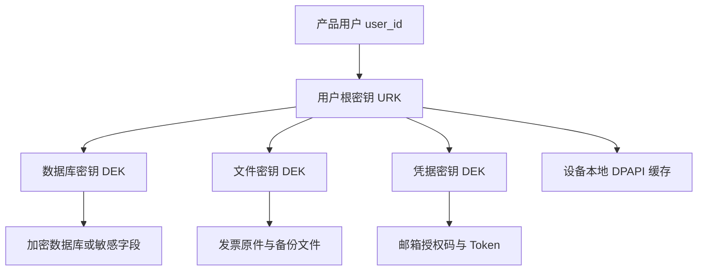

# 用户账号与数据加密分阶段设计

> 状态：设计决策稿
> 日期：2026-08-19
> 适用产品：Invoice Assistant Windows 桌面端
> 核心决策：功能 MVP 不以用户账号、持久化凭据和数据加密为发布前置条件；账号体系、跨设备身份匹配和可移植加密备份在核心功能发布稳定后建设。

## 1. 背景

产品的长期目标是让数据归用户所有，并允许同一产品用户在不同电脑之间备份、恢复和继续使用数据。要实现这一目标，长期密钥必须绑定产品用户，而不能只绑定某台 Windows 电脑。

当前实现使用随机主密钥加密邮箱凭据，并尝试把主密钥保存到操作系统 Keychain。Windows 测试已发现主密钥无法稳定读回，导致邮箱授权码保存成功后不能解密。继续在功能 MVP 阶段扩展账号、密钥恢复和跨设备备份，会同时引入身份认证、密钥托管、数据迁移、恢复流程和安全审计，明显扩大首个可用版本的范围。

因此，本设计将工作拆成两个阶段：

1. **功能 MVP**：完成采集、解析、校验、归组、审核、输出和 Concur 邮件收单；使用本地单用户模型，不注册、不登录，不持久化邮箱授权码，不承诺加密备份。
2. **发布后账号与加密版本**：加入产品账号、用户级根密钥、加密备份、跨设备恢复、设备管理和密钥恢复。

## 2. 设计目标

### 2.1 功能 MVP 目标

- 用户无需注册或登录即可完成完整发票处理流程。
- 发票/配套票据单文件、多文件和文件夹导入不依赖任何账号或密钥系统；`.eml` 不作为用户可见的本地导入对象。
- 邮箱采集允许用户输入应用专用密码或授权码，但秘密只存在于当前进程内存中。
- 应用重启后重新要求用户输入邮箱授权码，绝不为了便利而明文持久化。
- 发票、批次、台账和设置保存在当前 Windows 用户的本地应用数据目录。
- 数据库模型为后续账号绑定、加密和迁移保留必要的版本信息，但不在 MVP 实现完整安全体系。
- UI 和产品文档明确说明 MVP 的本地存储范围与备份限制。

### 2.2 发布后目标

- 产品账号拥有不可变的 `user_id`，邮箱仅作为可变登录标识。
- 数据密钥属于产品用户，不属于某台设备。
- 同一账号可以在另一台电脑恢复备份。
- 错误账号不能导入其他用户的备份。
- 备份被修改、截断或损坏时必须拒绝导入。
- DPAPI 只保护当前设备上的密钥缓存，不作为唯一密钥来源。
- 用户即使更换电脑，也能通过账号授权、恢复码或恢复密码重新取得自己的用户根密钥。

## 3. 非目标

### 3.1 功能 MVP 不做

- 用户注册、登录、密码找回和多因素认证。
- 余额、注册赠送、充值、订阅和自动计费。
- 多设备列表、远程退出和设备撤销。
- 云同步。
- 数据库透明加密或全盘加密。
- 邮箱授权码、OAuth Token 的持久化。
- 账号匹配的加密备份和跨设备自动恢复。
- 服务商不可解密的零知识密钥系统。

### 3.2 发布后首版仍不做

- 多人共同编辑同一批次。
- 企业组织、团队空间和管理员密钥托管。
- 实时跨设备同步和冲突自动合并。
- 将 Windows 登录身份直接当作产品账号身份。

## 4. 需求与验收规则

### R1：无账号完成核心流程

- 当用户首次启动功能 MVP 时，系统应直接进入本地设置流程，不要求注册或登录。
- 当用户选择发票/配套票据文件或文件夹导入时，系统应在没有网络账号的情况下完成全部本地处理。

### R2：邮箱秘密不持久化

- 当用户启动邮箱采集时，系统应要求输入应用专用密码或授权码。
- 当邮箱连接建立后，系统只应在当前运行会话中持有该秘密。
- 当应用退出或用户主动断开邮箱时，系统应清除当前会话中的邮箱秘密。
- 当应用重新启动时，系统应重新要求输入邮箱秘密。
- 系统不得把邮箱秘密写入 SQLite、配置文件、日志、崩溃报告或遥测数据。

### R3：本地数据透明告知

- 当用户首次保存发票数据时，系统应说明数据保存在当前电脑且 MVP 尚未提供应用级加密。
- 当用户打开数据目录或导出文件时，系统应提示导出物可能包含发票、金额、税号和行程信息。

### R4：为后续迁移保留能力

- 当 MVP 创建本地数据目录时，系统应生成不可变的 `local_profile_id`。
- 当数据库结构发生变化时，系统应通过 `schema_version` 执行显式迁移。
- 当后续版本启用加密时，系统应能识别数据处于 `plaintext`、`migrating` 或 `encrypted` 状态。

### R5：发布后跨设备恢复

- 当用户在新电脑登录相同产品账号并提供有效恢复凭证时，系统应允许解密并导入其备份。
- 当登录账号与备份的 `owner_user_id` 不一致时，系统应拒绝导入。
- 当备份认证标签或文件哈希校验失败时，系统应拒绝导入且不修改现有数据。
- 当导入过程中断时，系统应保留原数据并允许重新执行。

## 5. 功能 MVP 设计

### 5.1 本地用户模型

MVP 只有一个本地使用者概念，不构成产品账号，也不用于安全认证。

```text
LocalProfile
├── local_profile_id    随机 UUID，创建后不变
├── display_name        可选，报销人姓名
├── created_at
└── schema_version
```

设计约束：

- 一个应用数据目录只对应一个 `LocalProfile`。
- `local_profile_id` 只用于未来迁移和数据关联，不能证明操作者身份。
- 不使用邮箱地址作为主键，因为用户可能更换邮箱。
- MVP 不向服务器上传 `local_profile_id`、发票内容或本地配置。

### 5.2 本地数据存储

MVP 继续使用 SQLite 和本地文件目录：

```text
Invoice Assistant data/
├── app.db                 设置、批次、发票、台账、流水线检查点
├── files/
│   └── {batch_uuid}/
│       ├── originals/
│       ├── rendered/
│       └── outputs/
└── logs/                  仅非敏感运行日志
```

如果短期内不合并现有双库，`accounts.db` 只能保存邮箱地址、服务器配置和连接状态等非秘密元数据，不能保存邮箱密码；`ledger.db` 继续保存批次、发票和台账。

MVP 数据为未加密本地数据。最低安全基线包括：

- 免安装程序目录与用户数据目录分离；默认数据目录为 `%LOCALAPPDATA%\InvoiceAssistant\Data`，并继承用户级访问控制。
- 替换、移动或删除程序目录不得影响用户数据；数据目录迁移必须先快照、复制校验并保留源数据。
- SQLite 数据库不直接运行在 UNC、NAS、共享盘或同步盘；用户可将导出文件另存到这些位置。
- 临时解析文件放入应用私有临时目录，任务完成后清理。
- 日志不得包含邮箱密码、授权码、完整发票号码、税号和原始邮件正文。
- 崩溃报告默认不包含数据库、原始文件或秘密内存。
- 匿名遥测保持关闭。
- UI 不宣称“数据库已加密”或“其他程序无法读取”。

Windows 文件访问控制只是最低隔离措施，不等同于应用级加密。

### 5.3 邮箱凭据会话


`CredentialSession` 的约束：

- 只存在于 Tauri/Rust 进程内存，不进入前端持久化存储。
- 前端提交后立即清空输入框，不写入 `localStorage` 或 IndexedDB。
- 后端不得实现自动回退到明文文件。
- 尽量缩短明文秘密生命周期，并在释放前清零相关缓冲区。
- 连接测试失败时只返回分类错误，不回显服务端完整认证响应。
- 一个会话可供同次测试、采集和 Concur 邮件发送复用；应用退出后失效。

用户体验文案应明确：

> 功能预览版不会保存邮箱授权码。关闭应用后，下次采集需要重新输入。

### 5.4 现有 Keychain/加密模块的处理

当前 `invoice-store` 中的 Keychain 和 AES 凭据代码不应继续作为 MVP 主流程依赖。

建议的后续实现边界：

- 邮箱采集命令接收会话级凭据句柄，而不是每次从 `accounts.db` 解密读取。
- 设置页面可以保存邮箱地址、IMAP 主机、端口和 TLS 配置，但不保存授权码。
- 当前已经保存但无法解密的凭据不迁移；提示用户重新输入。
- 删除凭据时不影响发票、批次和台账。
- 旧加密代码可以暂时保留在隔离模块中，但不得使全量测试失败，也不得被发布路径调用。
- `key_is_stable_across_calls` 不再作为功能 MVP 的发布门禁；会话凭据“不落盘”测试取代它。账号与加密版本重新启用持久化后，再恢复跨进程密钥稳定性测试。

本设计取代 `docs/superpowers/plans/2026-08-10-encrypted-storage.md` 中“系统 Keychain 是 MVP 必需依赖”的范围决策；旧文档可保留为历史实施记录。

### 5.5 MVP 备份与迁移边界

功能 MVP 不提供“账号验证的加密备份”。如果产品必须提供临时人工迁移能力，只能提供显式的未加密迁移包，并满足：

- 不包含邮箱授权码、OAuth Token 或其他秘密。
- 导出前明确提示迁移包包含个人发票数据，要求用户妥善保管。
- 文件名带格式版本，导入前完整校验结构和数据库版本。
- 用户主动选择文件后才导入，不自动扫描其他目录。
- 只能作为用户主动的数据搬运工具，不能宣称已经验证“同一用户”。

如果上述风险不可接受，则 MVP 完全不提供跨设备导入，待账号与加密版本一起上线。不得用 `local_profile_id` 相同冒充身份认证。

## 6. 发布后账号与加密目标设计

### 6.1 产品账号

```text
UserAccount
├── user_id                 不可变 UUID
├── login_identifier        邮箱等可变登录标识
├── status
├── created_at
└── security_version
```

账号版本至少需要：

- 登录、退出、账号恢复和多因素认证。
- 短生命周期访问令牌和可撤销刷新令牌。
- 设备注册、设备名称、最后使用时间和远程撤销。
- 本地 `local_profile_id` 与服务端 `user_id` 的一次性绑定。
- 账号邮箱变更不改变数据所有权。

### 6.2 密钥层级



- URK 是随机 256 位用户根密钥，跨设备保持一致。
- DEK 是实际加密数据的随机密钥，可按数据库、备份或文件集合生成。
- 使用认证加密保存数据，同时保护机密性和完整性。
- 备份保存被 URK 包装后的 DEK，不保存明文密钥。
- DPAPI 只缓存当前设备上的 URK；缓存丢失后可以通过账号或恢复凭证重新取得。

### 6.3 跨设备密钥恢复模式

产品发布账号版本前必须明确选择下列信任模型。

#### 模式 A：账号托管，体验优先

- 后端 KMS 保存或管理每个用户的密钥包装材料。
- 用户在新电脑完成登录和 MFA 后，后端允许恢复或重新包装 URK。
- 用户体验是“登录同一账号即可恢复”。
- 代价是服务端在技术上具备释放用户密钥的能力，不能宣称严格零知识。

#### 模式 B：用户恢复密码，隐私优先

- 客户端通过内存困难的密码派生函数从恢复密码得到 KEK。
- KEK 只用于包装 URK，服务端只保存密文、盐和参数。
- 新电脑需要登录账号并输入恢复密码。
- 服务端无法恢复忘记的密码，必须提供高熵恢复码。

#### 推荐组合

- 默认采用账号授权恢复，满足“同一用户跨电脑使用”的产品要求。
- 首次启用备份时同时生成用户持有的恢复码，避免完全依赖服务端。
- 对隐私要求更高的用户提供“私密备份”，由恢复密码保护，服务端不托管可解密材料。
- 产品文案必须准确区分“账号托管备份”和“私密备份”的信任边界。

### 6.4 加密备份格式

```text
invoice-assistant-backup.iab
├── manifest
│   ├── format_version
│   ├── owner_user_id
│   ├── backup_id
│   ├── created_at
│   ├── source_device_id
│   ├── key_version
│   └── encrypted_file_hashes
├── wrapped_keys
├── database.enc
└── files/
    ├── originals/
    ├── rendered/
    └── outputs/
```

安全要求：

- `owner_user_id` 必须参与认证加密的附加认证数据，不能只是可修改的普通字段。
- 导入前校验账号归属、认证标签、文件哈希、格式版本和空间需求。
- 在临时目录完整解密和校验后，再进入合并事务。
- 默认采用“合并并预览冲突”，而不是直接覆盖当前数据库。
- 发票按稳定 UUID、发票号和内容哈希去重；台账冲突需要用户确认。
- 任何失败不得破坏原有数据。

### 6.5 跨设备数据范围

默认备份：

- 发票原件及解析结果。
- 批次、流水线检查点和审核修改。
- 历史台账。
- 常驻城市、抬头、税号和归组规则。
- Concur 费用类型映射。
- 输出记录和审计记录。

单独处理：

- 邮箱授权码、OAuth Token 等进入独立 `secrets` 区域。
- 恢复秘密后仍应重新测试邮箱连接，因为授权可能已经被服务商撤销。
- 账户余额、充值、订阅和开票记录以服务端为准，不进入本地备份。

## 7. 从 MVP 迁移到账号与加密版本

迁移必须是显式、可恢复的状态机：

```text
plaintext
  → preparing
  → encrypting
  → verifying
  → encrypted
         ↘ rollback
```

建议步骤：

1. 检查磁盘空间、数据库完整性和未完成流水线。
2. 创建迁移前本地快照，并向用户说明快照仍是未加密数据。
3. 用户注册或登录产品账号。
4. 将 `local_profile_id` 绑定到不可变 `user_id`。
5. 生成 URK 和各类 DEK。
6. 在临时目录加密数据库和文件，不直接覆盖原数据。
7. 校验记录数、金额汇总、文件哈希和随机抽样解密。
8. 原子切换到加密数据目录。
9. 保留有限回滚窗口；用户确认成功后再安全清理明文快照。
10. 重新输入邮箱授权码，并以新凭据密钥加密保存。

密码变更或登录邮箱变更只重新包装 URK，不重新加密全部发票数据。

## 8. UI 调整

### 8.1 功能 MVP

- 删除注册、余额和订阅作为首次运行前置步骤。
- 首次设置只收集报销人、常驻城市、抬头、税号和数据采集方式。
- 邮箱设置显示“本次会话使用，不保存授权码”。
- 应用重启后，在运行邮箱采集前再次请求授权码。
- 设置页显示本地数据目录和“当前版本数据未进行应用级加密”的准确说明。
- 不展示“已安全备份”“已与账号绑定”等尚未实现的状态。

### 8.2 发布后版本

- 增加账号与设备页面。
- 增加数据加密状态、最近备份、恢复码和密钥恢复入口。
- 首次绑定账号时展示迁移范围、预计空间和回滚方式。
- 导入时展示来源设备、备份时间、数据数量和冲突预览。
- 错误账号选择备份时，在解密前阻止继续。

## 9. 分阶段实施顺序

### 阶段 0：功能 MVP

1. 让邮箱采集支持会话级授权码。
2. 让发票/配套票据文件、文件夹和图片导入不依赖账号数据库；邮件/EML解析只作为邮箱采集内部能力。
3. 从流水线发布路径移除 Keychain 主密钥依赖。
4. 完成解析、校验、归组、审核、输出和 Concur 邮件收单。
5. 完成批次检查点、失败恢复和 Windows 发布测试。

### 阶段 1：功能发布稳定化

1. 收集邮箱重复输入的实际影响和用户反馈。
2. 确认跨设备备份优先级、用户规模和账号恢复要求。
3. 确认账号托管与私密备份的信任模型。
4. 冻结备份格式、密钥层级和迁移方案。

### 阶段 2：账号与数据加密

1. 实现账号、MFA、设备管理和本地档案绑定。
2. 实现 URK/DEK 密钥层级和设备缓存。
3. 实现现有明文数据加密迁移。
4. 实现加密备份、账号匹配、跨设备恢复和冲突预览。
5. 实现恢复码、密钥轮换、审计和故障演练。

### 阶段 3：商业能力

1. 在账号体系稳定后接入余额、充值、订阅和开票。
2. 计费必须依赖已完成且可恢复的批次状态，不能反向阻塞核心处理流程。

## 10. 发布门禁

### 功能 MVP

- 未注册、无网络账号时可以完成文件导入到输出的完整流程。
- 邮箱授权码在进程退出后不存在于数据库、配置、日志和前端存储中。
- 应用重启后邮箱采集明确要求重新输入授权码。
- Keychain 不可用不会阻塞文件夹导入和核心本地功能。
- 产品界面与文档没有虚假加密或安全声明。
- Windows 全量自动化测试和 UI 错误路径测试通过。
- 签名免安装包在标准 Windows 用户下无需 UAC 即可运行，程序目录替换后数据保持不变。
- WebView2 缺失、数据目录迁移失败和数据库回退均有经过验证的恢复路径。

### 账号与加密版本

- 同一账号可以在第二台干净 Windows 电脑恢复备份。
- 不同账号不能导入该备份。
- 篡改任意密文或清单后导入失败且不损坏现有数据。
- 迁移中断、磁盘满、应用崩溃时能够回滚或继续。
- DPAPI 缓存删除后仍能通过账号或恢复码取得用户密钥。
- 邮箱、账号密码、Token 和明文密钥不进入日志、遥测或崩溃报告。

## 11. 风险与决策记录

| 风险 | 当前决策 |
|---|---|
| MVP 本地数据库未加密 | 明确告知，只依赖当前 Windows 用户目录隔离；优先验证核心价值 |
| 用户不愿每次输入邮箱授权码 | 功能发布后根据实际使用频率决定是否提前持久化凭据 |
| 临时迁移包泄露 | 默认不实现；若实现则排除秘密并显示强警告 |
| 后续加密迁移失败 | 临时目录转换、完整校验、原子切换和回滚窗口 |
| 账号托管密钥扩大服务端责任 | 上线前明确披露信任边界，并提供用户恢复码或私密备份模式 |
| 旧 Keychain 代码继续干扰发布 | 从主流程隔离，不允许其失败阻断本地功能测试 |
| 用户误以为“免安装”等于“数据随 EXE 走” | UI 明确展示独立 DataRoot；更新只替换程序目录，备份使用专门导出流程 |
| SQLite 位于网络/同步盘导致损坏 | 数据库限定本机目录；共享或同步仅用于静态导出和关闭数据库后的备份包 |

## 12. 待确认事项

以下事项不阻塞功能 MVP，但必须在账号与加密阶段开始前确认：

1. 默认采用账号托管恢复，还是默认采用用户恢复密码。
2. 是否允许用户选择“私密备份”。
3. 账号密码重置后如何恢复旧数据密钥。
4. 是否把邮箱秘密纳入备份，还是始终要求新设备重新授权。
5. 是否需要支持完全离线、没有产品账号的加密备份。
6. 明文 MVP 数据升级后保留多长回滚窗口。
