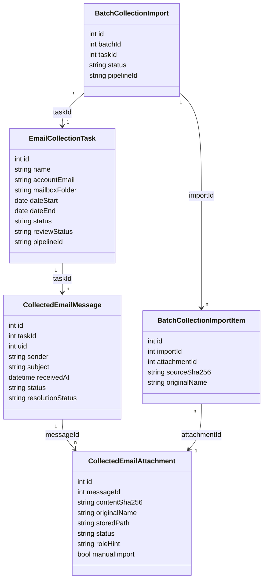

# 独立邮件收集工作台设计

## 1. 架构结论

现有 `start_pipeline` 保留为“批次处理流水线”，不再承担邮箱搜索。新增独立邮件收集任务及其状态机：

```text
邮件收集任务：created → collecting → review → completed
                          ↘ failed / interrupted → retry

批次处理任务：created → collected → parsed → deduped → grouped → review
```

邮件收集只生成持久化来源材料；批次处理只消费来源材料快照。两者不共享检查点名称或恢复状态。

## 2. 核心实体



## 3. SQLite schema v13

### `email_collection_tasks`

- 任务配置、状态、统计和错误类别。
- `pipeline_id` 只用于收集任务自身恢复，不写入批次处理状态。
- 用户邮箱地址可本地保存，授权码仍只存在当前进程内存。

### `collected_email_messages`

- 每个任务内 `mailbox_folder + uid` 唯一。
- 保存发件人、主题、服务器收件时间和来源级状态。
- 不保存正文或正文链接。

### `collected_email_attachments`

- 保存逻辑附件元数据和持久化材料库路径。
- `stored_path` 仅对可供后续使用的文件存在。
- 状态限定为 `candidate`、`supporting_candidate`、`filtered`、`unsupported`、`failed`。

### `batch_collection_imports` 与 `batch_collection_import_items`

- 用户确认选择时先建立不可变快照。
- 一个收集任务可以被多个批次引用。
- 已使用附件再次选择时由 UI 强提醒，数据库不做硬阻断。

## 4. 文件存储

```text
DataRoot/
  collection-files/
    task-<task-id>/
      <sha256>-<safe-original-name>
```

- 文件名使用内容哈希和安全原名，禁止目录穿越。
- 同一任务相同内容只保存一次，但每个邮件附件仍保留独立台账记录。
- 批次处理时复制到该批次自己的任务暂存目录，避免解析阶段修改收集原件。
- 删除任务前检查批次引用；有引用时禁止删除材料。

## 5. 收集流程

1. 用户创建任务，系统记录当前会话邮箱、日期范围和 INBOX。
2. 用户点击“开始收集”；后端只读搜索并逐封读取邮件。
3. 每个逻辑附件执行 ZIP 安全展开、大小上限、文件魔数/扩展名分类和内容哈希。
4. 可处理候选文件复制到持久化材料库。
5. 邮件及附件台账一次事务写入任务；任务进入 `review`。
6. 用户处理需下载、需确认和失败项；完成后标记 `completed`。

收集阶段不引用 `invoice_parse`、批次去重和 `invoice_grouping`。

## 6. 批次导入流程

1. 新建批次只创建名称和时间。
2. 用户选择收集任务及附件；系统建立 `batch_collection_import` 快照。
3. 批次流水线新增来源 `collection_import { import_id }`。
4. 流水线从快照解析安全文件路径并复制到批次暂存目录。
5. 按现有逻辑执行解析、去重、费用生成、材料待挂载和归组。
6. 成功后快照状态为 `completed`；失败时保留快照和收集原件供重试。

本地文件导入保持现有行为，但不再在批次中提供邮箱日期表单。

## 7. 历史兼容

- schema v13 不删除 v12 的 `email_import_messages` 和 `email_import_attachments`。
- 迁移为每个旧 `pipeline_id + batch_id` 创建一个“历史邮件收集”任务并复制台账。
- 可从旧发票或待挂载材料推导到稳定原件路径时写入 `stored_path`；无法推导时只迁移元数据。
- 同时建立旧批次到历史任务的 `batch_collection_import` 只读来源记录。
- 旧数据没有记录的邮件不得补造。

## 8. Tauri 命令

### 邮件收集

- `create_email_collection_task`
- `list_email_collection_tasks`
- `get_email_collection_task`
- `start_email_collection_task`
- `list_collected_email_messages`
- `resolve_collected_email_message`
- `supplement_collected_email_message`
- `complete_email_collection_review`

### 批次选择

- `create_batch_collection_import`
- `list_batch_collection_sources`
- `start_pipeline`，来源使用 `collection_import { import_id }`

## 9. UI 页面

### 页面一：收集任务列表

- 主导航独立入口。
- 顶部汇总和任务表格。
- 新建抽屉只填写任务名、当前邮箱和日期范围。

### 页面二：收集任务详情

- 全宽邮件表格，字段为收件日期、主题、发件人、附件数、处理结果、状态、操作。
- 使用“需要用户处理 / 待审核 / 已审核”三个互斥分组；默认按日期倒序，每页 25 条。
- 收件时间统一显示为 `YYYY-MM-DD`，不显示时分秒；缺失日期排在最后。
- 只显示来源级状态，不显示费用字段；点击邮件进入独立审核页。
- 固定底栏展示任务审核进度和“完成来源审核”。

### 页面二-A：独立邮件审核页

- 页头提供返回列表、上一封/下一封和当前进度，返回时保留列表状态。
- 主体先显示邮件元数据和纯文本正文，再显示需要用户打开的发票下载链接和附件材料清单。
- 正文通过 IMAP 按需读取，仅渲染纯文本；不加载 HTML、远程图片、脚本或跟踪像素。
- 下载链接只显示操作标签与域名，点击后先确认，再由后端重新读取、校验并交给 Windows 系统浏览器。
- 附件预览采用按需弹层/抽屉，不常驻占用主布局；PDF、OFD、XML、图片复用现有安全预览能力。
- 固定操作区提供“导入已下载文件”“材料已齐全”“确认无关”或“重新打开”。

### 页面三：批次导入抽屉

- 三步：选择任务 → 选择材料包 → 确认并解析。
- 同邮件材料默认一起选择；已被其他批次使用的附件默认取消选择。

### 页面四：批次来源摘要

- 批次不再显示完整邮件台账。
- 在导入区和费用来源中显示收集任务名称、邮件主题和返回入口。

## 10. 安全与验证

- IMAP 继续执行 FLAGS 前后指纹核对。
- 收集任务路径、快照路径和任务 ID 均进行同根目录与归属校验。
- v12→v13 迁移必须有快照、回滚和完整性测试。
- 增加收集阶段不调用解析器的单元测试。
- 增加同邮件附件、人工补充、跨批次引用警告和批次导入端到端测试。
- Svelte 静态检查、组件测试、Windows 全量验证和免安装包校验均为发布门禁。

## 11. 审核详情读取契约

- `get_collected_email_review_detail(message_id)`：校验消息归属和当前会话邮箱后，用 UID 读取原始邮件；返回清理后的纯文本正文、截断标记和安全链接摘要，不返回可由前端任意打开的原始 URL。
- `open_collected_email_link(message_id, link_index)`：重新读取同一邮件、重建链接清单、校验索引与 HTTPS 站点后使用系统浏览器打开；完整 URL 不落库、不写日志。
- `get/read/render/open_collected_attachment_*`：按附件 ID 校验受控材料库路径，提供元数据、原始读取、PDF/OFD 渲染和系统打开。
- 所有邮件正文读取继续执行 IMAP FLAGS 前后指纹核对；失败仅影响正文/链接区域，不影响本地附件审核。
