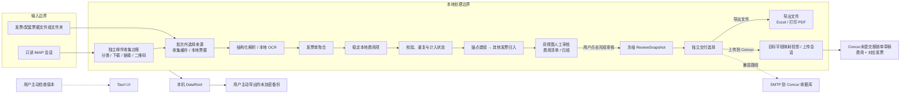
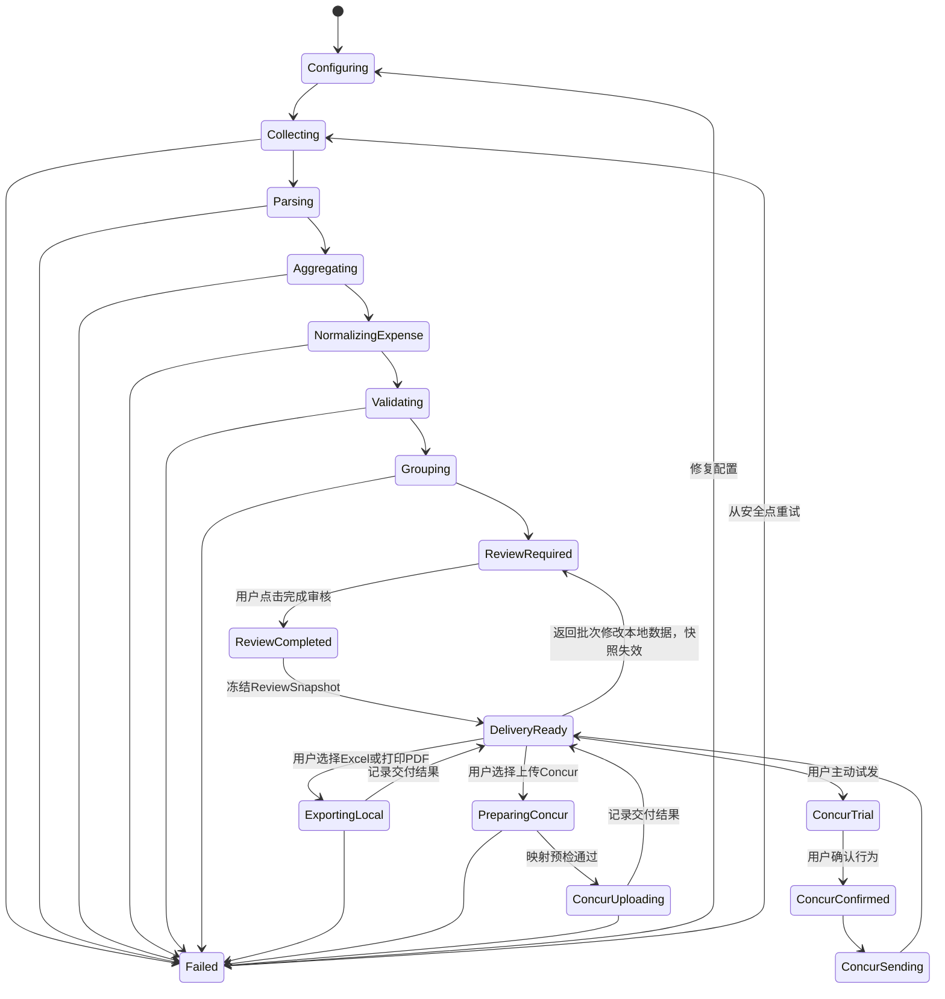

# Invoice Assistant MVP 统一设计基线

> 状态：D01–D32 已确认；非 Concur 功能已完成产品验收，Concur 真实适配待验证
> 版本：2.1
> 日期：2026-09-03
> 对应需求：`specs/mvp-release-baseline/requirements.md`

## 1. 设计结论

MVP 是 Windows 11 x64 免安装、本地优先、无账号的单用户应用。程序不调用外部大模型，不持久化邮箱授权码；确定性规则无法判断的项目进入人工审核。邮件收集是独立、只读、结果持久化的任务；发票解析只在用户把收集结果或本地票据导入批次后开始。核心费用数据使用目标系统无关的稳定本地模型，Concur字段只在上传阶段通过版本化配置生成投影。批次内部只包含“费用清单”和“归组”两个一级视图；用户完成审核后，系统冻结审核快照并进入独立交付选择，再导出Excel/打印PDF或上传Concur。核心发布范围包含用户触发、用户可见的Concur未提交草稿创建、费用填写和发票关联，收据邮件作为兼容降级；MVP 同时提供带警告的未加密备份导出/导入。

程序文件、用户数据、用户输出和会话秘密是四个独立安全边界。免安装更新只替换程序；数据库迁移必须先快照；邮箱读取严格只读；任何外发和删除操作均由用户明确触发。

## 2. DESIGN SPECIFICATION

本设计继承 `docs/product-ui-and-user-interaction-design.md`，不创建第二套视觉系统。

### 2.1 Purpose Statement

产品面向每次处理 15 张以上差旅发票、需要使用 Concur 报销的个人用户。界面把采集、解析、校验、归组、审核和输出压缩为一条可恢复路径，并通过原件对照、金额合计、明确状态和人工确认建立信任。

### 2.2 Aesthetic Direction

**Industrial / utilitarian：工业化财务工作台。**

视觉强调精确、稳定和可审计；使用账本、文件夹、工作台和检查标记语言。高密度审核区保持秩序，低频设置区保留留白。

### 2.3 Color Palette

| 用途 | 色值 |
|---|---|
| 暖纸背景 | `#F3F0E8` |
| 深墨文字 | `#17211C` |
| 松针主色 | `#136B52` |
| 提醒琥珀 | `#C47A16` |
| 风险红 | `#B33A32` |
| 分隔线 | `#D6D1C5` |

颜色不单独承担状态含义，必须同时提供文字、图标或形状。

### 2.4 Typography

- 中文正文：随应用打包的 `Source Han Sans SC`。
- 英文、金额、日期：`IBM Plex Sans`。
- 发票号、任务 ID、文件名：`IBM Plex Mono`。
- 金额使用等宽数字特性。

### 2.5 Layout Strategy

- 左侧导航默认展开并允许折叠，折叠状态保留清晰图标、标签提示和当前页面状态。
- 费用清单、归组清单和邮件台账使用列表→独立详情的层级；单条费用详情使用左侧稳定字段、右侧原件查看器，不同时挤入第三栏。
- 归组详情把本组费用作为主要工作区；每笔费用信息与其操作同一行/同一卡片，避免按钮单独成行制造大块无意义空白。
- 首次设置使用左侧说明、右侧表单；不使用居中浮动大卡片作为主结构。
- 图标统一使用 Lucide；MVP 只实现完整浅色主题。
- 页面切换 160ms、抽屉 180ms、状态变化 120ms，并尊重减少动态效果。

## 3. 总体架构



不存在以下生产路径：

- 发票或行程数据到外部 LLM。
- 自动遥测或后台错误上传。
- 邮箱授权码到数据库、浏览器存储或日志。
- 未经用户确认的 Concur 发送。
- 无人值守Concur操作、最终提交、公司限额处理或Concur登录凭据持久化。
- 自动下载、静默安装或提权更新。

## 4. 模块边界

| 模块 | 输入 | 输出 | 关键约束 |
|---|---|---|---|
| SessionCredential | UI 一次性授权码 | 内存凭据句柄 | 不序列化、不日志化、退出清除 |
| Collector | 邮箱配置/日期区间 | 持久邮件台账、原件、链接/二维码与来源元数据 | IMAP 只读、PEEK、单次下载；不解析发票 |
| BatchImporter | 已完成收集缓存/本地票据文件 | 批次输入清单 | 批次创建与来源分离；本地无 EML；可重建 |
| Parser | 原件 | 字段、置信度、解析证据 | 结构化优先；本地 OCR 随包分发 |
| InvoiceAggregator | 已分类文件与解析证据 | `DocumentAsset`、`InvoiceRecord`、待挂载材料 | 配套材料不独立计费；保留全部来源 |
| ExpenseModel | 发票单、行程、用户输入 | 版本化 `ExpenseItem` | 字段语义稳定；不包含Concur名称、选项ID或必填性 |
| Validator | 字段、设置、历史台账 | 问题、重复依据、阻断状态 | 精确小数；不静默纠正 |
| Grouper | 发票单、常驻城市、规则 | 锚点行程组、归入建议、歧义 | 强证据先建组；无锚点不建差旅行程；无 LLM |
| Review | 行程、发票单、本地费用项、票据文件、问题 | 已确认批次 | 只审核本地字段；阻断项必须由人解决；重复计入须显式确认 |
| Exporter | 已确认批次 | Excel、材料打印 PDF | 同一审核快照；PDF 无封面/目录/异常页并使用全局页码 |
| TargetMapping | 已确认 `ExpenseItem`、目标档案、上传补充值 | `MappedExpensePayload` 与映射快照 | 版本化、可解释；不反写本地费用项；缺口只阻断该目标上传 |
| ConcurAdapter | 已冻结映射投影、原始发票、当前授权会话 | 未提交报销单草稿、费用、附件关联结果 | 用户触发且可见；外部ID；幂等；回读核对；不最终提交 |
| ConcurMailer | 已确认附件、会话 SMTP 凭据 | 试发/批量发送结果 | 用户确认、限流、幂等 |
| BackupManager | 关闭写入的 DataRoot | 未加密备份/导入预览 | 排除秘密、完整校验、原子导入 |
| ReleaseBootstrap | ProgramDir/BootstrapRoot | Runtime/DataRoot/迁移状态 | 原生 WebView2 检测、无提权 |

## 5. 数据模型与目录

### 5.1 目录

```text
ProgramDir/
└─ InvoiceAssistant.exe + 必需运行资源

%LOCALAPPDATA%\InvoiceAssistant\
├─ bootstrap.json               # 数据根目录指针、最后应用版本；无秘密
└─ Data/
   ├─ app.db                    # 设置、批次、发票、台账、检查点
   ├─ files/{batch_uuid}/
   │  ├─ originals/
   │  ├─ rendered/
   │  └─ outputs/
   ├─ temp/                     # 可清理中间文件
   └─ logs/                     # 脱敏日志
```

`OutputDir` 可以由用户选择，但不能把正在使用的 SQLite 数据库放在 UNC、网络共享或同步盘。程序目录可只读，不能成为持久数据依赖。

### 5.2 核心标识与版本

- `local_profile_id`：随机、不可变，用于本地数据关联；不能证明用户身份。
- `schema_version`：数据库结构版本。
- `backup_format_version`：备份协议版本。
- `pipeline_id`：单次处理流水线标识。
- `source_id`：Message-ID、内容哈希和本地来源组成的采集标识。
- `send_idempotency_key`：Concur 成功发送项的幂等标识。
- `concur_upload_session_id`：一次可恢复的草稿上传会话标识。
- `external_report_id` / `external_expense_id`：Concur返回的稳定对象标识，用于回读、防重和恢复。
- `concur_step_idempotency_key`：报销单、费用和附件阶段的幂等标识。
- 金额统一使用十进制定点类型，禁止 `f64` 进入业务计算。

### 5.3 发票单聚合与计入状态

```text
InvoiceRecord
├─ primary_invoice: DocumentAsset(role=invoice)
├─ itinerary_documents[]: DocumentAsset(role=itinerary)
├─ detail_documents[]: DocumentAsset(role=detail)
├─ other_supporting_documents[]
└─ duplicate_source_copies[]
```

`DocumentAsset`保存不可修改文件路径、哈希、格式、来源任务、角色和所属发票单。无法确定所属发票单的材料进入 `UnattachedDocument` 队列。一个 `InvoiceRecord` 默认对应一个费用；除主发票外的文件不增加张数、费用或金额。

计入状态枚举为：

```text
included
suspected_duplicate_excluded
confirmed_duplicate_excluded
user_confirmed_distinct_included
manually_excluded
```

申报总额只累加 `included` 与 `user_confirmed_distinct_included`。重复候选从命中开始即不计入；未知/暂不决定不会改变状态；用户明确确认非重复后才转为计入，并写审计事件。

### 5.4 稳定本地费用项与目标投影

每个可处理 `InvoiceRecord` 默认关联一个版本化 `ExpenseItem`：

```text
ExpenseItem
├─ expense_item_id / schema_version / revision
├─ invoice_record_id / trip_group_id / inclusion_status
├─ category_code                 # 软件内部稳定分类
├─ transaction_date              # 实际业务发生日期
├─ description                   # 费用说明，不等同于某租户Business Purpose
├─ counterparty_name
├─ location {country_code, province_code, city_code, display_name}
├─ payment_method                # 内部枚举，可为unknown
├─ gross_amount / currency_code
├─ tax_details[] {tax_type, rate, amount}
└─ field_provenance / confirmation_state / audit_events
```

发票号码、开票日期、购销方税号、版式和解析证据属于 `InvoiceRecord`；费用分类、实际发生日期、发生地点、金额和费用说明属于 `ExpenseItem`。两者不得使用Concur外部选项ID或某个租户的必填性定义字段语义。

选择目标Concur档案后，`TargetMapping` 才生成只属于一次上传的投影：

```text
ExpenseItem + ConcurMappingProfile(version) + UploadOverrides
→ MappedExpensePayload
→ MappingSnapshot(input_revision, rule_version, output, gaps)
```

`ConcurMappingProfile`保存内部字段路径到外部字段ID的映射、选项表、转换、默认值、条件必填规则和目标页面/接口版本。企业自定义字段及本次补充值只存于档案或上传会话。切换租户、更新规则或重试会重新生成投影，但不得修改 `ExpenseItem`；回读结果按映射快照逐项对账。

完成审核时创建不可变、可版本化的交付输入：

```text
ReviewSnapshot
├─ review_snapshot_id / batch_id / revision / created_at
├─ expense_item_revisions[] / invoice_record_revisions[]
├─ inclusion_statuses / trip_group_revisions / document_asset_hashes[]
├─ included_count / included_amount / excluded_duplicate_amount
└─ content_digest / invalidated_at / invalidation_reason

DeliveryTask
├─ delivery_task_id / review_snapshot_id
├─ kind: export_excel | concur_upload | receipt_mail_compat
├─ idempotency_key / status / attempts / last_error
└─ output_manifest_or_external_result
```

`ReviewSnapshot`只在本地审核阻断项清零且用户点击“完成审核”时生成。影响费用、票面事实、计入状态、归组或附件的修改会使当前快照失效；既有交付历史仍可查看，但新交付必须基于重新审核后的新快照。不同交付任务可以引用同一有效快照，彼此不锁死。

### 5.5 流水线状态



批次处理状态、审核快照状态和各交付任务状态分别持久化，不能用一个“已完成”覆盖全部语义。每个安全点完成后写入检查点，UI 事件是状态通知而不是唯一事实来源。

## 6. 邮箱与会话凭据

### 6.1 SessionCredential

授权码从 UI 通过一次 IPC 进入 Rust 后端，前端立即清空输入。后端返回不含秘密的会话 ID，后续测试、采集和用户确认后的 SMTP 发送引用该 ID。

会话在以下情况销毁：

- 应用退出或崩溃恢复。
- 用户主动断开邮箱。
- 邮箱地址、主机、端口或 TLS 配置变化。
- 明确超时或认证失败次数达到安全阈值。

### 6.2 IMAP 只读

- 使用只读文件夹选择。
- 正文和附件读取使用 PEEK 等价语义。
- 生产客户端不暴露 `STORE`、`COPY`、`MOVE`、`APPEND`、`DELETE`、`EXPUNGE` 路径。
- 真实测试前后比较 UID、FLAGS、大小和 Message-ID。
- Alpha 只把 QQ 标为真实验证；公开 Beta 前增加 163。其他通用 IMAP 配置显示“实验性”。

### 6.3 日期

所有日期查询使用 `[start, end_exclusive)`。月份由本地时区生成，但邮件搜索和报告必须记录时区与边界，防止跨月误抓。

## 7. 解析、校验、归组和审核

### 7.1 解析路由

1. XML/OFD 内嵌结构化字段。
2. PDF 文本层和票种模板。
3. 图片或无文本层 PDF 使用本地 OCR。
4. 关键字段冲突或低置信进入人工录入。

OCR 引擎和模型必须随免安装包提供、版本固定并纳入许可/SBOM。不得要求用户安装 Python；若当前 OCR 方案无法满足包体、安全和准确率门槛，图片统一走人工录入而不是偷偷使用云 OCR。

### 7.2 校验和重复

- 金额、税额、税率和价税合计使用精确小数。
- 规则结果包括 `pass`、`warning`、`blocking` 和人类可读依据。
- 重复只标记不自动删除；疑似/确认重复默认不计入，用户能查看同批、跨批和历史台账依据。
- 只有“用户确认不是重复”能把重复候选转回计入状态；暂不决定、重启和输出不得隐式转回。
- 输出前按计入状态再次校验张数、申报总额、重复未计入金额和其他排除金额。

### 7.3 本地归组

归组引擎输入为发票单列表、一个或多个常驻城市和规则设置。第一阶段只从铁路/航空城际票据、已挂载行程单等强证据建立带稳定ID、锚点、起止日期和城市链的候选行程组；第二阶段再为酒店、餐饮、出租车等其他发票单生成归入建议。配套材料随发票单移动，不独立归组。没有明确锚点时不创建差旅行程；任何无法确定的事件进入 `ReviewRequired`，不调用 LLM。

### 7.4 审核工作区

批次页固定使用`费用清单`和`归组`两个一级视图。费用清单承担浏览、筛选、批量处理、单条核对、重复和待挂载材料；归组承担明确行程组、市内消费、待归组、拆分和合并。问题作为两个视图内的状态与筛选，修改记录作为右侧检查器中的审计信息，不额外占用一级标签。

费用清单先以表格和筛选呈现；点击费用进入独立核对页面，左侧编辑“费用信息、票据信息、问题与依据”，右侧为可折叠/全屏的原件查看器。单条核对只编辑稳定 `ExpenseItem` 和必要的 `InvoiceRecord` 票面事实，不显示Concur字段名称、目标选项ID或租户必填标记。默认先显示本地阻断项、重复未计入和待挂载材料，再显示警告和低置信项目。移动、合并、拆分、排除、恢复和编辑均需键盘等价操作；批量操作提供撤销。

费用字段确认与归组确认使用独立状态：费用清单只核对日期、类型、金额等本地事实，归组页只核对组成员关系。任一页面保存都不依赖另一页面已确认。待处理材料作为与“本次费用”“未计入”并列的列表，提供挂载、转为费用和明确忽略。

两个视图共享粘性页头和底部审核摘要。底部只显示计入张数/金额、重复未计入、其他排除、未解决阻断数和“完成审核”；审核期间不显示导出、上传或创建Concur草稿。按钮禁用时必须就地说明阻断项。

## 8. 输出与 Concur

### 8.1 输出

- 本地交付只能从有效 `ReviewSnapshot` 的独立“交付选择”页面启动；不得作为批次标签或审核中的操作出现。
- 本地入口命名为“导出文件”，提供 Excel 和打印 PDF；都使用同一有效审核快照且不要求Concur映射完整。
- Excel 使用稳定本地费用字段、票面事实、行程、问题处理结果和金额汇总。
- 打印 PDF 只合并计入费用关联的有效发票、行程单、水单和其他材料；第一页直接是第一份凭证，不生成封面、费用/材料目录或异常附录。
- 打印 PDF 使用 A4 页面和跨全部材料连续的全局页码；PDF/图片/OFD/XML按可打印能力转换，失败项留在 UI 警告而不插入错误页。
- 生成过程显示准备、逐材料转换、写入、校验和完成阶段；同目录临时写入、同步并原子替换目标文件。
- CSV、标准目录和原件集合若保留，只能作为次级或诊断输出，不作为MVP交付主入口。

### 8.2 Concur草稿上传

草稿上传只能从有效 `ReviewSnapshot` 的独立“交付选择”页面选择“上传到Concur”后启动，不得从批次双视图直接启动。它不改变本地批次创建规则：本地新建批次仍只输入名称并记录系统创建时间。

执行前页面显示并确认：

- 目标租户配置档案、映射版本和当前可见登录会话；
- 报销单名称、报销单日期、可选备注；
- 计入费用数、附件数、申报总额、重复未计入数量与金额；
- 由本地费用项生成的外部字段映射预览、目标必填缺口、本次上传补充值、重复计入状态、归组确认和全部票据文件可读状态。

本地审核完成度与Concur上传准备度是两个状态：目标映射缺口只能阻止当前Concur上传，不能使已经完成的本地费用项退回未审核，也不能阻止基于同一有效快照的Excel输出。用户修正本地业务事实时更新 `ExpenseItem` 并使原审核快照失效；用户只为某个租户补充成本中心等外部字段时写入 `UploadOverrides`，不使本地快照失效。

执行阶段固定为：

```text
create_report_draft
→ create_expense_entries
→ generate_and_freeze_mapping_projection
→ fill_mapped_fields
→ upload_and_link_receipts
→ read_back_and_verify
```

每个计入状态的本地费用项只创建一条Concur费用，并把对应发票单的主发票及其行程单/明细等配套文件关联到该费用；重复未计入、其他排除和待挂载材料不创建费用。上传会话冻结费用项版本、映射档案版本、补充值和生成投影，逐字段回读对账。每个阶段持久化外部ID、幂等键、状态、尝试次数和最后错误。重启或网络中断后恢复原上传会话；若外部结果未知，先回读或要求人工核对。成功步骤不可重复创建，失败步骤可单独重试。

完成后仅显示“草稿已创建并核对”，提供“在Concur中打开并检查”。系统不点击最终提交、不执行公司限额、不填写核准金额，也不把草稿状态冒充为已提交或已批准。

适配器优先采用目标租户明确授权且经过验证的集成能力；若只能采用本地UI辅助操作，必须由用户手动完成SSO/MFA、窗口可见、结构漂移即停止，并且不得持久化Concur密码或可复用会话Cookie。

### 8.3 Concur 试发和批量发送（兼容路径）

内部 Alpha 默认禁用真实发送。产品负责人批准后：

1. 验证用户发件邮箱是 Concur 已认可地址。
2. 选择一张非敏感程度最低且已审核的测试收据。
3. 显示收件地址、附件名和不可撤销的外发说明。
4. 用户确认后发送一张。
5. 用户在 Concur 中确认只进入收据库或记录 ExpenseIt 行为。
6. 只有确认结果允许时才解锁批量发送。
7. 每封附件数受限；成功项持久化幂等键；失败项可重试。

该兼容路径本身不创建报销单、不填条目、不关联指定费用，也不提交；它不能代替8.2的完整核心闭环，只在直接草稿上传不可用时提供可说明的降级结果。

## 9. MVP 未加密备份

### 9.1 格式

```text
InvoiceAssistant-Backup-<timestamp>-v1.zip
├─ manifest.json
├─ app.db
├─ files/
└─ SHA256SUMS
```

`manifest.json` 至少包含格式版本、应用版本、schema 版本、local profile ID、创建时间、文件清单和总大小。不包含邮箱授权码、OAuth Token、会话 ID、临时文件和普通运行日志。

### 9.2 导出

- 暂停写入并创建一致性快照。
- 显示备份未加密、包含个人财务数据和建议保管方式。
- 用户主动选择输出位置。
- 计算文件哈希和总清单，失败不留下可误用的完整扩展名文件。

### 9.3 导入

- 用户主动选择文件，不扫描其他目录。
- 在临时目录解包，检查路径穿越、文件大小、格式、哈希和数据库完整性。
- 展示来源版本、批次数、发票数和磁盘需求。
- 导入前快照当前数据；转换完成并校验后原子切换。
- 任何失败保留原数据。
- UI 明确说明 MVP 不能验证备份是否属于同一产品账号。

### 9.4 退出并清除程序与数据

D10 采用 B。设置页和退出菜单提供“退出并清除程序与数据”，但默认退出和直接删除程序目录都不触发数据删除。

清除流程：

1. 预扫描并展示程序目录、数据目录、批次/发票/原件数量和预计大小。
2. 提供“先导出备份”；用户可返回，导出成功不是强制前置条件。
3. 显示不可恢复警告，要求勾选确认并输入指定确认短语。
4. 生成仅含规范化绝对路径、产品 ID、随机 nonce 和一次性授权的清理计划；计划不得包含通配符。
5. 关闭数据库并退出主进程，受控清理程序等待主进程结束后执行。
6. 清理程序只接受同时通过产品清单、允许根目录、非 UNC、非磁盘根、非用户主目录、非联接点/符号链接检查的目标。
7. 遇到路径检查失败、文件占用或部分删除时立即停止，不递归扩大范围；向用户报告剩余路径和人工处理方式。

清理程序属于自有可执行文件，必须进入同一构建、签名、哈希、恶意软件扫描和 DLL 搜索路径测试。清理记录只含版本、时间、脱敏路径和结果，不包含发票内容。

## 10. 网络和隐私边界

| 连接 | 触发 | 发送内容 | 默认状态 |
|---|---|---|---|
| IMAP TLS | 用户测试/采集 | 认证凭据、日期查询、只读邮件请求 | 用户主动 |
| SMTP TLS | 用户确认 Concur 试发/批量发送 | 发件凭据、已审核附件、最小邮件头 | Alpha 禁用；Beta 用户主动 |
| 版本清单 HTTPS | 用户点击检查更新 | 当前版本、标准 HTTP 元数据 | 用户主动 |
| 外部 LLM | 不存在 | 无 | 禁止 |
| 遥测/崩溃上传 | 不存在 | 无 | 禁止 |

隐私政策必须按真实实现列出处理目的、方式、种类、保存期限、用户权利、所有第三方和网络连接。版本检查也属于联网行为，不得被遗漏。

## 11. 免安装发布

### 11.1 包结构

```text
InvoiceAssistant-<version>-windows-x64-portable/
├─ InvoiceAssistant.exe
├─ invoice-ocr-worker.exe
├─ ocr/                         # 固定版本运行库与模型
├─ LICENSES/                    # 依法必须随分发物提供的许可
├─ README-FIRST.txt
├─ PRIVACY.md                   # 内部Alpha可明确标为草案；公开版必须定稿
├─ USER-AGREEMENT.md            # 内部Alpha可明确标为草案；公开版必须定稿
├─ THIRD-PARTY-NOTICES.txt
├─ version.json
├─ manifest.json
└─ SHA256SUMS.txt
```

用户 ZIP 使用显式白名单。发布说明、SBOM 和 ZIP 独立 SHA-256 是同一 GitHub Release 的旁挂附件，不占用用户程序目录；IT 审核包、机器验证 JSON、开放缺陷、性能/隐私处置报告、夹具清单、设计和 schema 文档只进入受控发布证据。字体许可归入 `LICENSES/FONTS`，OCR 许可归入 `LICENSES/OCR`，避免根目录堆叠。

本机构建目录按职责分层：`artifacts/releases/<version>/` 保存当前候选和旁挂附件，`artifacts/evidence/<run-id>/` 保存验证证据，`artifacts/archive/` 只保存受保留策略管理的历史候选。上述目录均为生成数据，不进入 Git，也不包含用户 DataRoot。

默认包使用系统 Evergreen WebView2。启动前通过原生代码检查 Runtime、数据目录、空间和数据库兼容性。缺少 Runtime 时只提供微软官方/企业 IT 处理路径，不静默安装和提权。

### 11.2 签名

- 内部 Alpha 未签名包必须在文件名、About 页和 README 标记。
- 对外 Beta/正式版的所有自有 PE 文件使用相同可信发布者签名和时间戳。
- 签名后生成哈希；ZIP、独立哈希和审核包版本一致。
- 未签名、签名无效、时间戳无效或发布者变化时阻止对外发布。

### 11.3 手动更新

Alpha 使用指定 GitHub Release；正式版迁移到官方 HTTPS 下载页。MVP 只提示版本，不自动下载或替换。用户解压到新目录，启动后读取稳定 `DataRoot`；数据库迁移前快照，失败可回退旧程序和快照。

### 11.4 版本和 GitHub 构建

- 应用使用完整 SemVer：稳定版 `0.1.0`、`0.2.0`，预发布版 `0.2.0-alpha.1`、`0.2.0-beta.1`；标签分别为 `v0.1.0`、`v0.2.0` 等。
- 发布前由版本脚本同时更新并校验 `src-tauri/tauri.conf.json`、`src-tauri/Cargo.toml` 和 `ui/package.json`。数据库 schema、备份格式、解析器和归组规则保持独立版本。
- 日常 push/PR 只运行质量门禁，不创建可下载 Release。只有精确匹配 `v*.*.*`（含合法预发布后缀）的标签进入发布流水线。
- 发布流水线从标签提交执行干净检出、锁定依赖验证、完整质量门禁、release 构建、签名策略、最小包封装、解压复验、SHA-256、SBOM和来源证明。
- 构建完成先形成 draft/prerelease；发布 job 使用受保护 GitHub Environment 或等价人工批准。任何版本不一致、工作树来源不明、签名策略不满足、包白名单漂移或复验失败都必须停止。
- GitHub Release 资产只包含用户 ZIP、ZIP 的 `.sha256`、SBOM 和必要发布说明；内部验证证据按最短可满足审计的保留期存放在 Actions artifact 或受控存储中，不公开混入用户包。

## 12. UI 信息架构与关键流程

常驻导航：工作台、邮件收集、报销批次、历史台账、设置；导航支持折叠。

首次使用：


主流程：创建并审核邮件收集任务（或准备本地票据）→ 新建仅含名称的批次 → 在批次中选择来源导入 → 发票解析/发票单聚合 → 建立稳定本地费用项 → 重复与计入判定 → 锚点建行程组 → 其他费用归入 → 在费用清单/归组双视图分别完成人工审核 → 冻结审核快照 → 进入独立交付选择 → 导出Excel/打印PDF或选择目标后生成映射投影并上传Concur草稿。

关键 UX 规则：

- 不显示“全部准备完成”，除非选中的来源已可用。
- 后端前置失败在 1 秒内进入可操作失败状态，不停在 0%。
- 所有后台阶段显示最近进展、已完成数量和安全停止操作。
- 批次内部只显示费用清单和归组两个一级视图，不显示输出、Concur或记录标签。
- 阻断项未解决不能完成审核；未生成有效审核快照不能启动任何新交付。
- 交付选择把“导出文件”和“上传到Concur”作为两个主入口；导出文件内提供 Excel 和打印 PDF，完成一种后可返回执行另一种。
- 审核后修改本地数据会使快照失效，必须重新完成审核；返回批次恢复原视图和筛选上下文。
- 单条核对页只使用本地费用字段；Concur字段仅出现在映射设置、上传预检和上传结果。
- 切换Concur租户或映射版本后，本地费用项显示值、审核状态和本地输出不得变化。
- 未加密数据库、未加密备份和会话授权码策略必须使用准确文案。
- 1100×720 为设计最小窗口；125%/150% 缩放不遮挡主操作。

## 13. 测试设计

### 13.1 分层

1. Rust/TypeScript 单元测试：规则、解析、金额、状态机、备份格式。
2. 集成测试：文件来源、模拟 IMAP/SMTP、数据库迁移、输出一致性。
3. 模拟 UI：首次设置、错误、恢复、审核、输出、备份、更新。
4. Windows 真实 UI：候选 ZIP、标准用户、缩放、WebView2、目录和回退。
5. 真实 QQ 邮箱：固定日期范围和北京配置，只读指纹。
6. 真实 163 和 Concur：公开 Beta 前独立受控验证。
7. Alpha 用户验收：5 人 × 至少 3 个批次。

Concur适配专项必须覆盖：同一 `ExpenseItem` 在两个映射档案下生成不同外部选项但本地字节级字段不变；映射缺失只阻断该目标上传；映射版本和本次补充值可恢复；回读值与冻结投影逐项一致。

### 13.2 安全和恶意输入

- 授权码、邮件正文和发票隐私扫描。
- 畸形/加密/超大 PDF、OFD/XML和图片；邮箱内部EML解析器另做非UI安全回归。
- 备份 ZIP 路径穿越、压缩炸弹、哈希篡改和版本不兼容。
- DLL 搜索路径和随包可执行文件签名。
- IMAP 写命令静态/协议断言。
- 磁盘满、文件占用、强杀进程、数据库损坏和迁移失败。

### 13.3 证据

每个发布需求必须有用例 ID、候选版本、环境、结果、日志/截图路径和审批人。真实报告只保留掩码邮箱、统计和哈希，不保留授权码、邮件正文和完整发票字段。

## 14. 回退策略

- 功能失败：保留最近检查点并允许阶段级重试。
- 输出失败：只重试失败输出。
- Concur 失败：成功项不可重发，失败项进入重试队列。
- 数据迁移失败：保留原数据库和快照，不提交目录切换。
- 新版本失败：关闭新版本，恢复快照并重新运行旧程序目录。
- 发布失败：撤回下载链接和版本清单，保留哈希、原因和受影响版本记录。

## 15. 发布元数据阻塞项

以下项目不阻塞规格确认，但阻塞对外 Beta 包生成：发布者/证书主体、正式发布主体、软件许可、版权人、Alpha Release 地址、正式下载域名、支持/隐私/安全邮箱、隐私政策和用户协议网址、正式 Go/No-Go 决策人及替补。
