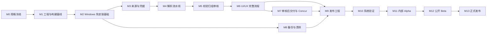

# Invoice Assistant Windows MVP 实施与验证任务计划

> 文档状态：原1.0任务实施中；D19–D22范围变更已确认，新增任务待排期执行
> 版本：1.4
> 日期：2026-08-26
> 前置依据：`decision-record.md` 1.4、`requirements.md` 1.4、`design.md` 1.4
> 确认记录：产品负责人已确认Concur草稿上传、本地导入/发票单/归组/重复口径、“稳定本地费用字段、上传阶段配置映射”，以及“批次双视图、完成审核后独立交付选择”的边界；任何真实Concur写入验证仍需指定测试租户、测试数据和当次明确批准

## 1. 执行目标

按已确认产品范围，完成 Windows 11 x64 免安装本地版的开发、验证和分阶段发布。执行顺序为：规格冻结 → 工程基线 → 本地核心流程 → UI → 备份与清除 → 免安装发布 → 真实环境验证 → Alpha → Beta → 正式版。

MVP 不建设产品账号、用户级密钥、跨设备同用户认证、云同步、自动更新、匿名遥测或外部大模型。上述能力不得作为核心功能交付的前置条件。

## 2. 执行规则

1. 按任务编号顺序执行；只有显式标注可并行的任务可以并行。
2. 每个任务必须引用需求 ID、提交可复核证据，并满足完成定义后才能标记完成。
3. 真实邮箱、真实发票和 Concur 操作必须遵守最小权限、人工确认和脱敏规则。
4. 任何授权码只从本机被 Git 忽略的 `.env.local` 加载，不写入日志、截图、报告、数据库或测试产物。
5. 对外 Beta 和正式版不得使用未签名或占位发布元数据的包。
6. P0、P1 缺陷以及数据损坏、授权码泄露、邮箱状态改变均按发布门禁处理，不以“后续修复”替代。
7. 任务范围发生变化时，先更新决策、需求、设计和追踪矩阵，再修改实现。

## 3. 完成定义

单项任务只有同时满足以下条件才算完成：

- 实现、配置或文档已进入版本控制，且不包含秘密和真实隐私数据。
- 相关单元、集成、UI 或发布检查已通过。
- 有候选版本、Windows 环境、用例 ID、结果和证据路径。
- 新增错误状态包含可操作恢复路径，不出现无限等待或静默失败。
- 相关需求、设计、用户说明和追踪矩阵已同步。
- 评审者已记录通过，或缺陷已进入有负责人和截止阶段的清单。

## 4. 依赖与阶段

## 5. 任务清单

### M0 规格冻结与执行治理

- [ ] **M0.1 固化规格基线**：确认 `decision-record.md`、`requirements.md`、`design.md`、本任务计划和追踪矩阵的版本；在仓库入口标明优先级和变更流程。证据：文档评审记录、规格版本标签。
  _Requirements: R01–R32_

- [ ] **M0.2 标记历史文档**：识别过期产品、计费、开发计划、状态总结和完成报告，在顶部标记“历史参考，不作为当前范围依据”，不删除原始记录。证据：历史文档清单和变更差异。
  _Requirements: R28_

- [ ] **M0.3 建立发布缺陷规则**：统一 P0/P1/P2/P3 定义、缺陷模板、豁免审批、回归要求和 Go/No-Go 报告格式。证据：缺陷规则和报告模板。
  _Requirements: R28_

- [ ] **M0.4 建立秘密与隐私处理规则**：覆盖 `.env.local`、日志、截图、测试报告、CI 产物、崩溃信息、样本和备份的允许/禁止字段。证据：检查清单和模拟泄露演练。
  _Requirements: R08, R09, R19, R22_
  _2026-08-24 实施记录：秘密扫描已加入模拟泄漏值拒绝/清除演练；合成夹具由机器清单、路径、标记、大小和 SHA-256 锁定。Git 机器审计确认 `HEAD` 与本地 `origin/main` 跟踪引用仍各含 20 个不能证明为合成的旧夹具，共 926,509 B、18 个唯一 blob；工作树删除尚未提交。GitHub 实时查询因 HTTPS 网络不可达且 SSH 无公钥权限未完成，历史重写、远端/缓存/旧制品撤回、干净克隆和负责人确认仍为 P0，因此任务暂不勾选。_

### M1 工程、测试和构建基线

- [ ] **M1.1 盘点当前实现差距**：逐条对照 R01–R32，确认现有前端、Tauri/Rust、数据库、解析器、测试和发布配置的实现状态，形成“已实现/部分实现/未实现/证据不足”报告。证据：基线审计报告。
  _Requirements: R01–R32_

- [ ] **M1.2 固化受支持工具链**：固定 Node、包管理器、Rust、Tauri、WebView2 检测方式和 Windows SDK 版本；提供干净机器复现步骤。证据：工具链清单和复现日志。
  _Requirements: R23–R26, R28_
  _2026-08-20 实施记录：Rust/Cargo 已精确固定为 1.97.1，Node 24.14.0、npm 11.9.0、Windows SDK 10.0.26100.0 和 WebView2 151.0.4129.93 已记录；远端 CI 尚未在候选提交运行，任务暂不勾选。_

- [ ] **M1.3 建立快速质量检查**：统一格式、静态检查、TypeScript/Rust 单元测试、依赖锁定、秘密扫描和许可证扫描命令。证据：本地和 CI 同一命令均通过。
  _Requirements: R22, R25, R28_

- [x] **M1.4 建立分层测试夹具**：创建不含真实隐私数据的 XML/OFD/PDF/图片黄金样本、畸形样本、重复样本和预期结果；EML夹具只验证邮箱内部解析器，不代表本地导入产品入口。证据：夹具清单、来源和期望值审计。
  _Requirements: R03, R12–R15, R22, R28, R30_
  _2026-08-22 完成记录：机器清单已登记并锁定 14 个合成文件，覆盖 XML、文本/扫描 PDF、OFD、图片、EML、业务 DTO、畸形、重复、ZIP 展开超限和机器可读预期结果；生成脚本连续两次输出 SHA-256 一致。解析端 4 个文件级测试与采集端 3 个文件级测试全部通过，文本 PDF 另通过元数据、文本提取、渲染和人工视觉检查。未知格式和加密输入仍由 M4.1 路由任务跟踪，不在本任务中冒充完成。_

### M2 Windows 免安装基础、目录和状态恢复

- [ ] **M2.1 修正应用身份与窗口基线**：统一产品标识、中文/英文名称、版本、最小窗口 1100×720、生产环境开发者工具策略和单实例行为。证据：配置检查和窗口测试。
  _Requirements: R23, R27_

- [ ] **M2.2 实现原生启动前检查**：在 WebView 创建前检查 Windows 架构、WebView2 Evergreen、数据目录可写性、磁盘空间和数据库兼容性；失败时显示原生可操作提示。证据：缺失 Runtime、只读目录、磁盘不足用例。
  _Requirements: R18, R23, R24_

- [ ] **M2.3 实现程序与数据分离**：程序目录只读可运行；默认 `DataRoot` 位于本机 LocalAppData；输出目录由用户选择；拒绝直接在 UNC、网络共享、只读介质或已知同步盘运行数据库。证据：目录矩阵和替换程序目录后的数据保留测试。
  _Requirements: R18, R23, R26_

- [x] **M2.4 实现数据版本和迁移回退**：为数据库、解析结果、归组结果、备份格式和输出保存版本；迁移前快照，失败不提交切换。证据：升级、降级拒绝和迁移故障注入。
  _Requirements: R11, R18, R19, R26_
  _2026-08-20 完成记录：v0→v6 连续迁移、schema 单一来源、备份防漂移及未来版本零修改拒绝通过；全部初始化/迁移/启动恢复位于单一事务，v5→v6 故障注入证明原库逐字节不变。解析检查点新增 `formatVersion`/`parserVersion` 包络并拒绝未来格式；归组规则版本改为单一常量，备份和输出 manifest 版本审计完成。最新 portable EXE 在隔离数据根完成 v5→v6、快照回滚、再次迁移闭环，证据见 `docs/release/data-version-and-migration-audit-2026-08-20.md`。_

- [ ] **M2.5 实现可恢复任务状态机**：采集、解析、发票单聚合、重复计入判定、锚点建组、其他发票归入、审核、审核快照和各类交付任务分别持久化检查点；强杀、重启和阶段失败后只重试安全范围。证据：每阶段故障注入报告。
  _Requirements: R11, R16, R17, R30_
  _2026-08-20 实施记录：新增运行中安全停止注册表、重复运行拒绝、检查点保留、interrupted 状态和 UI 恢复入口；邮箱停止路径仍先执行只读 FLAGS 核对。尚缺 packaged GUI 人工停止/恢复走查，任务暂不勾选。_

### M3 输入来源、会话凭据和邮箱只读

- [ ] **M3.1 实现首次设置与双模式选择**：支持 Concur 模式和纯本地模式；未配置邮箱时仍可使用发票/配套票据文件或文件夹，本地UI不显示EML。证据：首次设置路径和离线完成路径。
  _Requirements: R01, R02, R07_

- [ ] **M3.2 实现本地输入**：支持发票/配套票据单文件、多文件和文件夹批量；文件选择器、拖放区和帮助文案不暴露`.eml`；递归扫描、角色分类、重复发现和错误隔离均可预览。证据：输入组合与UI入口测试。
  _Requirements: R03, R11–R13, R30_
  _2026-08-20 实施记录：本地文件/文件夹/EML 已支持递归、去重、附件稳定化；新增单文件 25 MiB、展开 5000 文件/500 MiB 总量及重解析点拒绝。仍缺完整格式和错误隔离人工矩阵，任务暂不勾选。_

- [ ] **M3.3 实现会话凭据**：授权码只驻留内存，退出或清除时销毁；设置页不提供“保存授权码”；日志和错误统一脱敏。证据：内存生命周期测试、数据库/日志/产物扫描。
  _Requirements: R08, R22_

- [ ] **M3.4 实现 IMAP 能力探测和只读防线**：验证 TLS、认证、日期、文件夹和只读能力；协议层禁止写命令，读取前后比较只读指纹。证据：命令白名单/黑名单测试和模拟服务集成测试。
  _Requirements: R04, R09, R10_
  _2026-08-24 实施记录：在既有只读防线外补齐链接型邮件安全降级。MIME 层只产生不含 URL/正文的布尔提示；无附件时引导用户在邮箱客户端核对并手动下载，混合批次完成页保留提示，恢复检查点仅保存计数。合成安全回归和冻结 QQ 离线样本通过：链接型 3/3、其他 66 封误报 0、网络请求 0。完整 TLS/认证/文件夹/限流/断网服务矩阵仍未完成，任务暂不勾选。_

- [ ] **M3.5 实现日期与时区语义**：UI 使用包含结束日，协议内部转换为半开区间；按邮箱服务器时区处理边界并展示实际查询范围。证据：月末、跨时区、夏令时和空结果测试。
  _Requirements: R06, R10_

- [ ] **M3.6 建立邮箱服务支持标签**：Alpha 正式验证 QQ；公开版本完成 QQ 和 163；其他标准 IMAP 明确显示“实验性”，不混同正式支持。证据：设置页文案、兼容矩阵。
  _Requirements: R04, R27_

### M4 解析、OCR 和流水线一致性

- [ ] **M4.1 实现格式路由**：对 XML、OFD、PDF和图片票据使用确定性路由；邮箱内部EML解析器独立路由；未知、加密、损坏或超限输入进入明确异常。证据：格式路由参数化测试。
  _Requirements: R03, R12_

- [ ] **M4.2 完成结构化解析器**：XML/OFD 提取发票号、日期、金额、税额、销售方、类型等核心字段并保留来源依据。证据：黄金样本核心字段 100%。
  _Requirements: R12, R28_
  _2026-08-23 实施记录：真实 QQ 去重有效发票中 XML 8/8、OFD 21/21 可解析；另有 14 个铁路 PDF 通过有界 `EmbeddedFiles` XBRL/XML 路径进入 L0。OFD 无文本金额标签兜底被严格限定在 total_amount，通用字段误用回归已阻断。独立高置信预标注中已覆盖字段 84/84 一致，但其余 168 个槽位的人工真值未完成，任务暂不勾选。_

- [ ] **M4.3 完成 PDF 与图片 OCR**：支持文本 PDF 和扫描件；每个核心字段保存置信度和证据区域；图片低置信结果 100% 进入人工审核。证据：PDF ≥98%、图片 ≥92% 黄金样本报告。
  _Requirements: R12, R15, R28_
  _2026-08-24 实施记录：按扩展名纠正旧缺口口径后，修复前为 16 个 PDF + 1 个 PNG 失败。铁路 PDF 内嵌 XBRL 路径恢复 14 个，目标集误命中 0；严格运单明细/双语酒店账单模板再恢复 2 个 PDF，按魔数图片解码恢复 1 个 PNG。当前本批有效发票自动解析 84/84（100%），PDF 54/54、PNG 1/1；开票结果/下载页增加状态与操作双锚点拒绝，产品 worker 离线复测 1 张有效图片通过、2 张非发票结果页拒绝，聚合最终接受 84/84 有效发票、拒绝 9/9 无效或非发票。因其余 168 个核心字段槽位人工真值以及“每字段证据区域”验收尚未完成，任务暂不勾选。_

- [ ] **M4.4 实现资源限制和错误隔离**：限制文件大小、页数、解压大小、OCR 并发和超时；单个文件失败不终止整个批次。证据：超大/压缩炸弹/损坏样本和资源曲线。
  _Requirements: R11, R12, R22, R28_
  _2026-08-23 实施记录：图片/扫描 PDF 已设置 25 MiB、像素和 1–5 页边界；OCR 隔离到单并发 worker，每文件 45 秒硬超时；本地/EML/邮箱展开共享 5000 文件和 500 MiB 总预算，目录重解析点被拒绝。PDF 内嵌 XML 另有限制名称树节点、附件数、压缩输入、单份/总解压大小，Flate 解压膨胀回归已通过。超时终止、占用槽、worker 篡改和资源边界回归通过；仍缺完整批次局部失败和最低配置物理机证据，任务暂不勾选。_

- [ ] **M4.5 实现发票单聚合**：建立 `DocumentAsset`、`InvoiceRecord` 和待挂载材料模型；将主发票、行程单、消费明细、其他配套材料和来源副本挂在同一发票单，配套材料不独立形成费用或金额。证据：自动挂载、人工挂载、错误挂载撤销、重复来源和迁移测试。
  _Requirements: R11, R12, R15, R30_

### M5 校验、去重、归组和人工审核

- [ ] **M5.1 实现校验规则**：覆盖字段缺失、金额关系、日期范围、类型、币种和本地规则；境外/多币种强制人工确认。证据：规则表和边界用例。
  _Requirements: R06, R13, R15_

- [ ] **M5.2 实现可解释去重及计入状态**：同时使用内容哈希和稳定业务键，区分来源副本、同批、跨批和历史台账；疑似/确认重复默认不计入，只有用户明确确认非重复才恢复计入；不自动删除。证据：状态机、总额公式、重启、输出和UI依据测试。
  _Requirements: R13, R15, R30_

- [ ] **M5.3 实现两阶段确定性归组**：先由铁路/航空城际票据、已挂载行程单等强证据建立明确行程组，再建议其他发票单归入；无锚点不建差旅行程；保存依据，歧义进入审核，不调用外部大模型。证据：锚点/无锚点/多行程/配套材料场景和典型50张调整量。
  _Requirements: R05, R14, R28, R30_

- [ ] **M5.4 实现审核状态和阻断规则**：字段修改、票据挂载、行程组拆分/合并、归入建议、重复计入决定、异常处理和历史撤销可审计；未决定重复保持未计入但不阻断其他费用，真正阻断项未解决时禁止“完成审核”，且没有有效审核快照时禁止启动交付。证据：状态机、金额对账、快照失效和阻断绕过测试。
  _Requirements: R11, R15–R17, R30, R32_
  _2026-08-20 实施记录：字段/归组/重复/剔除恢复均使用草稿事务与前后快照，顺序撤销和提交/输出过滤回归通过；因真实 UI 走查未完成，任务暂不勾选。_

- [ ] **M5.5 建立稳定本地费用项模型**：新增版本化 `ExpenseItem`，使用软件内部分类、实际发生日期、费用说明、交易对方、结构化地点、付款方式、实际金额、币种、票面税项、行程/计入状态和字段来源；迁移既有审核值，不写入Concur字段名、选项ID或租户必填性。证据：schema迁移、字段语义、编辑审计、切换租户零变更和本地输出回归。
  _Requirements: R15, R16, R30, R31_

### M6 UI/UX 完整流程

- [ ] **M6.1 实现设计令牌和应用骨架**：使用已确认颜色、字体、224 px 导航、审核三栏布局和 Lucide 图标；不引入第二套视觉系统。证据：关键页面截图和设计核对表。
  _Requirements: R27_
  _2026-08-20 实施记录：设计令牌、224 px 侧栏和三栏布局已进入代码；UI 已内置 Source Han Sans CN 与 IBM Plex Sans/Mono，官方提交、OFL 和 SHA-256 已锁定并通过构建/许可门禁。仍缺图标体系核对、真实桌面关键页面截图与缩放证据，任务暂不勾选。_

- [ ] **M6.2 实现首次使用流程**：完成本机准备、模式、资料、来源、邮箱测试、隐私与输出位置；每步说明目的、是否必填和跳过后果。证据：首次用户走查。
  _Requirements: R01–R04, R07, R08, R18, R27_

- [ ] **M6.3 实现工作台与进度反馈**：显示当前批次、来源、阶段、数量、最近进展、安全停止、恢复和错误操作；前置失败 1 秒内离开 0% 状态。证据：正常、空结果、断网和后端失败 UI 测试。
  _Requirements: R11, R27_
  _2026-08-20 实施记录：工作台已显示阶段/数量/进展、可恢复任务及错误；新增安全停止按钮、请求中禁用、取消事件和检查点恢复提示。Svelte 0/0、UI 14/14 和生产构建通过；仍缺真实断网/空结果/packaged GUI 交互证据，任务暂不勾选。_

- [ ] **M6.4 实现批次双视图审核工作区**：批次一级视图严格只有“费用清单”和“归组”；费用清单提供本地费用项、问题筛选、单条核对及“费用信息/票据信息/问题与依据”，归组提供锚点行程、市内消费和待归组；不出现Concur字段、输出/上传标签或独立记录标签。共享底栏显示申报总额、重复未计入金额、阻断数和“完成审核”，键盘可完成挂载、定位、编辑、归组、确认和切换。证据：一级视图DOM/路由断言、审核用例、目标系统术语扫描、键盘走查和跨租户零变化测试。
  _Requirements: R13–R15, R27, R30–R32_
  _2026-08-20 实施记录：三栏工作区、安全原件预览、异常/字段、剔除恢复及 Alt/Ctrl/F6 快捷路径已实现；桌面控制组件启动失败，缺人工键盘与缩放证据，任务暂不勾选。_

- [ ] **M6.5 实现设置与敏感操作**：来源、输出、备份、检查更新、诊断、关于和“退出并清除程序与数据”入口；准确说明未加密备份、会话授权码和联网行为。证据：文案审查和危险操作测试。
  _Requirements: R08, R19–R22, R26, R27_
  _2026-08-20 实施记录：设置页已有来源、归组、备份导入、清除及“版本与支持”；版本检查明确仅点击联网且不自动下载/替换。正式支持渠道和真实版本 URL 未配置，任务暂不勾选。_

- [ ] **M6.6 完成可访问性和缩放**：1100×720、100%/125%/150% 缩放下主操作可见；提供焦点、标签、错误摘要和不依赖颜色的信息。证据：自动可访问性扫描和人工键盘测试。
  _Requirements: R27, R28_

- [ ] **M6.7 实现完成审核与独立交付选择**：阻断项清零后由用户点击“完成审核”，事务性冻结 `ReviewSnapshot` 并导航到批次外的交付选择；页面只提供“导出Excel”和“上传到Concur”两个主入口，完成一种后可返回执行另一种。返回批次恢复原视图/筛选/选中项；本地数据变更使快照失效并要求重新审核。证据：状态机、路由、事务故障注入、返回上下文、快照失效和双交付顺序测试。
  _Requirements: R15, R16, R27, R29–R32_

### M7 审核后输出和上传到Concur

- [ ] **M7.1 实现基于审核快照的Excel主导出**：只从独立交付选择读取有效 `ReviewSnapshot`，按稳定本地费用项和对应发票单生成Excel台账与明细；不依赖Concur映射，配套材料不独立计费，张数、申报总额、重复未计入金额、币种和分组一致。既有CSV/PDF/标准目录若保留，作为导出流程内的次级格式并使用同一快照。证据：逐字段对账、缺失目标映射仍可输出、失效快照拒绝和打印预览。

  _2026-08-20 实施记录：推荐输出已生成 Excel、CSV、PDF 台账、A4 合订本和精确原件 ZIP；A4 PDF 内置中文 TrueType，Poppler 对两页标准 A4 样本零警告渲染且视觉检查无缺字、重叠或裁切。仍缺完整批次跨格式逐字段对账和物理打印预览，任务暂不勾选。_
  _Requirements: R15, R16, R28, R30–R32_

- [ ] **M7.2 实现输出幂等与局部重试**：输出使用`review_snapshot_id + delivery_kind`稳定任务键，失败项可重试，成功文件不被静默覆盖；保留输出清单、快照摘要和哈希。证据：文件占用、磁盘满、部分失败、先上传后导出和重复点击测试。
  _Requirements: R11, R16, R32_

- [ ] **M7.3 实现 Concur 试发门禁**：Alpha 默认禁用；Beta 前只允许用户确认的已验证发件邮箱先发送一张收据，并要求用户确认 Concur 实际行为。证据：模拟 SMTP 和受控真实试发记录。
  _Requirements: R02, R17_
  _2026-08-20 实施记录：已完成已审批批次的一张试发、发件/收件/附件集合固定、用户确认 Available Receipts/ExpenseIt 后解锁批量、SMTP TLS/超时和页面内二次确认；模拟 SMTP 成功/中断通过。内部 Alpha 构建与 portable 元数据强制真实发送关闭；受控真实租户试发仍需当次批准，任务暂不勾选。_

- [ ] **M7.4 实现防重复批量发送**：附件数量受限、成功项持久化、失败项局部重试、已成功项禁止重发；每次真实批量发送均显示对象和附件清单。证据：重复点击、断网和部分成功测试。
  _Requirements: R17, R22, R28_
  _2026-08-20 实施记录：ledger schema v6 已持久化 pending/sending/sent/failed/unknown、幂等键、附件哈希、尝试次数和稳定 Message-ID；每封 1–5 张原子预留，成功项不重发，发送阶段中断转 unknown 并要求人工核对，审核后文件变化阻断。尚缺受控真实部分成功/重启复验，任务暂不勾选。_

- [ ] **M7.5 建立Concur企业档案和版本化映射配置**：保存不含凭据的租户标识、外部字段ID、费用类型/地点/VAT/付款/票据状态选项、条件必填性、内部字段路径、转换、默认值和页面/接口版本；配置只在设置与上传阶段使用。证据：目标租户字段清单、映射schema、7个已知必填项、企业自定义字段和配置漂移用例。
  _Requirements: R22, R29, R31_

- [ ] **M7.6 建立审核快照、交付任务、草稿上传会话与幂等模型**：持久化 `ReviewSnapshot`、`DeliveryTask`、上传会话、费用项revision、映射档案/规则版本、本次上传补充值、冻结映射结果、外部报销单/费用ID、阶段状态、附件哈希、幂等键、尝试次数和最后错误；未知状态必须先核对。证据：迁移、快照失效、映射恢复、双交付顺序、重复点击、强杀、断网和恢复测试。
  _Requirements: R11, R22, R29, R31, R32_

- [ ] **M7.7 实现目标映射引擎与报销单草稿适配器**：用户确认目标租户后，把已确认 `ExpenseItem` 通过版本化配置和上传补充值生成 `MappedExpensePayload`，冻结投影后创建未提交草稿并填入目标字段；映射不得反写本地费用项，不保存Concur凭据、不点击最终提交。证据：两个租户投影差异、本地零变更、缺失映射、模拟适配器契约和指定租户逐字段对账。
  _Requirements: R15, R29, R31_

- [ ] **M7.8 实现发票单附件上传、定向关联和回读核对**：只为计入状态本地费用项创建费用，把其对应发票单的主发票及行程单/明细等配套材料关联到该费用，按冻结映射快照回读报销单、费用和附件状态；只重试失败步骤。证据：重复排除、错序、多附件、映射对账、部分失败、未知状态和关联测试。
  _Requirements: R16, R22, R29–R31_

- [ ] **M7.9 实现交付选择后的“上传到Concur”UI**：只能由有效审核快照的独立交付选择进入；用户选择目标档案后提供映射版本、内部来源→外部字段预览、目标必填缺口、本次上传补充值、草稿级表单、计入费用/附件预览、重复未计入清单、固定阶段进度、逐项结果、恢复、局部重试和“在Concur中打开并检查”。不得把这些外部字段带回单条费用核对页，也不得把上传页做成批次标签。证据：路由门禁、UI自动化、术语边界、键盘/缩放、映射切换和失败文案审查。
  _Requirements: R27, R29–R32_

### M8 未加密备份、导入和程序数据清除

- [ ] **M8.1 实现备份导出**：生成带格式/schema 版本、清单和 SHA-256 的未加密 ZIP；排除授权码、Token、会话秘密和临时缓存。证据：包内容审计、篡改检测。
  _Requirements: R19, R22_

- [ ] **M8.2 实现跨电脑导入**：只处理用户主动选择的文件；在临时目录防路径穿越、限制解压、校验哈希和数据库；预览后原子导入，失败保持原数据。证据：跨两台 Windows 机器往返和恶意包测试。
  _Requirements: R19, R23, R28_
  _2026-08-20 实施记录：源/目标独立数据根的完整备份 ZIP 往返、旧台账回滚、原件恢复及目标 accounts.db 保留回归通过；仍缺两台物理 Windows 机器走查，任务暂不勾选。_

- [ ] **M8.3 实现清除预览和双重确认**：展示程序/数据绝对路径、数据类别、数量、大小和不可恢复后果，提供先备份入口并要求确认短语。证据：取消、返回备份和确认测试。
  _Requirements: R20, R27_

- [ ] **M8.4 实现受控清理程序**：主程序关闭数据库后退出，清理程序只按无通配符计划删除通过产品清单和安全根目录验证的程序/数据；拒绝根目录、用户主目录、UNC、联接点和符号链接。证据：路径攻击、占用、部分失败和误删防护测试。
  _Requirements: R20, R22, R25, R28_
  _2026-08-20 实施记录：一次性目录的清理执行回归已证明数据根删除、manifest 产品文件删除和同目录用户文件保留；仍缺标准 portable UI→helper 全链路，任务暂不勾选。_

### M9 免安装发布工程

- [ ] **M9.1 生成标准 portable ZIP**：包含 EXE、必需运行资源、首次使用、隐私、协议、发布说明、第三方许可、版本清单和哈希；不得包含开发工具、缓存、真实数据或秘密。证据：包清单差异和干净机启动。
  _Requirements: R23–R26_

- [ ] **M9.2 完成 WebView2 缺失路径**：默认不携带 Fixed Runtime；缺失时展示微软官方和企业 IT 获取说明，不静默安装、不申请管理员权限。证据：无 Runtime 环境测试。
  _Requirements: R24_

- [ ] **M9.3 建立签名与时间戳流水线**：内部 Alpha 未签名包明确标记；任何对外包的所有自有 PE 文件用同一可信 Authenticode 主体签名并加时间戳，签名后再计算哈希。证据：签名验证、篡改和发布者变化阻断。
  _Requirements: R25_

- [ ] **M9.4 实现用户触发的版本检查**：仅在点击后读取 HTTPS 版本清单，显示版本、说明、哈希和下载页；不自动下载、替换或提权。证据：关闭联网、超时、无更新和有更新测试。
  _Requirements: R21, R26_
  _2026-08-20 实施记录：后端/UI 已实现固定 HTTPS JSON 手动检查，系统证书/代理、5/10 秒超时、64 KiB、禁止重定向及产品/渠道/版本/哈希/下载页校验；未配置、断网、超时、无更新、有更新、本地更新和恶意清单测试通过。portable `version.json` 与验证脚本已接线。因正式 URL/下载页和签名 ZIP 尚未提供，任务暂不勾选。_

- [ ] **M9.5 生成 IT 审核包**：提供网络域名/端口/目的、进程、文件、注册表行为、数据目录、哈希、签名、SBOM、第三方许可、隐私说明和无管理员权限证明。证据：审核包完整性检查。
  _Requirements: R21–R26, R28_

### M10 系统验证与发布候选证据

- [ ] **M10.1 执行自动化回归**：单元、集成、模拟 UI、安全样本、迁移和打包检查在同一候选提交上通过。证据：机器可读结果和失败清零记录。
  _Requirements: R01–R32_
  _2026-08-24 实施记录：当前工作树门禁为 Rust 519 通过/15 默认忽略、UI 22/22、Svelte 0 错误/0 警告，格式/Clippy/检查/生产构建/秘密/许可均通过；门禁另行强制执行图片、扫描 PDF 与生产 worker 3 项 OCR golden。铁路、运单/酒店 PDF、图片魔数、252/252 核心字段与链接型 3/3/0 均完成回归；TEST-001、DATA-001 已关闭。最终主程序真实 QQ packaged 全流程、路径可访问性和动态日志复验通过，PRIV-002 已关闭。因完整 UI/故障矩阵和指定提交仍未完成，任务暂不勾选。_

- [ ] **M10.2 执行 Windows 真实 UI 矩阵**：Windows 11 x64 标准用户、无 UAC、100%/125%/150% 缩放、常见解压目录、非 ASCII 路径、只读/空间不足和回退均验证；覆盖批次仅双视图、审核前无交付、完成审核进入独立交付选择、Excel/Concur先后执行和返回上下文。Win10 ESU/LTSC 记录尽力兼容结果。证据：矩阵、截图和日志。
  _Requirements: R18, R23, R24, R26–R28, R30–R32_
  _2026-08-24 实施记录：最终主程序 `F449C597…AFD6` 已完成 portable 中文空格路径、数据隔离、OCR/DLL 对抗、严格空闲内存，以及全新数据根上的真实 QQ 首次设置、北京常驻地、月份/日期联动、收集、解析、84 份草稿、3 封链接提示、FLAGS 复核、84/84 原件路径和动态日志验证。较早候选的 150% 导航/设置与强杀恢复证据按各自哈希保留。发布矩阵仍缺当前候选可见恢复、100%/125%/150% 完整缩放、只读 ACL/低磁盘/无 WebView2、完整审核/导出/备份和第二台物理机，任务暂不勾选。_

- [x] **M10.3 执行真实 QQ 邮箱只读验证**：仅使用掩码测试邮箱 `879***187@qq.com`、本机 `.env.local` 的 `INVOICE_IMAP_PASSWORD`、城市北京、查询区间 `[2026-06-01, 2026-07-01)`；验证前后只读指纹一致。报告只记录掩码邮箱、统计、哈希和结论。
  _Requirements: R04, R08–R10, R22, R28_
  _2026-08-24 完成记录：按精确授权扫描 69 封邮件，69/69 PEEK 成功，前后 FLAGS/内容指纹一致；101 个直接 MIME 附件、115 个展开逻辑附件均保存在仓库外。最终主程序又通过真实 QQ packaged UI 生成批次 1、84 份待审核发票和 3 封链接型提示；测试后独立只读证据与测试前逐字节一致。84/84 原件均存在、最长路径 235 字符、凭据持久化 0、动态日志敏感命中 0。邮件/文件级盲标、链接型 3/3/0 和 252/252 核心字段真值也均完成；DATA-001、PRIV-002 已关闭。_

- [ ] **M10.4 执行性能和恢复验证**：参考机器 50 张批次处理不超过 5 分钟；强杀、断网、磁盘满、文件占用和数据库迁移失败可恢复或安全回退。证据：计时和故障注入报告。
  _Requirements: R11, R12, R16, R28, R30_
  _2026-08-24 实施记录：独立子进程强杀/重开回归通过，上一主程序的 synthetic schema v6 running 任务强杀后数据库仍完整并在同根重启转为 interrupted；最终产品候选集前 50 个离线累计 30.285 秒，完整 105 个累计 94.427 秒，84/84 有效发票成功且 21/21 非有效候选拒绝。105 文件进程树峰值 594,636,800 B、Release OCR worker 峰值 476,459,008 B；最终 packaged 解锁会话严格空闲 15 秒峰值 541,495,296 B，主程序 54,845,440 B，最多 6 个 WebView2，程序目录未变化且私密令牌命中 0；真实 QQ packaged 批次也已完成。仍需当前可见恢复、最低配置物理机、断网、磁盘满和文件占用，任务暂不勾选。_

- [ ] **M10.5 完成发布安全验证**：秘密扫描、恶意输入、ZIP 导入、DLL 搜索路径、签名、时间戳、哈希、SBOM、许可和 IMAP 写命令断言全部通过。证据：安全门禁报告。
  _Requirements: R09, R19, R20, R22, R25, R28_
  _2026-08-20 实施记录：秘密扫描与模拟泄漏演练、合成夹具清单、许可/SBOM、IMAP 写命令静态断言、备份/清理路径攻击和 portable 哈希门禁已通过。DLL 专项已完成：两个 release PE 的 DependentLoadFlags=0x0800、运行期 System32/显式目录白名单、诱饵 runtime/provider DLL + 恶意 CWD/PATH/ORT_DYLIB_PATH 对抗 golden 均通过；构建/portable 门禁直接解析 PE。历史夹具 Git 对象清理、签名和时间戳仍未完成，任务暂不勾选。_

- [ ] **M10.6 执行Concur草稿上传端到端验证**：在指定测试租户和用户明确授权的测试数据上，验证稳定本地费用项经冻结映射投影创建费用、切换档案不改变本地数据、主发票和配套材料关联同一费用、重复未计入、字段回读、中断恢复、防重和局部重试；不得点击最终提交。证据：脱敏对象清单、本地字段前后哈希、映射版本/快照、字段/附件/金额对账和前后状态截图。
  _Requirements: R22, R27–R32_

### M11 内部 Alpha

- [ ] **M11.1 生成 Alpha 候选包**：从指定提交生成 portable ZIP；未签名时在文件名、README 和 About 明确标记；发布到指定 GitHub Release。证据：提交、构建日志、哈希和下载记录。
  _Requirements: R23–R26, R28_
  _2026-08-24 实施记录：本地代码候选已包含 LINK-001、TEST-001、解析失败日志/启动路径脱敏、短稳定原件文件名、月份/日期联动、保守行程单性能修复和运单明细字段修复；当前门禁与真实 QQ packaged UI 通过。当前主程序 SHA-256 为 `F449C597F80A510BECB1108716BED7FF13FA4D1F510DA9E49A6DD6A36F79AFD6`，worker 为 `DF6BC273C4A0AF2CE3F74A1A570040E7B4541B1417ED79C3D0F067BD02184AAF`；最终文档后 portable ZIP SHA-256 为 `CF5E529F2803F49350A41A9076B9587EB268D0F9A4D1A1C5BDBCC23663C29C7B`，portable 复验通过。因仍缺指定提交、GitHub Release 地址和上传，任务暂不勾选。_

- [ ] **M11.2 完成 Alpha 用户验收**：建议 5 名用户，每人至少 3 个真实批次；覆盖发票文件/文件夹、QQ邮箱、发票单聚合、稳定本地费用字段核对、重复计入、两阶段归组、批次双视图、完成审核后的Excel交付选择、备份导入和恢复；Concur 默认不真实发送。证据：脱敏 UAT 汇总。
  _Requirements: R02–R19, R27–R32_

- [ ] **M11.3 Alpha Go/No-Go**：P0 为 0；P1 仅允许产品负责人书面、限时豁免；邮箱状态变化、数据损坏和秘密泄露为 0。证据：门禁报告和产品负责人决定。
  _Requirements: R28_

### M12 公开 Beta

- [ ] **M12.1 补齐对外发布元数据**：提供签名证书主体、发布主体、版权人、正式名称、支持/隐私/安全邮箱、反馈入口、隐私政策、用户协议和可信下载地址。证据：真实可访问信息和责任人验收。
  _Requirements: R25, R26, R28_

- [ ] **M12.2 完成 QQ、163 正式兼容验证**：两类服务各覆盖认证、日期、文件夹、附件、空结果、限流、断网和只读指纹；其他 IMAP 仍标实验性。证据：服务商矩阵。
  _Requirements: R04, R08–R10, R28_

- [ ] **M12.3 完成 Concur 草稿上传和兼容发送发布门禁**：使用指定测试账号/租户，完成未提交草稿、费用填写、附件关联、回读、防重和恢复；同时先一张收据试发并人工确认，再验证兼容路径防重复批量发送；禁止自动最终提交。证据：脱敏上传/发送清单、逐项对账和人工确认。
  _Requirements: R02, R17, R22, R28, R29, R31, R32_

- [ ] **M12.4 运行 30–50 人 Beta**：收集核心流程成功率、审核耗时、人工调整量、崩溃、企业策略阻断和支持问题；不启用匿名遥测。证据：用户主动提交的脱敏汇总。
  _Requirements: R21, R27–R32_

- [ ] **M12.5 Beta Go/No-Go**：只允许已签名、带时间戳、哈希、SBOM、许可和真实支持信息的候选包对外；P0/P1 门禁通过。证据：完整发布审批包。
  _Requirements: R25, R26, R28_

### M13 正式发布

- [ ] **M13.1 关闭 Beta 遗留缺陷**：P0/P1 为 0，所有发布阻塞项关闭；P2/P3 有清晰影响、规避方案、负责人和目标版本。证据：最终缺陷清单。
  _Requirements: R28_

- [ ] **M13.2 完成正式候选回归**：对最终签名产物而非签名前产物执行 Windows、邮箱、输出、备份、清除、升级和安全抽查。证据：RC 报告和产物哈希。
  _Requirements: R01–R32_

- [ ] **M13.3 发布到官方 HTTPS 下载页**：发布 portable ZIP、SHA-256、签名说明、版本说明、隐私政策、协议和支持入口；版本清单只指向本次签名产物。证据：线上可访问性和下载复核。
  _Requirements: R25, R26_

- [ ] **M13.4 正式 Go/No-Go 与回退准备**：研发提交构建证据，测试提交缺陷与门禁报告，产品负责人作最终决定；准备撤回链接、恢复上一版本和用户数据回退说明。证据：签字记录和回退演练。
  _Requirements: R26, R28_

## 6. 产品负责人仍需按阶段提供的信息

以下项目不阻塞本任务计划确认和 M0–M10 的开发验证，但阻塞对应发布阶段：

| 编号 | 信息/资源 | 最晚时间 | 不提供的结果 |
|---|---|---|---|
| P01 | Alpha 目标用户名单或招募负责人 | M11.2 前 | 无法完成真实 UAT |
| P02 | 指定 GitHub Release 仓库/下载地址 | M11.1 前 | 无法分发 Alpha |
| P03 | 163 测试邮箱及一次性会话凭据提供方式 | M12.2 前 | 163 不能标记正式支持 |
| P04 | Concur测试账号/租户、允许的集成方式和每次写入/外发审批人 | M7.5、M10.6前 | 无法开发验证草稿上传；Concur能力不能进入公开版本 |
| P05 | Authenticode 证书主体、申请负责人和预算 | M12.1 前 | 不得生成对外 Beta 包 |
| P06 | 正式发布主体、中文/英文产品名、版权人 | M12.1 前 | 法律与签名材料不能定稿 |
| P07 | 支持、隐私、安全邮箱和反馈入口 | M12.1 前 | 不得公开发布 |
| P08 | 隐私政策、用户协议的正式 HTTPS 地址 | M12.1 前 | 不得公开发布 |
| P09 | 正式下载域名和托管负责人 | M13.3 前 | 不得正式发布 |
| P10 | 最终 Go/No-Go 决策人及替补 | M11.3 前 | 不得进入下一阶段 |

## 7. 本轮确认方式

产品负责人回复“确认任务计划”即表示：

1. 同意按 M0–M13 的依赖顺序执行。
2. 同意开发期间严格遵守 R01–R32、D10-B、D19、D20、D21和D22。
3. 同意 M0–M10 可以先执行，P01–P10 按表中最晚时间提供。
4. 同意真实 QQ 邮箱测试仅在 M10.3 使用既定测试参数并保证只读。
5. 授权在任务计划确认后进入代码开发与测试；任何真实 Concur 外发仍需单独的当次批准。

如需修改，请按“任务编号 + 修改内容 + 验收结果”回复；修改完成并再次确认后才开始实施。
