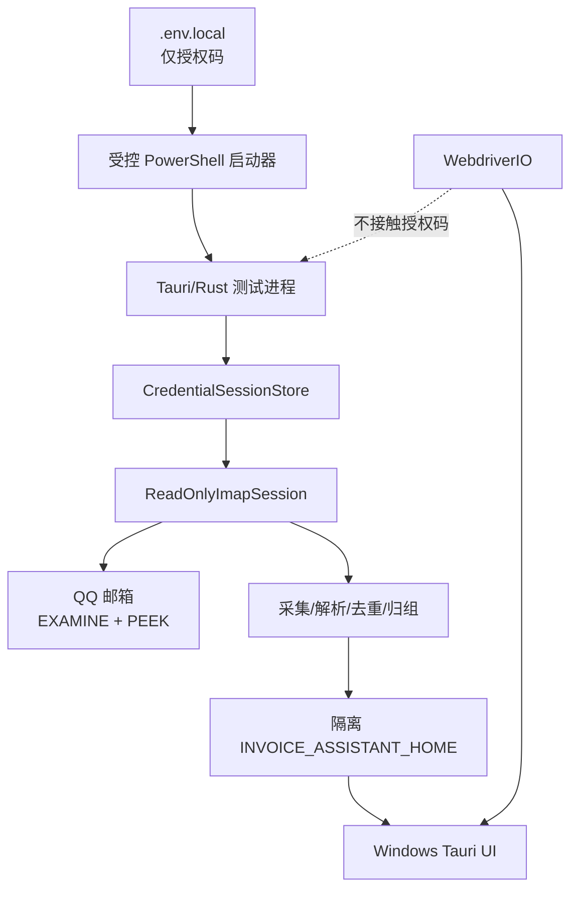

> **历史子规格。** 当前真实验证门禁以 `specs/mvp-release-baseline/` 1.0 为准。

# 真实邮箱 UI 验证技术设计

> 对应需求：`requirements.md`
> 当前阶段：设计，尚未授权实施

## 1. 当前代码审计结论

| 项目 | 当前状态 | 结论 |
|---|---|---|
| `.env.local` | 仓库根目录存在，已被 `.gitignore` 忽略 | 可作为人工受控测试秘密来源，但不能由前端/Vite读取 |
| IMAP 文件夹打开 | 使用 `SELECT` | 不能保证只读，真实测试前必须改为 `EXAMINE` |
| IMAP 正文获取 | 使用 `BODY[]` | 可能设置 `\\Seen`，必须改为 `BODY.PEEK[]` |
| 写邮箱命令 | 当前源码未发现 STORE/MOVE/DELETE/EXPUNGE | 仍需静态门禁和协议测试锁定 |
| 真实流水线测试 | `#[ignore]` 测试仅打印邮箱与密码长度 | 不是有效集成测试，且不应打印密码长度 |
| 凭据 | 设置命令修改全局环境变量并写入 accounts.db | 与 MVP 会话凭据设计冲突，且存在 Windows 主密钥问题 |
| 流水线事件 | 后端先启动，前端后监听 | 存在事件丢失和 0% 假死问题 |
| 常驻城市 | 流水线硬编码北京 | 真实用户也是北京，可能掩盖配置链路缺陷 |
| 审核 | 当前自动通过 | 不符合产品 Spec |
| UI E2E | 仓库内无可复用 WebDriver 测试套件 | 需要建立 WebdriverIO/Tauri 测试工程 |

因此，不能直接在当前代码上运行真实邮箱完整 UI 测试。必须先完成“只读、秘密、隔离、终态”四个安全门禁。

## 2. 总体架构



## 3. 测试秘密加载

### 3.1 启动器职责

新增 Windows 专用启动器，例如：

```text
scripts/run-real-email-ui-test.ps1
```

启动器只能：

1. 检查 `.env.local` 已被 Git 忽略。
2. 从 `.env.local` 读取允许列表中的 `INVOICE_IMAP_PASSWORD`。
3. 固定注入非秘密测试参数：邮箱、日期范围、常驻城市。
4. 生成仓库外的唯一 `INVOICE_ASSISTANT_HOME`。
5. 设置显式开关 `INVOICE_REAL_EMAIL_TEST=1`。
6. 启动后端、Tauri 应用和 WebDriver 测试子进程。
7. 测试完成后清除父进程环境变量并终止残留子进程。
8. 只打印运行 ID、阶段结果和隔离目录，不打印秘密或真实业务明细。

禁止把 `.env.local` 交给 Vite。任何 `VITE_` 前缀变量都会存在进入前端构建产物的风险，本方案不使用该机制。

### 3.2 自动化与手工输入分离

真实验证分两条路径：

- **人工真实冒烟**：操作者在 UI 密码框手工输入授权码，验证输入、遮罩、测试连接和清空行为；不录屏、不截图。
- **自动真实全流程**：Rust 后端从启动器接收环境变量，建立临时 `credential_session_id`；WebDriver 只操作 session ID 对应的 UI 状态，不接触授权码。

模拟 UI 测试继续使用假授权码覆盖字段校验、错误文案和重试行为。

## 4. IMAP 只读设计

### 4.1 API 边界

新增或重构为只暴露读取能力的接口：

```text
ReadOnlyMailbox
├── list_folders
├── examine_folder
├── search_range
├── fetch_summaries
├── fetch_flags
├── fetch_raw_peek
└── snapshot
```

生产采集层不直接持有通用 `imap::Session`，避免未来误调用写操作。

### 4.2 协议要求

- 文件夹使用 `EXAMINE`。
- 完整正文使用 `BODY.PEEK[]`。
- 摘要读取 `INTERNALDATE ENVELOPE RFC822.SIZE FLAGS BODY.PEEK[HEADER.FIELDS (MESSAGE-ID)]`。
- 不提供写命令包装器。
- 在 debug/测试模式记录 IMAP 命令名称，但不记录认证载荷和正文。
- 命令审计遇到写操作关键字立即失败。

### 4.3 邮箱指纹

在真实测试前后生成只读指纹：

```text
MailboxSnapshot
├── folder
├── uid_validity
├── exists
└── messages[]
    ├── uid
    ├── flags
    ├── rfc822_size
    └── message_id_digest
```

只比较 2026 年 6 月受测 UID。历史区间已经关闭，不受新邮件进入 INBOX 的影响。Message-ID 只保存摘要，不保存原值。

## 5. 日期范围设计

UI 显示：

```text
开始日期：2026-06-01
结束日期：2026-06-30
```

后端转换为：

```text
SINCE 01-Jun-2026 BEFORE 01-Jul-2026
```

UI 使用闭区间表达，IMAP 使用半开区间。转换逻辑集中在一个模块，并增加 6 月 30 日包含、7 月 1 日排除的测试。

## 6. 测试数据隔离

### 6.1 目录

每次运行创建：

```text
%TEMP%/invoice-assistant-real-ui/{run_id}/
├── app-data/
├── webdriver-profile/
├── artifacts/
├── security-audit/
└── run-summary.json
```

真实附件、数据库和输出不允许写入仓库。`run-summary.json` 只包含计数、阶段、耗时、状态和脱敏摘要。

### 6.2 制品策略

- 默认不截图真实发票页面。
- 失败截图必须先遮挡原件、金额、发票号、抬头和邮箱。
- 不保留原始邮件正文日志。
- 测试报告使用运行 ID，不使用完整邮箱地址作为文件名。
- 自动清理前先执行秘密扫描和邮箱只读对比。
- 删除真实测试数据属于显式清理步骤，由操作者确认后执行。

## 7. 会话凭据设计

### 7.1 后端状态

```text
CredentialSession
├── session_id
├── email
├── secret
├── created_at
├── last_used_at
└── expires_at
```

- 使用后端内存容器保存。
- secret 类型支持释放前清零。
- 默认空闲 30 分钟过期。
- Tauri 事件和 IPC 只传 `session_id`，不传 secret。
- 应用退出、测试结束或用户断开时清除。
- 不调用 `accounts_db.set_credential`。

### 7.2 IPC

```text
test_email_connection(email, password, config) -> credential_session_id
create_real_test_session_from_env() -> credential_session_id   // debug + 显式开关
disconnect_email_session(session_id)
start_pipeline(config, credential_session_id) -> pipeline_id
```

`create_real_test_session_from_env` 必须同时满足：

- debug/test 构建；
- `INVOICE_REAL_EMAIL_TEST=1`；
- 邮箱等于允许的测试邮箱；
- Release 构建不注册该命令。

## 8. 流水线状态设计

后端维护任务注册表：

```text
Queued → Preflight → Collecting → Parsing → Validating
       → Grouping → NeedsReview → Exporting → Completed
                                      ↘ Failed / Cancelled
```

- 前端生成或先获得 `pipeline_id`，完成监听后再启动。
- 前置检查失败直接返回结构化错误，或写入 Failed 终态。
- 所有退出路径经过统一终结器，终态只写一次。
- 每阶段写 SQLite 检查点。
- UI 进入页面时调用 `get_pipeline_status`，不只依赖事件。
- 停止使用“保留进度”，不删除已处理内容。

## 9. 北京归组设计

真实测试配置：

```text
home_cities = ["北京"]
```

流水线从 `grouping_rules` 读取该值，传入 `GroupingConfig`。为了防止“真实值刚好等于硬编码值”造成假通过，必须增加以下自动测试：

1. 设置北京，验证北京是行程起止和本地消费基准。
2. 设置上海，使用同一合成数据验证结果改变。
3. 未设置常驻城市时前置检查失败，不自动回退硬编码城市。

真实 UI 报告只记录需要人工调整的数量，不记录具体地点链和金额。

## 10. UI 自动化设计

### 10.1 工具

采用 WebdriverIO 与 Tauri 官方服务：

```text
e2e-tests/
├── package.json
├── wdio.conf.ts
├── helpers/
│   ├── app.ts
│   ├── real-test-session.ts
│   └── redaction.ts
└── specs/
    ├── onboarding.mock.e2e.ts
    ├── pipeline-errors.mock.e2e.ts
    ├── review.mock.e2e.ts
    └── real-email.readonly.e2e.ts
```

模拟测试进入普通 CI；`real-email.readonly.e2e.ts` 只有显式开关时运行。

### 10.2 真实 UI 场景

1. 启动隔离应用，确认没有读取用户正式数据库。
2. 首次设置选择本地模式，设置常驻城市北京。
3. 配置掩码测试邮箱 `879***187@qq.com`；完整地址只保存在本机测试配置中。
4. 通过测试后端命令建立会话，不把授权码送入 WebDriver。
5. 创建批次，UI 选择 2026-06-01 至 2026-06-30。
6. 启动流水线，记录阶段、计数和最近更新时间。
7. 等待进入 NeedsReview 或 Completed，禁止停在 0%。
8. 在审核页人工/自动处理不涉及真实明细暴露的交互。
9. 生成输出并验证文件存在、非空、可打开。
10. 比较邮箱前后指纹。
11. 扫描日志、数据库和测试制品，确认没有授权码。
12. 生成脱敏摘要，关闭应用和驱动。

首次基线运行不把张数和金额写死。由操作者审核结果后，在隔离目录保存本地基线；后续运行只比较计数和摘要，不把基线提交 Git。

## 11. 测试分层

| 层级 | 数据 | 默认运行 | 验证内容 |
|---|---|---|---|
| Rust 单元测试 | 合成 | 是 | 日期、只读命令、脱敏、状态机、归组配置 |
| Rust 集成测试 | 合成临时目录 | 是 | 采集接口、解析、去重、存储、输出 |
| UI 模拟 E2E | 假 IPC/假事件 | 是 | 表单、错误、进度、审核、输出交互 |
| 真实邮箱后端 | 真实邮箱 | 否 | 登录、只读、抓取、解析、邮箱指纹 |
| 真实 Windows UI | 真实邮箱 | 否 | 端到端任务、恢复、审核、输出 |
| Concur 试发 | 用户明确授权后 | 否 | 单张收据发送，不属于首轮门禁 |

## 12. 安全审计

每次真实运行结束后检查：

- Git 工作区没有新增真实发票或 `.env.local`。
- 运行目录之外没有新增数据库、日志和输出。
- 日志不包含授权码、完整邮箱正文、税号和完整发票号。
- WebDriver 命令和报告不包含授权码。
- 邮箱快照完全一致。
- 应用退出后凭据会话不存在。

任何一项失败都阻止继续真实测试，并要求撤销 QQ 邮箱授权码。

## 13. 回滚与故障处理

- 邮箱指纹变化：立即停止、保留审计目录、人工检查邮箱状态、撤销授权码。
- 授权码疑似泄露：立即撤销并生成新授权码；旧测试制品隔离销毁。
- 数据写入仓库：停止测试，不提交；确认精确文件后再安全清理。
- 流水线失败：保留隔离目录，不重新扫描邮箱，优先从检查点继续。
- UI 驱动失联：终止驱动和应用，验证邮箱指纹后再决定重试。

## 14. 验证报告

最终报告包含：

- 代码版本和 Windows/WebView2 版本。
- 运行 ID、日期范围、常驻城市。
- 各阶段通过/失败状态、耗时和计数。
- 邮箱只读指纹比较结果。
- UI 场景结果和遗留问题。
- 输出文件类型和完整性结果。
- 秘密扫描结果。

报告不包含授权码、邮件正文、完整主题、完整发票号、税号、金额明细和真实发票截图。
