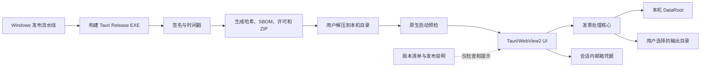
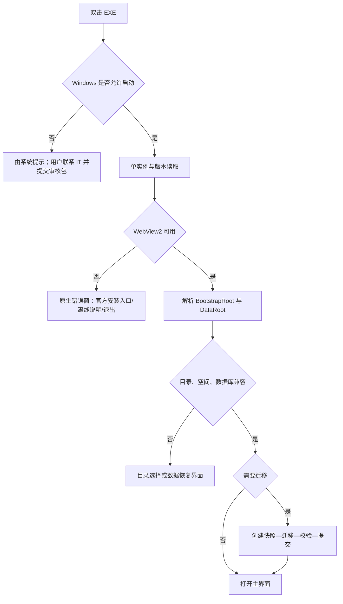

> **历史规格。** 已合并到 `specs/mvp-release-baseline/` 1.0；冲突时以后者为准。

# Windows 免安装本地版技术与交互设计

状态：设计完成，待任务计划确认后实施
对应需求：`specs/windows-portable-local-release/requirements.md`

## 1. 设计结论

首发采用“签名 EXE + ZIP”的本地免安装模式。程序目录只承载可替换的二进制和静态资源，用户数据固定落在本机用户数据目录。默认复用系统 WebView2 Evergreen Runtime；更新采用“提示下载—退出应用—替换程序目录—重启迁移”的人工可回退流程。

本设计继承 `docs/product-ui-and-user-interaction-design.md` 中已有的 **DESIGN SPECIFICATION**：工业化、实用、克制的视觉方向，既有颜色、字体、间距、状态语义和 Lucide 图标规范保持不变。本文件只增加免安装发行所需的启动、数据目录、更新和受管电脑交互，不建立第二套视觉系统。

## 2. 总体架构



关键边界：

- `ProgramDir`：解压所得程序目录，可整体删除或替换，不存用户数据。
- `DataRoot`：默认 `%LOCALAPPDATA%\InvoiceAssistant\Data`，保存数据库、任务状态、必要缓存和脱敏日志。
- `BootstrapRoot`：`%LOCALAPPDATA%\InvoiceAssistant`，仅保存数据目录指针、应用版本等非敏感启动配置。
- `OutputDir`：由用户选择，保存导出表格、PDF 包、摘要和用户主动生成的附件。
- `SessionSecret`：邮箱授权码只在进程内存存在，不属于上述任何目录。

## 3. 发布包设计

### 3.1 推荐目录

```text
InvoiceAssistant-<version>-windows-x64-portable/
├─ InvoiceAssistant.exe
├─ runtime/                 # 仅放必须随程序分发的非 WebView2 运行库
├─ README-首次使用.md
├─ PRIVACY.md
├─ RELEASE-NOTES.md
├─ THIRD-PARTY-NOTICES.txt
├─ version.json
└─ SHA256SUMS
```

用户不需要执行 `.bat`、`.cmd`、`.ps1` 或注册表脚本。默认包不携带 WebView2 Fixed Version Runtime，以控制体积并接受 Evergreen 安全更新。

### 3.2 构建与签名顺序

1. 在仓库根目录执行锁定依赖的前端和 Rust 构建。
2. 生成 Release EXE，但不把 MSI/NSIS 作为首发必需产物。
3. 对所有自有 PE 文件进行 Authenticode 签名和可信时间戳。
4. 验证签名链、发布者和时间戳。
5. 生成 SBOM、第三方许可、`version.json` 和签名后 SHA-256。
6. 组装 ZIP，重新解压到干净目录进行冒烟测试。
7. 发布 ZIP 与独立的哈希清单；归档构建日志和测试报告。

哈希必须在签名后计算。任何签名、二进制或说明文件变化都必须重新生成发布包和清单。

## 4. 启动流程



WebView2 检查必须在依赖 WebView 的主窗口创建之前完成，否则缺少运行时时无法显示可用的错误界面。若 Tauri 主进程不便直接提供原生错误窗，可使用最小 Win32 对话框，但不得启动下载器或提权安装。

## 5. WebView2 策略

### 5.1 默认精简包

- 使用系统 WebView2 Evergreen Runtime。
- 优点：包体小、微软持续提供安全更新、企业通常已有统一维护。
- 失败处理：显示检测到的 Windows 信息、缺失原因、微软官方入口和可交给 IT 的离线安装说明。
- 程序只提示，不静默下载安装，也不要求管理员权限。

### 5.2 可选完整包

Fixed Version Runtime 可在后续作为独立的 `portable-full` 包评估，不能成为首发默认方案。它会显著增加包体和维护责任，还需遵守 WebView2 对网络路径、目录权限及 Windows 版本的限制。若未完成独立兼容性和安全测试，不发布该包。

## 6. 数据目录与迁移

### 6.1 目录解析

首次启动优先使用 `%LOCALAPPDATA%\InvoiceAssistant\Data`。用户可以在首次启动或设置中迁移到另一个本机 NTFS 目录，但不能简单地把正在使用的 SQLite 文件放入 OneDrive、企业同步盘、UNC 或多人共享目录。

路径验证至少包括：

- 解析为绝对规范路径，避免相对路径和路径穿越。
- 验证可创建、写入、原子重命名、锁定和删除测试文件。
- 检查剩余空间、路径长度和只读属性。
- 识别 UNC、远程卷和常见同步根目录；数据库目录不合格时阻止继续，输出目录仅提示风险。
- 数据目录中不保存邮箱授权码。

### 6.2 旧目录迁移

当前历史路径 `%USERPROFILE%\.invoice-assistant` 只做兼容检测。发现旧数据时显示：旧路径、新路径、数据库版本、文件数、大小和建议动作。

迁移流程为：关闭任务写入 → 创建源清单和目标快照 → 复制到临时目标 → 校验数量/大小/数据库完整性 → 原子切换目录指针 → 保留旧目录。删除旧目录是用户后续主动操作，不属于迁移步骤。

### 6.3 备份边界

MVP 可以导出用户可携带的备份包，但不在免安装版中提前实现产品账号和加密。未来备份格式必须按用户身份进行跨电脑匹配；当前仅保证程序升级不会改动或吞掉 `DataRoot`。

## 7. 手动更新设计

MVP 不实现后台自动更新器。应用只读取签名的版本清单或由用户手动检查，显示：当前版本、新版本、发布日期、关键变化、数据格式影响、下载入口和 SHA-256。

用户流程：

1. 完成或暂停当前任务，点击“退出并更新”。
2. 从官方渠道下载新 ZIP，并核对发布者签名；高级用户可核对哈希。
3. 解压到新的程序目录，不覆盖正在运行的目录。
4. 启动新 EXE；程序读取同一个 `DataRoot`。
5. 若需要数据库迁移，先创建快照，再执行和校验。
6. 新版本确认正常后可删除旧程序目录；迁移不成功则退出新版本并按提示回到旧程序和快照。

版本降级不得直接打开高版本数据库。检测到不兼容时进入只读恢复提示，不能冒险写入。

## 8. UI 与交互增量

### 8.1 首次启动

在主工作流之前增加一个三步轻量引导：

1. **运行环境**：WebView2 和系统兼容状态；正常时自动通过，异常时给出处理路径。
2. **数据保存位置**：显示默认绝对路径，可选择“更改位置”；辅助文案为“程序更新不会删除此处数据”。
3. **隐私说明**：本地处理、本地数据在 MVP 中未做应用层加密、授权码只在本次运行使用。用户确认后进入导入页。

不可依赖 WebView2 的致命错误由原生窗口呈现；其余步骤沿用现有应用设计语言。

### 8.2 设置页新增“本机与版本”分组

- 版本：`免安装版 <version> / Windows x64`。
- 程序位置：只读展示，提供“打开目录”。
- 数据位置：展示路径、空间和状态，提供“打开目录”和“迁移数据”。
- 隐私状态：`本地数据库：未加密（MVP）`、`邮箱授权码：仅当前会话`。
- 运行环境：WebView2 版本和“重新检测”。
- 更新：当前/最新版本、检查时间、发布说明和“前往官方下载”。

“迁移数据”必须先停止任务、生成快照并二次确认，不能只改一个路径字段。

### 8.3 状态与错误文案

| 场景 | 标题 | 主操作 | 次操作 |
|---|---|---|---|
| 缺少 WebView2 | 缺少运行环境 | 查看官方安装方式 | 复制信息 / 退出 |
| 数据目录不可写 | 无法使用数据目录 | 选择其他本机目录 | 查看原因 |
| 检测到旧数据 | 发现历史数据 | 迁移并校验 | 暂不迁移 |
| 有新版本 | 新版本可用 | 前往官方下载 | 查看更新说明 |
| 数据库迁移失败 | 数据未被修改 | 恢复快照 | 导出诊断信息 |
| 企业策略阻止 | 应用被 Windows 或组织策略阻止 | 联系 IT | 查看审核资料说明 |

如果 EXE 在进程创建前被阻止，应用无法显示最后一行 UI；该文案用于帮助中心和可启动但后续组件被拦截的场景。

## 9. 企业 IT 审核包

每个正式版本输出一个与 ZIP 版本绑定的审核包：

- 产品名、版本、架构、发布者、证书指纹和有效期。
- 每个 EXE/DLL 的签名状态和 SHA-256。
- SBOM、第三方许可、已知高风险依赖处置结果。
- 写入目录、临时目录、日志目录、数据保留和卸载方式。
- 所需域名、端口、协议和用途；明确邮箱域名由用户配置决定。
- 权限说明：无需管理员、不安装服务/驱动、不修改安全策略。
- 邮箱只读证明、授权码生命周期和脱敏日志样例。
- AppLocker/WDAC 建议按发布者或签名规则审核，不建议按临时路径或改名规避。

## 10. 安全与威胁控制

- 代码签名解决发布者和完整性验证，不替代数据加密。
- DLL 搜索路径限制在受控目录，避免从当前工作目录加载非预期库。
- 发布目录中的可执行内容全部纳入签名/哈希清单。
- 不从 ZIP 内直接运行；README 提示先完整解压到本机目录。
- 不把隐私字段、邮箱正文或授权码放入日志、崩溃报告和文件名。
- 外部 OCR/Python 依赖若仍存在，必须被打包为受控、签名、版本固定的组件，或在首发前移除该运行时依赖；不能要求用户另装 Python。
- 所有联网行为在 IT 审核资料中可枚举，失败不得改变邮箱内容。

## 11. 测试策略

### 11.1 构建验证

- 前端类型检查、单元测试和生产构建。
- Rust `fmt --check`、`clippy`、workspace tests 和 release build。
- 从仓库根目录和发布脚本均能稳定构建；不再依赖当前工作目录碰巧正确。
- 解压发布 ZIP 后离线启动冒烟。

### 11.2 免安装矩阵

- Windows 10/11，标准用户，无管理员凭据。
- `%USERPROFILE%\Downloads`、含中文/空格的本地目录、只读目录、本地 USB。
- 系统 WebView2 已安装、版本偏旧、完全缺失。
- 100%/125%/150% 缩放和 1100×720 最小窗口。
- Defender/SmartScreen 正常状态；记录企业策略阻止时的外部表现，不尝试绕过。
- 首次运行、二次运行、程序目录只读、数据目录不可写、磁盘空间不足。

### 11.3 数据和升级矩阵

- 空数据库、当前版本数据库、历史 `%USERPROFILE%\.invoice-assistant` 数据。
- 新程序目录读取同一 `DataRoot`，任务和输出索引保持一致。
- 迁移前快照、成功迁移、故障注入、回退和不兼容降级。
- 数据目录在 UNC/同步盘时的阻止或警告。

### 11.4 真实业务回归

在隔离测试数据目录中，使用既定 QQ 邮箱、`.env.local` 中的授权码变量、北京常驻地和 `[2026-06-01, 2026-07-01)` 日期区间执行两轮只读测试。测试报告仅记录邮箱掩码和变量名，不读取、打印或归档授权码值。

## 12. 实施和回退原则

- 先修复核心流程和安全 P0，再封装免安装发布，不用打包工作掩盖功能缺口。
- 新目录策略先提供兼容读取和显式迁移，至少保留一个稳定版本的回退能力。
- 安装包仍可构建，但不阻塞免安装首发；所有版本必须使用同一数据目录和数据库迁移协议。
- 若签名证书、WebView2 缺失处理或数据迁移任一项未通过门禁，只能发布内部测试包，不能标记为正式版。

## 13. 参考资料

- Microsoft WebView2 Evergreen 与 Fixed Version 分发说明：<https://learn.microsoft.com/en-us/microsoft-edge/webview2/concepts/evergreen-vs-fixed-version>
- Microsoft WebView2 应用分发：<https://learn.microsoft.com/en-us/microsoft-edge/webview2/concepts/distribution>
- Microsoft Windows 应用签名选项：<https://learn.microsoft.com/en-us/windows/apps/package-and-deploy/code-signing-options>
- Microsoft AppLocker 可执行文件规则：<https://learn.microsoft.com/en-us/windows/security/application-security/application-control/app-control-for-business/applocker/executable-rules-in-applocker>
- Tauri Windows 分发说明：<https://v2.tauri.app/distribute/windows-installer/>
