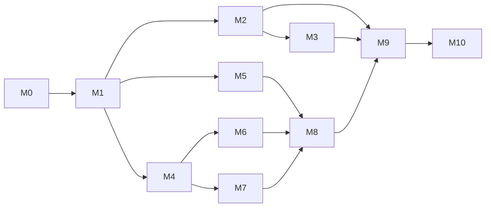

> **历史计划。** 当前执行计划为 `specs/mvp-release-baseline/tasks.md` 1.0。

# Windows 免安装本地版工作内容项

状态：待用户确认任务计划；尚未进入代码实施
执行原则：先完成核心功能与安全 P0，再完成免安装发布工程，最后执行真实数据验收。

## 1. 优先级定义

- **P0 / 阻塞发布**：不完成就不能给真实用户发布。
- **P1 / 首发建议**：不阻塞内部 Alpha，但应在公开发布前完成。
- **P2 / 发布后**：可在功能发布稳定后实施。

## 2. 里程碑与任务

## M0：冻结免安装发布范围（P0，0.5–1 天）

- [ ] M0.1 确认首发架构：Windows 10/11 x64；记录 ARM64 是否延期。
- [ ] M0.2 确认产品名、EXE 名、稳定应用标识、版本规则和发布者证书主体。
- [ ] M0.3 把 `portable-lite`（系统 WebView2）设为主包；安装包标记为可选，`portable-full` 暂不发布。
- [ ] M0.4 确认官方下载、版本清单、发布说明和 IT 审核包托管位置。
- [ ] M0.5 建立需求 R1–R12 到本任务清单及测试用例的追踪表。

验收：发布范围、架构、命名、签名主体和非目标形成书面冻结记录。

## M1：清理 Windows 构建基线（P0，1–2 天）

- [ ] M1.1 修复从 UI 目录执行 Tauri 打包时找不到项目的问题，统一以仓库根目录为构建入口。
- [ ] M1.2 修复 Rust 测试中硬编码的 Linux `/home/...` 路径，改为仓库/临时目录无关测试。
- [ ] M1.3 修复 `cargo fmt --check` 失败和前端可访问性警告。
- [ ] M1.4 建立锁定版本、可重复执行的 Windows release 构建命令。
- [ ] M1.5 修正生产标识、版本资源、文件描述、图标和版权信息。
- [ ] M1.6 确认免安装主产物无需 MSI/NSIS 构建成功即可生成；安装器放入独立可选作业。

验收：前端 check/test/build、Rust fmt/clippy/test 和 release build 在干净工作区一次通过。

## M2：生成免安装发布包（P0，1 天）

- [ ] M2.1 新增受版本控制的发布脚本，输出固定目录结构和 ZIP。
- [ ] M2.2 仅包含运行必需文件，清除源码、测试数据、`.env*`、缓存和开发符号。
- [ ] M2.3 加入首次使用说明、隐私说明、更新/回退说明、版本说明和第三方许可。
- [ ] M2.4 生成 `version.json`、SBOM 和签名后的 `SHA256SUMS`。
- [ ] M2.5 将 ZIP 解压到全新目录，验证无需脚本、安装器和 UAC 即可启动。

验收：标准用户仅执行“下载—完整解压—双击 EXE”即可进入产品。

## M3：代码签名与企业审核材料（P0，1–3 天，不含证书采购）

- [ ] M3.1 取得组织代码签名证书，确定私钥托管、签名权限和轮换流程。
- [ ] M3.2 对所有自有 EXE/DLL 签名并加可信时间戳，CI 验证发布者一致性。
- [ ] M3.3 签名完成后计算哈希；任何签名或内容变更自动使旧清单失效。
- [ ] M3.4 生成 IT 审核包：证书、哈希、SBOM、路径、权限、域名/端口、数据处理和邮箱只读说明。
- [ ] M3.5 在 Windows 属性、PowerShell 验签和 SmartScreen 场景下验证发布者显示。
- [ ] M3.6 建立证书到期、吊销或泄露时的应急发布流程。

验收：未签名、无时间戳、发布者不符或哈希不符的包被流水线阻止。

## M4：原生启动预检与数据目录（P0，3–5 天）

- [ ] M4.1 在 WebView 窗口创建前实现 WebView2 检测和原生缺失提示，不静默安装或提权。
- [ ] M4.2 将默认数据根目录统一为 `%LOCALAPPDATA%\InvoiceAssistant\Data`，程序目录保持无状态。
- [ ] M4.3 建立不含敏感信息的 bootstrap 配置，用于记录数据目录指针和版本。
- [ ] M4.4 实现目录规范化、可写性、剩余空间、原子操作和远程卷检查。
- [ ] M4.5 阻止 SQLite 直接运行在 UNC/网络共享；对已知同步盘给出明确警告和迁移建议。
- [ ] M4.6 检测历史 `%USERPROFILE%\.invoice-assistant`，实现“复制—校验—切换—保留源”的显式迁移。
- [ ] M4.7 确保单实例、异常退出和程序目录只读时不损坏数据。

验收：替换或删除程序目录不会删除 `DataRoot`；缺少 WebView2 和目录不可用时均可安全退出或恢复。

## M5：安全与运行时依赖收口（P0，3–5 天）

- [ ] M5.1 移除邮箱授权码持久化路径，禁止写入 keychain/DPAPI/数据库/配置；仅使用进程内会话存储。
- [ ] M5.2 将 IMAP 调整为严格只读访问，增加“无写操作”协议级断言和邮件前后快照验证。
- [ ] M5.3 清理日志、错误、截图和崩溃报告中的邮箱正文、发票隐私字段和密钥。
- [ ] M5.4 收紧 Tauri capability/CSP、文件系统和 shell 权限。
- [ ] M5.5 处理当前外部 `python3`/OCR 模型依赖：内置并固定受控运行时，或替换为无需用户安装的实现。
- [ ] M5.6 限制 DLL 搜索路径，对随包二进制执行签名/哈希验证。

验收：新电脑无需另装 Python 等开发环境；敏感信息扫描为零命中；真实邮箱无状态变化。

## M6：手动更新、迁移和回退（P0，3–5 天）

- [ ] M6.1 实现只读版本检查、更新提示、发布说明和官方下载入口，不实现自动替换或提权。
- [ ] M6.2 数据库变更使用版本化、幂等迁移；执行前自动创建一致性快照。
- [ ] M6.3 迁移失败时保留原数据库并提供一键恢复或清晰的人工回退步骤。
- [ ] M6.4 阻止旧程序直接写入高版本数据库；提供只读诊断提示。
- [ ] M6.5 验证“新旧程序目录并存—共享稳定 DataRoot—确认后删除旧程序”的更新流程。
- [ ] M6.6 发布说明明确哪些文件可替换、哪些目录必须备份、如何核对签名和版本。

验收：故障注入下升级不会破坏原数据，旧程序与快照可以完成规定的回退。

## M7：UI/UX 适配免安装版（P0，2–4 天）

- [ ] M7.1 新增首次启动三步引导：环境、数据位置、隐私说明。
- [ ] M7.2 在设置页新增“本机与版本”：版本/架构、程序目录、数据目录、WebView2、隐私状态和更新。
- [ ] M7.3 实现数据目录迁移进度、停止任务、快照、确认和失败恢复交互。
- [ ] M7.4 实现 WebView2 缺失、目录不可写、发现旧数据、新版本、迁移失败等规定状态文案。
- [ ] M7.5 帮助页说明企业策略边界和 IT 审核资料，不引导关闭或绕过安全控制。
- [ ] M7.6 复用现有 DESIGN SPECIFICATION、设计 token 和 Lucide 图标，补齐键盘操作、焦点、对比度和 1100×720 适配。

验收：首次用户不需要理解“便携版、运行时、SQLite”等技术词即可完成启动；所有异常都有明确下一步。

## M8：免安装自动化与兼容性验证（P0，3–5 天）

- [ ] M8.1 在 Windows 10/11 标准用户虚拟机执行解压启动，全程监测无 UAC、无安装项、无服务/驱动。
- [ ] M8.2 覆盖中文/空格路径、Downloads、Documents、本地 USB、只读程序目录和超长路径。
- [ ] M8.3 覆盖 WebView2 已有/过旧/缺失，以及官方在线和企业离线处理说明。
- [ ] M8.4 覆盖 100%/125%/150% 缩放、最小窗口、键盘导航和屏幕阅读器基本路径。
- [ ] M8.5 覆盖 Defender、SmartScreen；记录 AppLocker/WDAC 阻止结果并验证审核包足够，不尝试绕过。
- [ ] M8.6 覆盖程序目录替换、数据保留、迁移失败、快照恢复和降级阻止。
- [ ] M8.7 断言程序目录没有用户数据，`DataRoot` 没有授权码，日志没有隐私泄露。

验收：兼容矩阵形成可重复测试用例和证据包，P0 失败为零。

## M9：真实邮箱端到端验收（P0，2–3 天）

- [ ] M9.1 从正式候选 ZIP 解压启动，而不是从源码或开发服务器启动。
- [ ] M9.2 使用独立测试 `DataRoot`，固定北京常驻地和日期区间 `[2026-06-01, 2026-07-01)`。
- [ ] M9.3 只从 `.env.local` 引用 `INVOICE_IMAP_PASSWORD`，禁止测试工具读取后打印或写入报告。
- [ ] M9.4 记录运行前后邮箱 UID/flags/文件夹计数快照，证明未读、旗标、移动、删除等状态未变化。
- [ ] M9.5 完成获取、解析、校验、去重、分组、人工复核、输出和用户确认后的 Concur 凭证路径。
- [ ] M9.6 同一候选包至少连续运行两轮，确认结果可重复、去重稳定、无残留授权码。

验收：两轮核心业务通过，邮箱保持只读，报告只显示掩码邮箱和环境变量名。

## M10：发布门禁与交付（P0，1–2 天）

- [ ] M10.1 汇总功能、UI、免安装、升级、安全、真实邮箱和性能报告。
- [ ] M10.2 执行源码、发布包、日志、截图和报告的敏感信息扫描。
- [ ] M10.3 验证签名、时间戳、哈希、SBOM、许可和版本元数据。
- [ ] M10.4 复核未关闭的 P0/P1 缺口；P0 必须清零，P1 必须有发布决定和负责人。
- [ ] M10.5 用全新标准用户机器按用户 README 做一次盲测。
- [ ] M10.6 归档候选 ZIP、独立哈希、IT 审核包、回退包和发布报告。

验收：满足需求文档第 5 节全部发布门禁，由产品、研发和测试共同签署 Go/No-Go。

## 3. 发布后任务（P2）

- [ ] P2.1 评估 WebView2 Fixed Version Runtime 完整免安装包。
- [ ] P2.2 根据真实企业反馈决定是否维护 MSI/NSIS 企业部署包。
- [ ] P2.3 评估签名版本清单和无提权自动更新器。
- [ ] P2.4 在核心功能稳定后实施产品账号、用户绑定加密和跨电脑备份导入。
- [ ] P2.5 评估浏览器本地精简版；必须先解决浏览器无法直接完成通用 IMAP/SMTP 的产品边界。
- [ ] P2.6 评估 ARM64 原生发布。

## 4. 依赖关系

核心发票功能修复与 `specs/real-email-ui-validation/tasks.md` 并行推进，但 M9 必须等待其 P0 业务任务和本清单 M2–M8 完成。

## 5. 预计工期

- 仅免安装发行工程（核心功能已达到发布门禁后）：约 3–5 周，包括签名、数据迁移、UI、自动化和发布资料；证书采购/企业审批时间另计。
- 从当前代码状态到可对外发布：建议仍按 8–12 周规划，因为邮箱只读、会话凭据、真实流水线、人工复核、输出/Concur、OCR 运行时、测试硬编码和格式门禁均尚未收口。
- 可先在 2–3 周形成内部免安装 Alpha，但不得因“能直接运行”而跳过签名、数据安全或真实邮箱门禁。

## 6. 完成定义

免安装本地版只有在以下结果同时成立时才算完成：

- 不安装、不提权、标准用户可完成核心业务。
- 程序、用户数据、输出和会话密钥的边界符合设计。
- 更新可回退，数据库迁移有快照且经过故障测试。
- 发布包签名、哈希、许可和 IT 审核材料齐全。
- Windows 兼容矩阵和两轮真实邮箱只读测试通过。
- 账号、加密和浏览器版延期边界在 UI 和文档中一致，没有向用户作超范围承诺。
